# Design Patterns — Interview Revision Handbook

This handbook is based on the actual Java examples in this repository under `designpattern.*`. I have used the project’s real class names and structures wherever possible, and I have kept the explanations interview-focused and practical.

## Table of Contents

- [Design Patterns Fundamentals](#design-patterns-fundamentals)
  - [What is a Design Pattern?](#what-is-a-design-pattern)
  - [Why do we need Design Patterns?](#why-do-we-need-design-patterns)
  - [Pattern vs Algorithm](#pattern-vs-algorithm)
  - [Pattern vs Framework](#pattern-vs-framework)
  - [Composition vs Inheritance](#composition-vs-inheritance)
  - [IS-A vs HAS-A vs USES-A](#is-a-vs-has-a-vs-uses-a)
  - [Association, Aggregation, Composition, Dependency](#association-aggregation-composition-dependency)
  - [Coupling, Cohesion, Encapsulation, Abstraction, Polymorphism](#coupling-cohesion-encapsulation-abstraction-polymorphism)
  - [Dependency Injection and Inversion of Control](#dependency-injection-and-inversion-of-control)

- [Creational Patterns](#creational-patterns)
  - [Singleton Pattern](#1-singleton-pattern)
  - [Factory Pattern](#2-factory-pattern)
  - [Factory Method Pattern](#3-factory-method-pattern)
  - [Abstract Factory Pattern](#4-abstract-factory-pattern)
  - [Builder Pattern](#5-builder-pattern)
  - [Prototype Pattern](#6-prototype-pattern)

- [Structural Patterns](#structural-patterns)
  - [Adapter Pattern](#7-adapter-pattern)
  - [Decorator Pattern](#8-decorator-pattern)
  - [Facade Pattern](#9-facade-pattern)
  - [Composite Pattern](#10-composite-pattern)
  - [Proxy Pattern](#11-proxy-pattern)

- [Behavioral Patterns](#behavioral-patterns)
  - [Strategy Pattern](#12-strategy-pattern)
  - [Observer Pattern](#13-observer-pattern)
  - [State Pattern](#14-state-pattern)
  - [Template Method Pattern](#15-template-method-pattern)
  - [Command Pattern](#16-command-pattern)
  - [Chain of Responsibility Pattern](#17-chain-of-responsibility-pattern)
  - [Iterator Pattern](#18-iterator-pattern)
  - [Mediator Pattern](#19-mediator-pattern)

- [Pattern Comparison Sections](#pattern-comparison-sections)
  - [Factory vs Abstract Factory](#factory-vs-abstract-factory)
  - [Factory vs Builder](#factory-vs-builder)
  - [Builder vs Prototype](#builder-vs-prototype)
  - [Adapter vs Facade](#adapter-vs-facade)
  - [Adapter vs Decorator](#adapter-vs-decorator)
  - [Decorator vs Proxy](#decorator-vs-proxy)
  - [Facade vs Mediator](#facade-vs-mediator)
  - [Strategy vs State](#strategy-vs-state)
  - [Strategy vs Template Method](#strategy-vs-template-method)
  - [Observer vs Mediator](#observer-vs-mediator)
  - [Chain of Responsibility vs Decorator](#chain-of-responsibility-vs-decorator)
  - [Command vs Strategy](#command-vs-strategy)
  - [Command vs Memento](#command-vs-memento)
  - [Singleton vs Dependency Injection](#singleton-vs-dependency-injection)

- [How to Identify the Pattern in an Interview](#how-to-identify-the-pattern-in-an-interview)
- [Design Patterns in LLD Questions](#design-patterns-in-lld-questions)
- [Quick Revision Cheat Sheet](#quick-revision-cheat-sheet)
- [How to Prepare Design Patterns for Interviews](#how-to-prepare-design-patterns-for-interviews)

---

## Interview-Ready Examples

These are the 5 examples most likely to come up in interviews and map directly to patterns you already studied in this project.

1. Payment system
   - `PaymentStrategy` variants like card, UPI, cash
   - Pattern: Strategy
   - Why it is interview-relevant: same operation, different algorithms

2. Notification system
   - `Subscriber` objects receive updates when a `NotificationSubject` publishes an event
   - Pattern: Observer
   - Why it is interview-relevant: one event notifying many listeners

3. Order processing and checkout
   - Inventory check + payment + shipping orchestrated behind one `OrderFacade`
   - Pattern: Facade
   - Why it is interview-relevant: simplifies a complex workflow behind one clean API

4. Expense approval or support escalation
   - Request passes from team lead to manager to higher authority
   - Pattern: Chain of Responsibility
   - Why it is interview-relevant: multiple handlers and dynamic escalation

5. Vending machine or ATM state flow
   - `IdleState`, `HasMoneyState`, `DispensingState`
   - Pattern: State
   - Why it is interview-relevant: behavior depends on current internal mode

> Interview tip: when you hear “same operation in multiple ways”, think Strategy; when you hear “many listeners”, think Observer; when you hear “complex workflow behind one entry point”, think Facade; when you hear “different states”, think State.

## Design Patterns Fundamentals

### What is a Design Pattern?

A design pattern is a reusable solution to a common software design problem. It is not code you copy blindly; it is a proven way to structure classes and interactions when a known problem appears repeatedly.

> Interview answer: A design pattern is a reusable design template for solving a recurring problem in a clean and maintainable way.

### Why do we need Design Patterns?

- They improve code readability.
- They reduce design mistakes.
- They help teams communicate using a shared vocabulary.
- They keep code flexible when requirements evolve.
- They help with maintainability and scalability.

### Pattern vs Algorithm

- An algorithm is a step-by-step instruction to solve a computational problem.
- A design pattern is a structural solution for organizing classes and objects.

> Think: algorithm = how to calculate; pattern = how to structure the system.

### Pattern vs Framework

- A framework is a reusable skeleton that calls your code.
- A design pattern is a general idea, not a working application skeleton.

> Framework: “You plug in your logic.”
> Pattern: “The structure of the solution is reusable.”

### Composition vs Inheritance

Prefer composition when behavior needs to vary independently of the object’s type.

> `Car HAS-A Engine` is often better than making `Engine` part of the same inheritance hierarchy.

- Inheritance models “is-a”.
- Composition models “has-a” or “uses-a”.
- Composition is often more flexible and easier to change.

### IS-A vs HAS-A vs USES-A

- IS-A: inheritance; subclass relation.
  - `Dog` IS-A `Animal`
- HAS-A: composition or aggregation; object contains another object.
  - `Car HAS-A Engine`
- USES-A: temporary or functional dependency.
  - `OrderService USES PaymentGateway`

### Association

Two objects know each other and communicate, but the relationship is not necessarily ownership-based.

> Example: `Customer` associates with `Order`.

### Aggregation

A whole-part relationship with weaker ownership.

- The child can exist independently.
- The parent can be removed without destroying the child.

> Example: `Department` has many `Employees`, but employees can still exist independently.

### Composition

A stronger ownership relationship.

- The child typically cannot exist independently of the parent.
- The parent owns lifecycle responsibility.

> Example: `House` contains `Room`; if house is destroyed, rooms are destroyed.

### Dependency

One class uses another class, usually by parameter, local variable, or method call.

> Example: `Payment` depends on a `PaymentStrategy` interface.

### Coupling

Coupling measures how tightly connected classes are.

- High coupling means more change impact.
- Low coupling is usually better.

### Cohesion

Cohesion measures how focused a class or module is.

- High cohesion means one responsibility, clear purpose.
- Low cohesion leads to bloated classes.

### Encapsulation

Hide internal details and expose a controlled interface.

> Example: `VendingMachine` exposes `insertMoney()` and `selectItem()`, not its internal state logic.

### Abstraction

Expose only what is essential; hide irrelevant details.

> Example: `PaymentStrategy` defines `pay()`, not how each concrete strategy works.

### Polymorphism

Different objects can respond to the same method call differently.

> `PaymentStrategy.pay()` can be implemented by `CreditCardPayment`, `UpiPayment`, and `CashPayment`.

### Open/Closed Principle

Open for extension, closed for modification.

- Add new behavior by creating new classes, not by rewriting existing code.

### Liskov Substitution Principle

Subtypes should be substitutable for their base type without breaking correctness.

> A subclass should not violate the expectations of the parent abstraction.

### Interface Segregation Principle

A client should not be forced to depend on methods it does not use.

> Prefer focused interfaces over large “god” interfaces.

### Dependency Inversion Principle

Depend on abstractions, not concrete implementations.

> `Payment` depends on `PaymentStrategy`, not on `CashPayment` directly.

### Dependency Injection

Inject dependencies from outside instead of constructing them internally.

> Example: `new Payment(new CreditCardPayment())` injects the strategy.

### Inversion of Control

The framework or container manages control flow instead of the object doing everything itself.

> In practice: a framework configures the object lifecycle; the object no longer decides everything.

---

# Creational Patterns

## 1. Singleton Pattern

### 🔹 Intent

Ensure that only one instance of a class exists and provide a common access point to it.

This is useful when a class represents a single shared resource, such as a configuration or registry.

### 🔹 Example

Example: one shared `AppConfiguration` object should be reused across the whole application instead of creating multiple copies.

### 🔹 The Problem

Without a singleton, multiple parts of the application can create independent instances of the same global object. That can lead to inconsistent settings, duplicate resources, or hidden bugs.

### 🔹 The Core Idea

- Private constructor
- Static instance
- Shared access method, usually `getInstance()`

This pattern centralizes access to one shared object.

### 🔹 Structure / Diagram

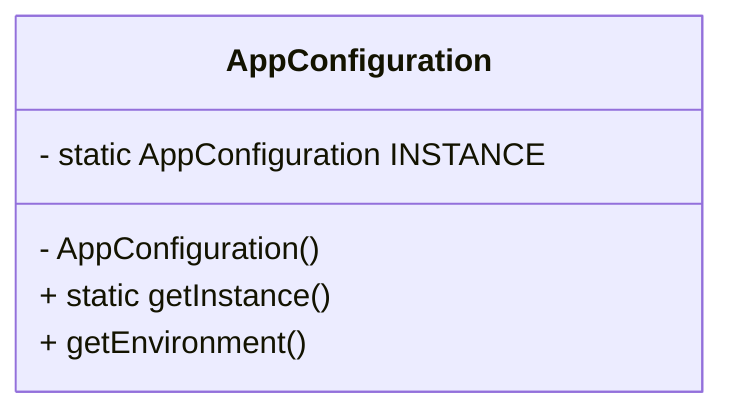

### 🔹 Java Structure

```java
public class AppConfiguration {
    private static final AppConfiguration INSTANCE = new AppConfiguration();
    private AppConfiguration() {}
    public static AppConfiguration getInstance() { return INSTANCE; }
}
```

### 🔹 How My Implementation Works

In this repository, the real singleton is:

- `designpattern.tier1.SingletonPatternExample.AppConfiguration`

This class has:

- a private constructor
- a static instance field `INSTANCE`
- public static `getInstance()`

In `main`, the code creates two variables and checks whether they are the same instance:

```java
AppConfiguration first = AppConfiguration.getInstance();
AppConfiguration second = AppConfiguration.getInstance();
System.out.println("Same instance: " + (first == second));
```

This is a simple eager singleton implementation. It is thread-safe because the instance is created when the class is loaded.

### 🔹 Real-World Analogy

Think of a company’s main global configuration. There should be one source of truth for environment settings, not multiple copies floating around.

### 🔹 When Should I Use It?

Use Singleton when:

- one shared configuration is needed
- one instance of a manager or registry is required
- a single shared resource truly must be unique

### 🔹 When Should I NOT Use It?

Do not use it when:

- you only want convenience
- the object is just a normal service that can be injected
- global mutable state is likely to cause test issues

### 🔹 Interview Recognition

Look for signals like:

- “only one instance”
- “global configuration”
- “shared resource”
- “single access point”

### 🔹 Advantages

- Single shared instance
- Take global state out of scattered code
- Easy access from anywhere

### 🔹 Disadvantages

- Global state can hide dependencies
- Harder unit testing
- Can become a design smell if overused

### 🔹 Common Interview Mistakes

- Saying “Singleton is always good”
- Forgetting the private constructor
- Ignoring thread-safety and lifecycle concerns
- Using Singleton when dependency injection is a better fit

### 🔹 Related Patterns

- Singleton vs Dependency Injection
  - Singleton creates a global instance.
  - DI supplies dependencies explicitly.
  - In modern Java, DI is usually preferred for services.

### 🔹 30-Second Interview Answer

> Singleton ensures that only one instance of a class exists and provides a global access point to it. It is useful when a single shared resource, such as configuration or registry, must be consistent across the application. The tradeoff is that it introduces global state, which can reduce testability and hides dependencies.

---

## 2. Factory Pattern

### 🔹 Intent

Centralize object creation behind a factory so the client does not need to know the concrete class being created.

### 🔹 Example

Example: `VehicleFactory.create("car")` returns a `Car`, `create("bike")` returns a `Bike`, and the caller only depends on the `Vehicle` contract.

### 🔹 The Problem

If the client directly creates objects using `new Car()`, `new Bike()`, and `new Truck()`, object creation logic spreads across the codebase. A new product type requires touching multiple places.

### 🔹 The Core Idea

The factory decides which concrete class to instantiate based on input, while the client only asks for a product type.

### 🔹 Structure / Diagram

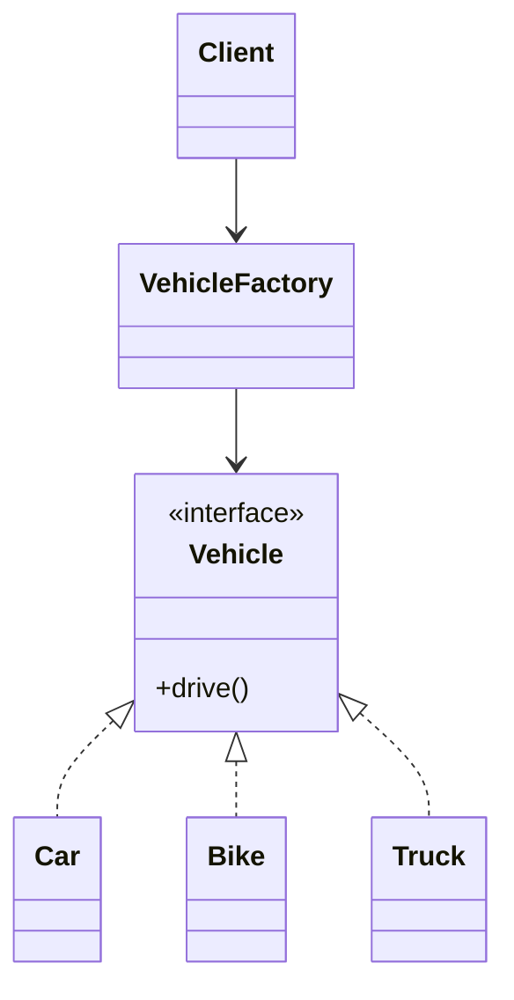

### 🔹 Java Structure

```java
interface Vehicle { void drive(); }
class Car implements Vehicle { ... }
class Bike implements Vehicle { ... }
class Truck implements Vehicle { ... }

class VehicleFactory {
    public Vehicle create(String type) {
        if ("car".equalsIgnoreCase(type)) return new Car();
        if ("bike".equalsIgnoreCase(type)) return new Bike();
        if ("truck".equalsIgnoreCase(type)) return new Truck();
        throw new IllegalArgumentException();
    }
}
```

### 🔹 How My Implementation Works

This repo has:

- `Vehicle` interface
- `Car`, `Bike`, `Truck`
- `VehicleFactory`

The client uses:

```java
VehicleFactory factory = new VehicleFactory();
factory.create("car").drive();
factory.create("bike").drive();
factory.create("truck").drive();
```

This is a classic simple factory. It keeps creation logic together and hides concrete implementations behind `Vehicle`.

### 🔹 Real-World Analogy

Think of a car dealership. Customers ask for a vehicle type, but they do not care which concrete model is chosen under the hood.

### 🔹 When Should I Use It?

Use Factory when:

- creation logic is non-trivial
- the caller should depend on an interface, not concrete classes
- object creation is spread across the codebase
- new product types are likely to be added

### 🔹 When Should I NOT Use It?

Do not use it when:

- object creation is trivial and stable
- there are only one or two classes and no variation
- a factory would add complexity without benefit

### 🔹 Interview Recognition

Look for:

- “create object based on type”
- “hide instantiation logic”
- “return a common interface”
- “switch on category or enum”

### 🔹 Advantages

- Centralized creation logic
- Reduces dependency on concrete classes
- Easier to extend by adding new product types

### 🔹 Disadvantages

- Factory can become large with many types
- Logic may still grow into a “god factory” if not structured carefully

### 🔹 Common Interview Mistakes

- Confusing Factory with Factory Method
- Instantiating all products directly in the client
- Using a giant if/else without centralizing logic

### 🔹 Related Patterns

- Factory vs Abstract Factory
  - Factory creates one product family or one type.
  - Abstract Factory creates a family of related products.

### 🔹 30-Second Interview Answer

> Factory pattern encapsulates object creation behind a common method, so the caller works with an abstraction instead of concrete classes. It is useful when creation logic is complex or when many product types share a common interface. This reduces coupling and centralizes change in one place.

---

## 3. Factory Method Pattern

### 🔹 Intent

Let subclasses decide which object to create while the base class owns the algorithm that uses it.

### 🔹 Example

Example: `PizzaRestaurant` creates `Pizza`, while another restaurant subclass creates `Burger`, but both serve a meal through the same `Restaurant` workflow.

### 🔹 The Problem

A generic workflow may be the same across many cases, but the actual product created differs by subclass.

### 🔹 The Core Idea

The base class defines the flow, while subclasses override the creation step.

### 🔹 Structure / Diagram

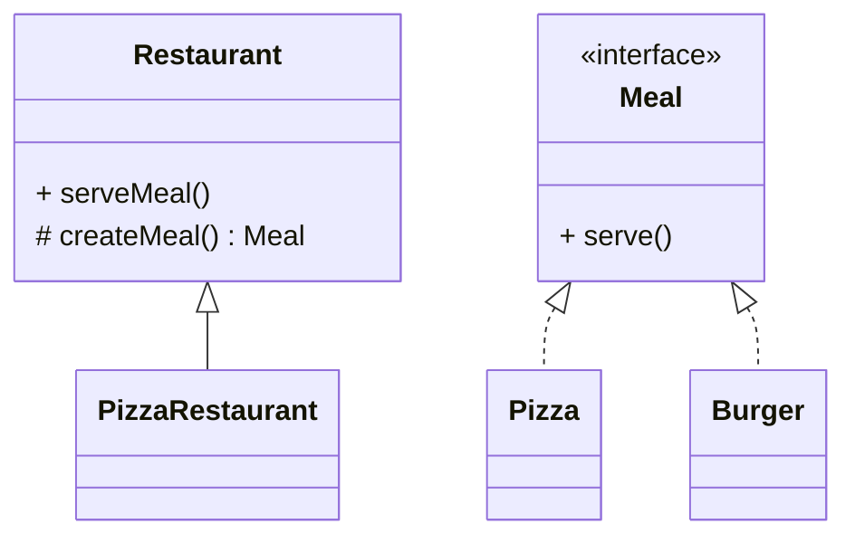

### 🔹 Java Structure

```java
abstract class Restaurant {
    protected abstract Meal createMeal();
    public void serveMeal() { createMeal().serve(); }
}

class PizzaRestaurant extends Restaurant {
    protected Meal createMeal() { return new Pizza(); }
}
```

### 🔹 How My Implementation Works

This repo combines Factory Method and Abstract Factory in the same file:

- `designpattern.tier1.FactoryMethodAbstractFactoryExample.Restaurant`
- `createMeal()` is abstract
- `PizzaRestaurant` overrides it

The example shows:

```java
public static abstract class Restaurant {
    protected abstract Meal createMeal();
    public void serveMeal() {
        createMeal().serve();
    }
}
```

This is a clean implementation of Factory Method. The method that creates the object is deferred to the subclass.

### 🔹 Real-World Analogy

A restaurant chain may have a common process for serving a meal, but each branch decides which meal it will create based on its own menu.

### 🔹 When Should I Use It?

Use Factory Method when:

- multiple subclasses create different products
- a general workflow stays fixed but the creation step varies
- a base class should not know concrete product classes

### 🔹 When Should I NOT Use It?

Do not use it when:

- creation logic is simple and not likely to vary by subclass
- you only need a single generic factory method

### 🔹 Interview Recognition

Look for:

- “base class decides workflow, subclass decides object creation”
- “template method + creation step”
- “common algorithm, varying product”

### 🔹 Advantages

- Keeps algorithm structure stable
- Supports extensibility via subclasses
- Avoids hardcoded creation logic in the base class

### 🔹 Disadvantages

- Adds inheritance complexity
- More classes to maintain

### 🔹 Common Interview Mistakes

- Thinking Factory Method is the same as a simple Factory
- Forgetting that subclass creation is the key idea
- Using inheritance where composition or simple factory is enough

### 🔹 Related Patterns

- Factory Method vs Simple Factory
  - Simple Factory uses one factory class.
  - Factory Method delegates creation to subclasses.

### 🔹 30-Second Interview Answer

> Factory Method allows a base class to define a workflow while subclasses decide which specific product to instantiate. This keeps the algorithm stable and delays object creation to the subclass that knows the correct product. It is useful when the process is common but the concrete product varies.

---

## 4. Abstract Factory Pattern

### 🔹 Intent

Create families of related objects without depending on their concrete classes.

### 🔹 Example

Example: a `LightUiFactory` creates matching `LightButton` and `LightCheckBox` components so the UI remains consistent.

### 🔹 The Problem

A client may need multiple products that must work together, such as a button and checkbox from the same UI theme. Creating them independently creates mismatches.

### 🔹 The Core Idea

The factory provides a family of related objects that belong together, such as Light UI or Dark UI components.

### 🔹 Structure / Diagram

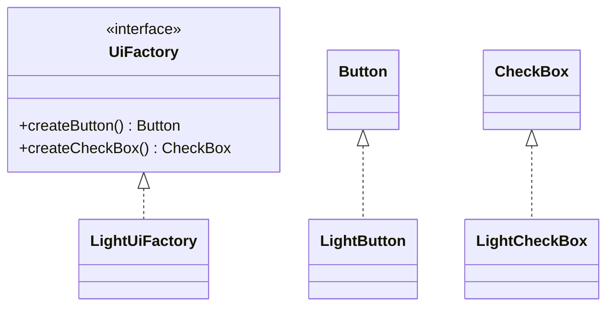

### 🔹 Java Structure

```java
interface UiFactory {
    Button createButton();
    CheckBox createCheckBox();
}

class LightUiFactory implements UiFactory { ... }
```

### 🔹 How My Implementation Works

The repository implements this in:

- `designpattern.tier1.FactoryMethodAbstractFactoryExample.UiFactory`
- `LightUiFactory`
- `Button` / `CheckBox`
- `LightButton` / `LightCheckBox`

The client does:

```java
UiFactory factory = new LightUiFactory();
factory.createButton().render();
factory.createCheckBox().render();
```

A key point: the factory returns a matching pair of related products from one family.

### 🔹 Real-World Analogy

Think of a theme pack for a UI. A “light” theme should create light buttons and light checkboxes, not a mix of dark and light controls.

### 🔹 When Should I Use It?

Use Abstract Factory when:

- multiple related objects must be created together
- families of products vary by platform, theme, or environment
- product compatibility matters

### 🔹 When Should I NOT Use It?

Do not use it when:

- you only need one type of object
- the product family is not complex or not likely to vary

### 🔹 Interview Recognition

Look for:

- “families of related objects”
- “matching products”
- “theme/platform-specific families”
- “do not name concrete classes”

### 🔹 Advantages

- Ensures consistent product families
- Hides concrete family details
- Easier to swap themes or platforms

### 🔹 Disadvantages

- More classes and interfaces
- Can become heavy if too many families are added

### 🔹 Common Interview Mistakes

- Mixing up Abstract Factory with Factory Method
- Claiming that Abstract Factory is just a single “factory” class
- Ignoring the “related family” requirement

### 🔹 Related Patterns

- Factory vs Abstract Factory
  - Factory gives one product
  - Abstract Factory gives a family of products

### 🔹 30-Second Interview Answer

> Abstract Factory creates related objects as a family while hiding their concrete classes behind an interface. It is useful when different environments or themes require a consistent set of products, such as buttons and checkboxes that must match. The client depends on the factory abstraction, not on the concrete implementations.

---

## 5. Builder Pattern

### 🔹 Intent

Construct a complex object step by step, especially when many optional fields are involved.

### 🔹 Example

Example: `new User.Builder().name("John").age(25).email("x@y.com").build()` creates a complete object without a long constructor.

### 🔹 The Problem

A constructor with many parameters becomes hard to read and maintain. Long parameter lists also lead to poor readability and repeated overloads.

### 🔹 The Core Idea

The builder receives optional values one by one and returns a final object only at the end.

### 🔹 Structure / Diagram

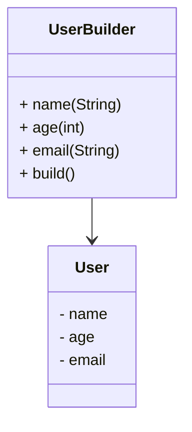

### 🔹 Java Structure

```java
class User {
    private User(Builder builder) { ... }

    static class Builder {
        public Builder name(String name) { ... }
        public Builder email(String email) { ... }
        public User build() { return new User(this); }
    }
}
```

### 🔹 How My Implementation Works

This repo uses:

- `designpattern.tier1.BuilderPatternExample.User`
- `User.Builder`

The final object is created with a fluent API:

```java
User user = new User.Builder()
        .name("John")
        .age(25)
        .email("x@y.com")
        .build();
```

This is a good interview example of gradually assembling a complex object while keeping the final type immutable.

### 🔹 Real-World Analogy

Think of ordering a custom pizza. You do not call one giant constructor with every topping; you add ingredients step by step and then finalize the order.

### 🔹 When Should I Use It?

Use Builder when:

- object has many optional parameters
- object creation is multi-step or configurable
- you want readable, fluent construction code

### 🔹 When Should I NOT Use It?

Do not use it when:

- the object is trivial
- only a few fields are required
- a constructor is simpler and clearer

### 🔹 Interview Recognition

Look for:

- “many optional fields”
- “fluent setters”
- “build()” method
- “complex object assembly”

### 🔹 Advantages

- Better readability
- Good for immutable objects
- Separates construction from representation

### 🔹 Disadvantages

- More classes and code
- Not worth the complexity for simple types

### 🔹 Common Interview Mistakes

- Using builder for tiny objects
- Forgetting immutability or final fields
- Building invalid object state without validation

### 🔹 Related Patterns

- Builder vs Prototype
  - Builder creates new object from scratch with configuration steps.
  - Prototype copies an existing configured object.

### 🔹 30-Second Interview Answer

> Builder separates object construction from the object itself and allows the object to be assembled step by step. It is useful when an object has many optional fields or needs a readable, fluent creation API. This avoids long constructor parameters and makes the final object easier to build consistently.

---

## 6. Prototype Pattern

### 🔹 Intent

Create a new object by copying an existing prototype instead of reconstructing it from scratch.

### 🔹 Example

Example: a `GameCharacter` is cloned before damage is applied to the copy, leaving the original unchanged.

### 🔹 The Problem

Sometimes object creation is expensive or requires many repeated configuration steps.

### 🔹 The Core Idea

A prototype object already has a valid state; the program creates a clone of it.

### 🔹 Structure / Diagram

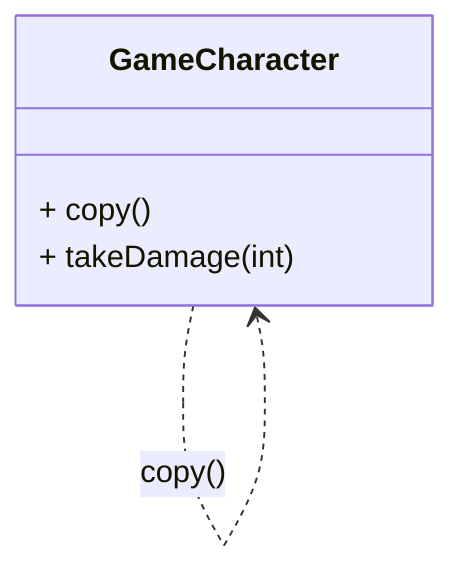

### 🔹 Java Structure

```java
class GameCharacter {
    public GameCharacter copy() {
        return new GameCharacter(this.type, this.health);
    }
}
```

### 🔹 How My Implementation Works

This repo has:

- `designpattern.tier3.PrototypePatternExample.GameCharacter`

The method is:

```java
public GameCharacter copy() {
    return new GameCharacter(type, health);
}
```

The example creates one original warrior and then copies it. The clone is independent and can be modified separately.

### 🔹 Real-World Analogy

Think of a game engine creating multiple identical soldiers from a configured prototype instead of re-running all initialization steps.

### 🔹 When Should I Use It?

Use Prototype when:

- an instance is expensive to create
- the object starts from a valid configured state
- clone-and-modify is cheaper than reconstructing from scratch

### 🔹 When Should I NOT Use It?

Do not use it when:

- the object contains deep, complex mutable state and cloning is not straightforward
- a simple constructor is easier

### 🔹 Interview Recognition

Look for:

- “clone existing object”
- “copy” or `clone()` concept
- “save construction cost”
- “configured template”

### 🔹 Advantages

- Avoids repeated heavy setup
- Useful for object templates
- Great for runtime duplication

### 🔹 Disadvantages

- Deep-copy complexity
- Harder to reason about when objects are highly nested or mutable

### 🔹 Common Interview Mistakes

- Confusing prototype with builder
- Ignoring shallow vs deep copy concerns
- Forgetting that cloning must produce an independent object

### 🔹 Related Patterns

- Builder vs Prototype
  - Builder assembles from scratch.
  - Prototype duplicates existing configuration.

### 🔹 30-Second Interview Answer

> Prototype allows a program to create new objects by cloning an existing configured instance rather than reinitializing everything from scratch. This helps when object creation is expensive or when many variants begin from the same setup. The key idea is copy-and-modify, with careful attention to deep-copying complex internal state.

---

# Structural Patterns

## 7. Adapter Pattern

### 🔹 Intent

Convert one interface into another expected by the client without changing the original code.

### 🔹 Example

Example: an XML source is adapted to JSON output through `XmlToJsonAdapter`, so the client only works with `JsonDataReader`.

### 🔹 The Problem

A client expects a certain API, but an existing library or service exposes a different one. Without adaptation, the two cannot work together.

### 🔹 The Core Idea

The adapter wraps the existing object and exposes the required interface.

### 🔹 Structure / Diagram

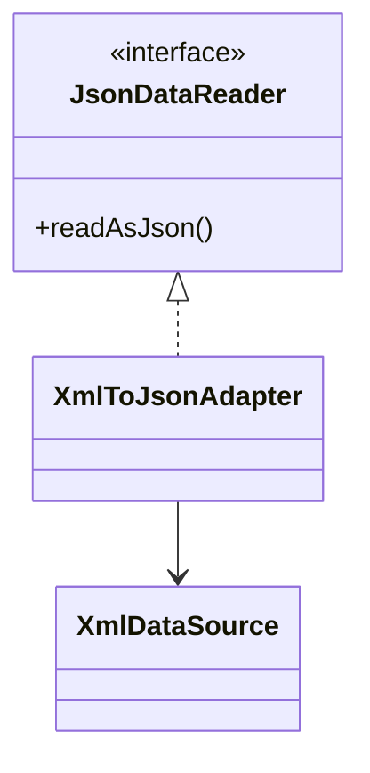

### 🔹 Java Structure

```java
interface JsonDataReader { String readAsJson(); }

class XmlDataSource { String readAsXml() { ... } }

class XmlToJsonAdapter implements JsonDataReader {
    private final XmlDataSource source;
    public String readAsJson() {
        return convertXmlToJson(source.readAsXml());
    }
}
```

### 🔹 How My Implementation Works

The repository implements this in:

- `designpattern.tier3.AdapterPatternExample.JsonDataReader`
- `XmlDataSource`
- `XmlToJsonAdapter`

The adapter accepts the XML source and converts it to JSON before returning it to the client:

```java
JsonDataReader reader = new XmlToJsonAdapter(new XmlDataSource());
System.out.println(reader.readAsJson());
```

This is a textbook adapter: the client only sees the target interface and does not care how XML is converted internally.

### 🔹 Real-World Analogy

Think of a universal power adapter. Your device needs one socket type, but the wall outlet gives another; the adapter bridges the mismatch.

### 🔹 When Should I Use It?

Use Adapter when:

- external libraries expose incompatible APIs
- you need to reuse old code with a new interface
- a system has legacy components that must fit modern expectations

### 🔹 When Should I NOT Use It?

Do not use it when:

- the code can be refactored cleanly instead of wrapped
- there is no genuine interface mismatch
- the adapter would just hide a poor design

### 🔹 Interview Recognition

Look for:

- “existing code has a different API”
- “wrap incompatible system”
- “convert one format to another”
- “target interface expected by client”

### 🔹 Advantages

- Reuses existing code
- Keeps client code stable
- Provides interface compatibility

### 🔹 Disadvantages

- Extra layer of indirection
- Potentially hides bugs if conversion logic is too complex

### 🔹 Common Interview Mistakes

- Confusing Adapter with Facade
- Saying the adapter “changes behavior” rather than “changes interface”
- Using it when refactoring would be cheaper and simpler

### 🔹 Related Patterns

- Adapter vs Facade
  - Adapter bridges different interfaces.
  - Facade simplifies a complex subsystem behind one interface.

### 🔹 30-Second Interview Answer

> Adapter allows two incompatible interfaces to work together by creating a wrapper that converts one API into the other. It is useful when an existing component has the right behavior but the wrong interface. Instead of rewriting the old code, we adapt it to the client’s expected contract.

---

## 8. Decorator Pattern

### 🔹 Intent

Add behavior dynamically to an object without changing its type or creating a large number of subclasses.

### 🔹 Example

Example: a simple coffee becomes `new MilkDecorator(new SugarDecorator(new SimpleCoffee()))`, stacking features without creating a new subclass for each combination.

### 🔹 The Problem

A class may need optional features, such as milk, sugar, logging, or security, but creating every combination as a subclass becomes unmanageable.

### 🔹 The Core Idea

Each decorator wraps the same interface and adds behavior before or after delegating to the wrapped object.

### 🔹 Structure / Diagram

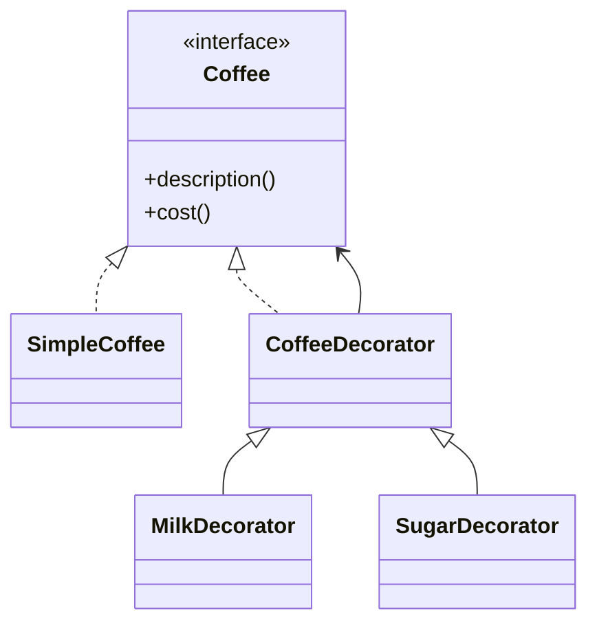

### 🔹 Java Structure

```java
interface Coffee { String description(); double cost(); }

abstract class CoffeeDecorator implements Coffee {
    protected final Coffee coffee;
}

class MilkDecorator extends CoffeeDecorator {
    public String description() {
        return coffee.description() + ", Milk";
    }
}
```

### 🔹 How My Implementation Works

This repository uses:

- `designpattern.tier2.DecoratorPatternExample.Coffee`
- `SimpleCoffee`
- `CoffeeDecorator`
- `MilkDecorator`
- `SugarDecorator`

The actual composition is:

```java
Coffee coffee = new SimpleCoffee();
coffee = new MilkDecorator(coffee);
coffee = new SugarDecorator(coffee);
```

This stacks responsibilities dynamically at runtime. Each decorator adds a feature while preserving the same `Coffee` contract.

### 🔹 Real-World Analogy

Think of a basic coffee order that gets extra milk and sugar added on top of the base coffee, without creating separate coffee classes for each combination.

### 🔹 When Should I Use It?

Use Decorator when:

- behaviors must be added dynamically
- combinations of features are common
- subclass explosion would be a problem

### 🔹 When Should I NOT Use It?

Do not use it when:

- behaviors are fixed and known up front
- a regular inheritance hierarchy is simpler
- the wrappers would add unnecessary complexity

### 🔹 Interview Recognition

Look for:

- “add behavior without subclassing”
- “stack wrappers”
- “dynamic features”
- “same interface, different responsibilities”

### 🔹 Advantages

- Flexible behavior composition
- Reduces subclass explosion
- Runtime combinations are easy to build

### 🔹 Disadvantages

- Harder debugging because many wrapper layers may stack
- Can make object flow harder to understand

### 🔹 Common Interview Mistakes

- Confusing decorator with inheritance
- Forgetting that decorators implement the same interface
- Not recognizing the composition chain

### 🔹 Related Patterns

- Decorator vs Proxy
  - Decorator adds responsibilities.
  - Proxy controls access or adds indirection.

### 🔹 30-Second Interview Answer

> Decorator lets us add behavior to an object dynamically by wrapping it in another object that implements the same interface. This avoids a large inheritance hierarchy for every combination of features while keeping the base object contract stable. It is ideal when optional responsibilities should be added at runtime.

---

## 9. Facade Pattern

### 🔹 Intent

Provide a simple interface to a complex system of subsystems.

### 🔹 Example

Example: `OrderFacade.placeOrder("Book", 499.0)` hides the inventory check, payment charge, and shipping steps behind one call.

### 🔹 The Problem

Without a facade, the client must know many detailed classes and calls to coordinate a use case across multiple subsystems.

### 🔹 The Core Idea

The facade hides subsystem complexity and exposes a single high-level operation.

### 🔹 Structure / Diagram

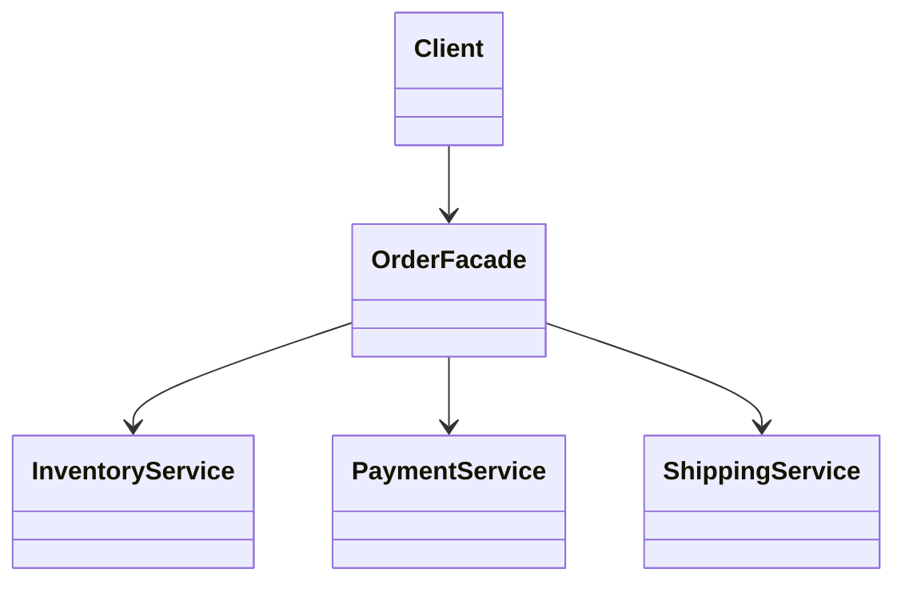

### 🔹 Java Structure

```java
class OrderFacade {
    private InventoryService inventory = new InventoryService();
    private PaymentService payment = new PaymentService();
    private ShippingService shipping = new ShippingService();

    public void placeOrder(String product, double amount) {
        if (inventory.isAvailable(product)) {
            payment.charge(amount);
            shipping.ship(product);
        }
    }
}
```

### 🔹 How My Implementation Works

This repository includes:

- `designpattern.tier3.FacadePatternExample.OrderFacade`
- `InventoryService`
- `PaymentService`
- `ShippingService`

The client simply does:

```java
new OrderFacade().placeOrder("Book", 499.0);
```

The client does not need to coordinate each subsystem manually.

### 🔹 Real-World Analogy

Think of an airline booking portal. The user books a flight without dealing with inventory, payments, and baggage systems individually.

### 🔹 When Should I Use It?

Use Facade when:

- a system is complex and multiple subsystems must work together
- the client should see a simplified interface
- you want to reduce coupling to subsystem internals

### 🔹 When Should I NOT Use It?

Do not use it when:

- you need the client to work directly with subsystem features frequently
- the facade starts absorbing too much logic and turns into a god object

### 🔹 Interview Recognition

Look for:

- “simplify a complex subsystem”
- “one interface for many services”
- “process orchestration”

### 🔹 Advantages

- Easier client code
- Reduces subsystem coupling
- Centralizes orchestration logic

### 🔹 Disadvantages

- Can hide complexity behind a single large class
- May become too broad if it tries to do everything

### 🔹 Common Interview Mistakes

- Calling any high-level wrapper a facade
- Confusing it with an adapter
- Forgetting that the subsystem remains intact under the facade

### 🔹 Related Patterns

- Facade vs Mediator
  - Facade simplifies a subsystem boundary.
  - Mediator coordinates objects that know each other.

### 🔹 30-Second Interview Answer

> Facade provides a single simplified interface for a complex system so that clients do not need to know about nested subsystem details. It centralizes orchestration and reduces coupling to low-level implementations. It is useful when a use case involves several services that must work together smoothly.

---

## 10. Composite Pattern

### 🔹 Intent

Treat individual objects and groups of objects uniformly.

### 🔹 Example

Example: a `Folder` can contain files and nested folders, and the same `print()` operation works on both the leaf and the composite node.

### 🔹 The Problem

A system may have a tree of objects, like folders containing files, and the client should not care whether it is handling a single leaf or a collection of nodes.

### 🔹 The Core Idea

Leaf and container objects implement the same interface and are handled by the same client API.

### 🔹 Structure / Diagram

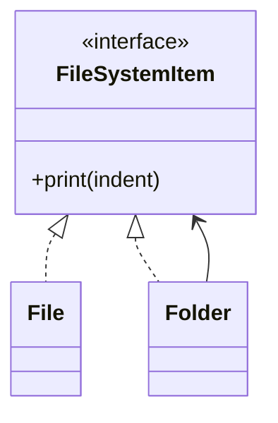

### 🔹 Java Structure

```java
interface FileSystemItem { void print(String indent); }

class File implements FileSystemItem { ... }
class Folder implements FileSystemItem {
    List<FileSystemItem> children = new ArrayList<>();
}
```

### 🔹 How My Implementation Works

This repo uses:

- `designpattern.tier3.CompositePatternExample.FileSystemItem`
- `File`
- `Folder`

The folder recursively prints children:

```java
Folder root = new Folder("project");
root.add(new File("README.md"));
Folder source = new Folder("src");
source.add(new File("App.java"));
root.add(source);
root.print("");
```

The same `print()` method is called on both leaves and nested folders.

### 🔹 Real-World Analogy

Think of a file system with files and directories. The client can print a single file or a whole folder the same way.

### 🔹 When Should I Use It?

Use Composite when:

- data is hierarchical
- leaves and groups should be treated similarly
- tree traversal and uniform operations matter

### 🔹 When Should I NOT Use It?

Do not use it when:

- there is no tree structure
- the interface would force meaningless methods on all nodes

### 🔹 Interview Recognition

Look for:

- “tree structure”
- “hierarchy of files/folders/components”
- “same operation on parent and child”

### 🔹 Advantages

- Uniform treatment of leaves and groups
- Simple tree traversal logic
- Easy to extend with new node types

### 🔹 Disadvantages

- Base interface can become overloaded
- Some operations may not make sense for every node type

### 🔹 Common Interview Mistakes

- Forgetting that leaf and composite share the same interface
- Not recognizing the recursive tree relationship
- Over-engineering without a true tree structure

### 🔹 Related Patterns

- Composite vs Decorator
  - Composite is about hierarchical composition.
  - Decorator is about wrapping to add behavior.

### 🔹 30-Second Interview Answer

> Composite allows a client to treat a single object and a group of objects the same way by using a common interface. This is highly useful for tree structures like file systems, UI components, and organizational hierarchies. The client can call a uniform operation on both edges and nodes without knowing the internal structure.

---

## 11. Proxy Pattern

### 🔹 Intent

Control access to another object via a stand-in object.

### 🔹 Example

Example: `AuthorizedDocumentProxy` allows reading a document only when the user is authorized; otherwise it blocks access.

### 🔹 The Problem

A real object may be expensive, restricted, remote, or sensitive. Direct access may not be safe or efficient.

### 🔹 The Core Idea

The proxy implements the same interface and intercepts access before delegating to the real object.

### 🔹 Structure / Diagram

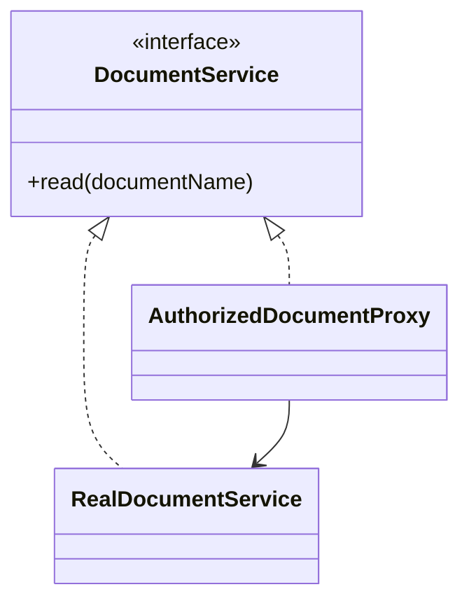

### 🔹 Java Structure

```java
interface DocumentService { void read(String name); }

class AuthorizedDocumentProxy implements DocumentService {
    private final DocumentService realService = new RealDocumentService();
    public void read(String name) {
        if (authorized) realService.read(name);
        else System.out.println("Access denied");
    }
}
```

### 🔹 How My Implementation Works

This repo includes:

- `designpattern.tier3.ProxyPatternExample.DocumentService`
- `RealDocumentService`
- `AuthorizedDocumentProxy`

The proxy checks authorization before delegating:

```java
new AuthorizedDocumentProxy(true).read("salary-report.pdf");
new AuthorizedDocumentProxy(false).read("salary-report.pdf");
```

This is a clear access-control proxy.

### 🔹 Real-World Analogy

Think of a security guard at a door. The guard stands in front of the real system and decides whether access is allowed.

### 🔹 When Should I Use It?

Use Proxy when:

- you need access control
- the real object is expensive to create or remote
- you want caching, logging, or lazy initialization

### 🔹 When Should I NOT Use It?

Do not use it when:

- there is no need for indirection or access control
- the code is simple enough to call the real object directly

### 🔹 Interview Recognition

Look for:

- “access control”
- “stand-in object”
- “lazy load”
- “remote or expensive object”

### 🔹 Advantages

- Adds access control or indirection
- Can improve performance with caching or lazy initialization
- Keeps real service implementation untouched

### 🔹 Disadvantages

- Another object in the flow
- Can be hard to debug if too many proxy layers are used

### 🔹 Common Interview Mistakes

- Confusing Proxy with Decorator
- Forgetting that a proxy usually protects or controls access
- Using it where a simple method call is enough

### 🔹 Related Patterns

- Decorator vs Proxy
  - Decorator adds responsibility.
  - Proxy controls or protects access.

### 🔹 30-Second Interview Answer

> Proxy provides a placeholder object that controls access to another object. It can enforce authorization, lazy-load data, or log requests before delegating to the real implementation. The client interacts with the proxy through the same interface, while the real object remains hidden behind the control layer.

---

# Behavioral Patterns

## 12. Strategy Pattern

### 🔹 Intent

Encapsulate interchangeable behaviors behind a common interface so the client can switch algorithms without changing its implementation.

### 🔹 Example

Example: `Payment` can use `CreditCardPayment`, `UpiPayment`, or `CashPayment` without changing the payment logic at the call site.

### 🔹 The Problem

The same operation can be performed in many different ways, and choosing among them with conditionals creates a rigid design.

### 🔹 The Core Idea

The client depends on a strategy interface, while concrete strategies implement the actual behavior.

### 🔹 Structure / Diagram

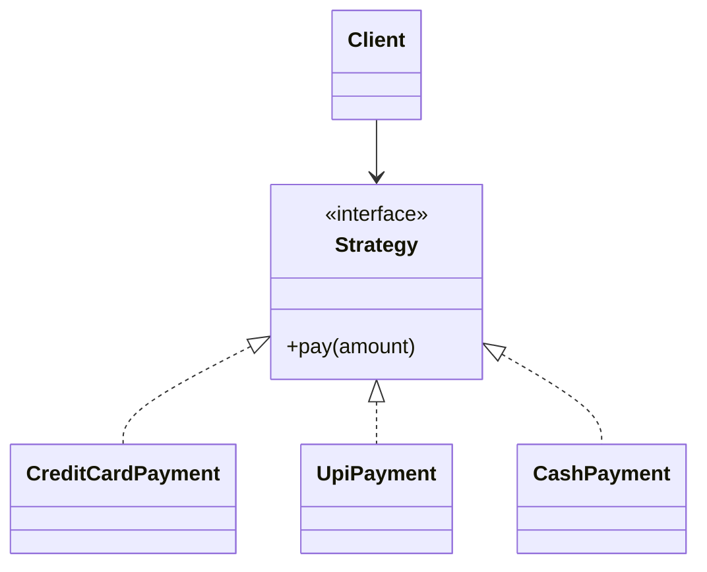

### 🔹 Java Structure

```java
interface PaymentStrategy { void pay(double amount); }

class CreditCardPayment implements PaymentStrategy { ... }
class UpiPayment implements PaymentStrategy { ... }

class Payment {
    private final PaymentStrategy strategy;
    public Payment(PaymentStrategy strategy) { this.strategy = strategy; }
    public void pay(double amount) { strategy.pay(amount); }
}
```

### 🔹 How My Implementation Works

This repository includes:

- `designpattern.tier1.StrategyPatternExample.PaymentStrategy`
- `CreditCardPayment`
- `UpiPayment`
- `CashPayment`
- `Payment`

The usage is straightforward:

```java
new Payment(new CreditCardPayment()).pay(500.0);
new Payment(new UpiPayment()).pay(250.0);
new Payment(new CashPayment()).pay(100.0);
```

The `Payment` context is independent of payment type. The behavior is selected by injecting the strategy.

### 🔹 Real-World Analogy

Think of checkout at a shop. The system does not care whether the customer pays by card, UPI, or cash; it simply uses a payment strategy.

### 🔹 When Should I Use It?

Use Strategy when:

- multiple algorithms perform the same operation differently
- behavior should switch at runtime
- you want to avoid large `if-else` or `switch` logic
- new algorithms should be added without modifying client code

### 🔹 When Should I NOT Use It?

Do not use it when:

- there are only one or two trivial behaviors that are not expected to change
- the strategy hierarchy would be overkill for the problem

### 🔹 Interview Recognition

If the interviewer says:

- “multiple algorithms”
- “switch behavior at runtime”
- “avoid if-else”
- “interchangeable behavior”

→ think Strategy Pattern.

### 🔹 Advantages

- Behavior is interchangeable
- Client code remains stable
- Easy to add new strategies

### 🔹 Disadvantages

- More classes and interfaces
- Selection logic still needs to be managed somewhere

### 🔹 Common Interview Mistakes

- Treating Strategy as a simple if/else improvement
- Forgetting that the client injects or chooses the strategy
- Not separating the algorithm from the context

### 🔹 Related Patterns

- Strategy vs State
  - Strategy represents different algorithms chosen by the client.
  - State represents different behavior modes of the same object, where the context owns the state transitions.

### 🔹 30-Second Interview Answer

> Strategy pattern lets us encapsulate interchangeable algorithms behind a common interface, so the client depends on the abstraction instead of the concrete implementation. This reduces conditional logic and makes it easy to switch behavior at runtime. It is ideal when one operation can be implemented in multiple ways and the choice should remain flexible.

---

## 13. Observer Pattern

### 🔹 Intent

Notify multiple interested objects when a subject changes.

### 🔹 Example

Example: `EmailSubscriber` and `MobileSubscriber` receive updates when a `NotificationSubject` publishes a new message.

### 🔹 The Problem

One event may need to notify many listeners, but the subject should not be tightly coupled to each specific subscriber.

### 🔹 The Core Idea

The subject keeps a list of observers and calls a common update method on each one when state changes.

### 🔹 Structure / Diagram

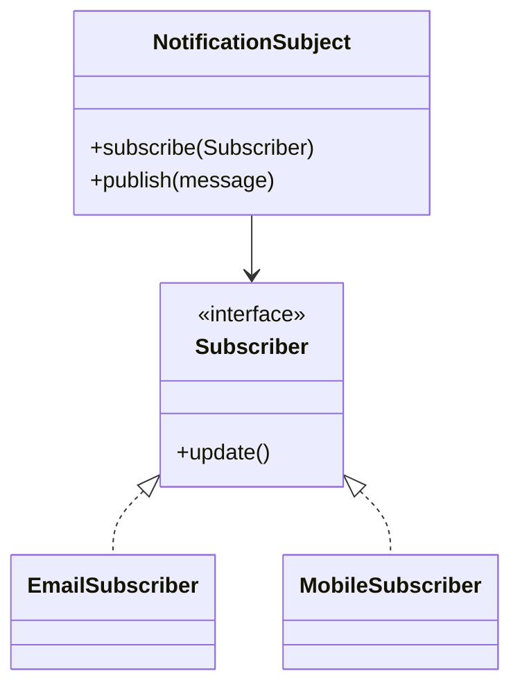

### 🔹 Java Structure

```java
interface Subscriber { void update(); }

class NotificationSubject {
    private List<Subscriber> subscribers = new ArrayList<>();
    public void subscribe(Subscriber s) { subscribers.add(s); }
    public void publish(String message) {
        for (Subscriber s : subscribers) s.update();
    }
}
```

### 🔹 How My Implementation Works

This repo has:

- `designpattern.tier1.ObserverPatternExample.Subscriber`
- `EmailSubscriber`
- `MobileSubscriber`
- `NotificationSubject`

The flow is:

```java
NotificationSubject notification = new NotificationSubject();
notification.subscribe(new EmailSubscriber());
notification.subscribe(new MobileSubscriber());
notification.publish("Your order has shipped");
```

The subject does not need to know how each subscriber handles the update; it just notifies them.

### 🔹 Real-World Analogy

Think of a newsletter subscription. When an update is published, all subscribers receive the message.

### 🔹 When Should I Use It?

Use Observer when:

- one event must notify many listeners
- subscribers want updates without direct coupling to the publisher
- event-driven systems are involved

### 🔹 When Should I NOT Use It?

Do not use it when:

- there are only one or two listeners and coupling is simple
- event flow is not really broadcast-based

### 🔹 Interview Recognition

Look for:

- “multiple subscribers”
- “event-driven”
- “publish/subscribe”
- “notify listeners”

### 🔹 Advantages

- Loose coupling between subject and observers
- Good for event-driven systems
- Easy to add new listeners

### 🔹 Disadvantages

- Harder to debug with many observers
- Potential memory leaks if unsubscribing is not handled properly

### 🔹 Common Interview Mistakes

- Mixing up Observer with callback methods or direct method calls
- Forgetting the subject keeps a list of observers
- Thinking Observer means only a single listener

### 🔹 Related Patterns

- Observer vs Mediator
  - Observer has a publisher and many subscribers.
  - Mediator centralizes communication among many objects.

### 🔹 30-Second Interview Answer

> Observer pattern allows a subject to notify multiple dependent objects when its state changes without tightly coupling them to each other. Subscribers register with the subject and receive updates through a common interface. It is ideal for event-driven systems such as notifications, UI updates, and pub/sub models.

---

## 14. State Pattern

### 🔹 Intent

Allow an object to change behavior when its internal state changes.

### 🔹 Example

Example: a `VendingMachine` moves from `IdleState` to `HasMoneyState` to `DispensingState` depending on the operation sequence.

### 🔹 The Problem

A class with many state-specific rules often becomes a messy set of conditionals.

### 🔹 The Core Idea

The context delegates behavior to a state object, and each state decides what should happen next.

### 🔹 Structure / Diagram

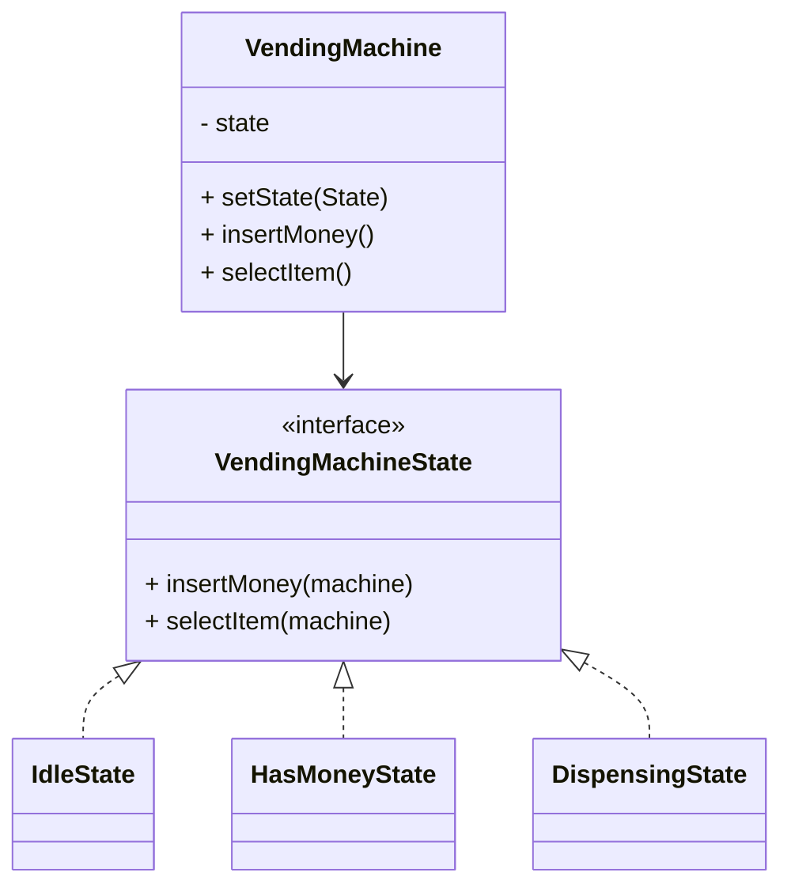

### 🔹 Java Structure

```java
interface VendingMachineState {
    void insertMoney(VendingMachine machine);
    void selectItem(VendingMachine machine);
}

class IdleState implements VendingMachineState { ... }
class HasMoneyState implements VendingMachineState { ... }
```

### 🔹 How My Implementation Works

This repo uses:

- `designpattern.tier2.StatePatternExample.VendingMachine`
- `VendingMachineState`
- `IdleState`
- `HasMoneyState`
- `DispensingState`

The context changes state internally:

```java
public void insertMoney() { state.insertMoney(this); }
public void selectItem() { state.selectItem(this); }
```

When a state method is called, it can set the next state, such as moving from `IdleState` to `HasMoneyState`.

### 🔹 Real-World Analogy

Think of a vending machine. Its behavior depends on whether it is idle, has money inserted, or is currently dispensing.

### 🔹 When Should I Use It?

Use State when:

- the object has many states
- behavior depends on current state
- conditional logic is growing too large

### 🔹 When Should I NOT Use It?

Do not use it when:

- only a few states exist and the logic is simple
- the object is not really stateful in a meaningful way

### 🔹 Interview Recognition

Look for:

- “finite states”
- “different behavior based on mode”
- “if state is X do Y”
- “transitions between states”

### 🔹 Advantages

- Better separation of state-specific logic
- Easier to reason about transitions
- Reduces large conditional blocks

### 🔹 Disadvantages

- More classes for each state
- Can be over-engineered for small systems

### 🔹 Common Interview Mistakes

- Thinking State is the same as simple enum values
- Forgetting that the context delegates to the state object
- Not explaining state transitions clearly

### 🔹 Related Patterns

- Strategy vs State
  - Strategy is chosen externally.
  - State is internal to the object and transitions according to current state.

### 🔹 30-Second Interview Answer

> State pattern models an object’s behavior as a set of state-specific classes, with the context delegating actions to its current state. This removes large conditional logic and makes transitions between states explicit. It is useful when an object behaves differently depending on its current mode or phase.

---

## 15. Template Method Pattern

### 🔹 Intent

Define the skeleton of an algorithm in one place while allowing subclasses to customize certain steps.

### 🔹 Example

Example: `CsvReportGenerator` and `JsonReportGenerator` both follow `generate()`, but each defines how data is read and formatted differently.

### 🔹 The Problem

Several algorithms share the same high-level workflow, but some steps differ by implementation.

### 🔹 The Core Idea

A final template method calls a series of abstract or hook methods in a fixed order. Subclasses implement the variable parts.

### 🔹 Structure / Diagram

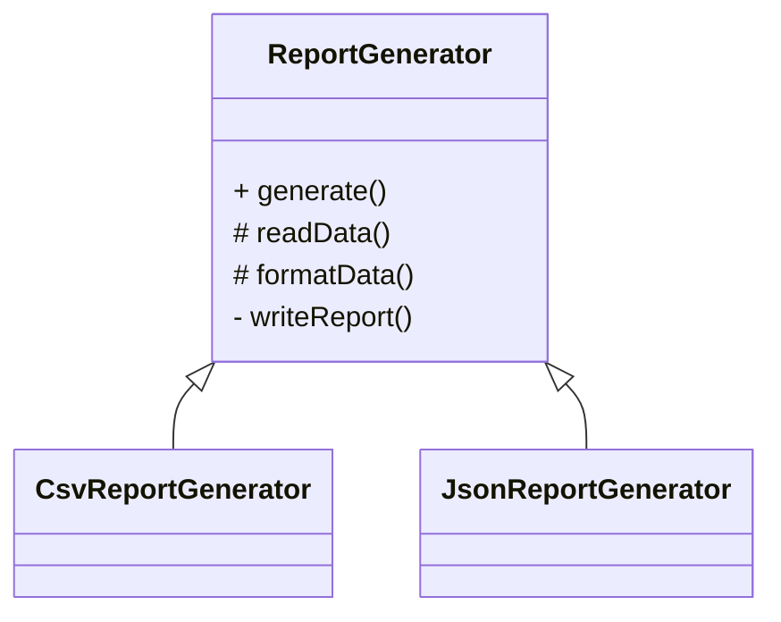

### 🔹 Java Structure

```java
abstract class ReportGenerator {
    public final void generate() {
        readData();
        formatData();
        writeReport();
    }
    protected abstract void readData();
    protected abstract void formatData();
}
```

### 🔹 How My Implementation Works

This repo provides:

- `designpattern.tier2.TemplateMethodPatternExample.ReportGenerator`
- `CsvReportGenerator`
- `JsonReportGenerator`

The template method is:

```java
public final void generate() {
    readData();
    formatData();
    writeReport();
}
```

Subclasses only customize the read and format steps; the overall algorithm stays fixed.

### 🔹 Real-World Analogy

Think of a recipe. The steps are mostly the same, but the exact ingredients or cooking method can vary by version of the dish.

### 🔹 When Should I Use It?

Use Template Method when:

- multiple algorithms share a fixed outline
- only a few steps vary
- you want to prevent changing the overall process order

### 🔹 When Should I NOT Use It?

Do not use it when:

- the workflows differ too much to share a common skeleton
- the inheritance model is too rigid for the business problem

### 🔹 Interview Recognition

Look for:

- “same algorithm, different steps”
- “template with hook methods”
- “fixed process order”

### 🔹 Advantages

- Reuses common algorithm structure
- Keeps ordering consistent
- Easy to extend with new variants

### 🔹 Disadvantages

- Uses inheritance, which can be rigid
- May become fragile if the algorithm changes often

### 🔹 Common Interview Mistakes

- Forgetting the template method is final and controls the algorithm flow
- Saying this is just a simple abstract class without the fixed order concept
- Not describing which steps are fixed and which are customizable

### 🔹 Related Patterns

- Strategy vs Template Method
  - Strategy varies behavior by composition.
  - Template Method varies steps by inheritance and fixes the algorithm skeleton.

### 🔹 30-Second Interview Answer

> Template Method defines the skeleton of an algorithm in a base class and lets subclasses override only the variable steps. This keeps the process order fixed while allowing tailored behavior where needed. It is useful when many implementations share the same high-level workflow but differ in a few details.

---

## 16. Command Pattern

### 🔹 Intent

Encapsulate a request as an object so it can be queued, logged, executed, or undone later.

### 🔹 Example

Example: `RemoteControl` invokes `TurnOnLightCommand` or `TurnOffLightCommand` without directly knowing how the `Light` performs the job.

### 🔹 The Problem

The caller should not directly know how the operation is performed. It should just invoke a command object that represents the task.

### 🔹 The Core Idea

The invoker calls a command interface, and each command delegates to a receiver.

### 🔹 Structure / Diagram

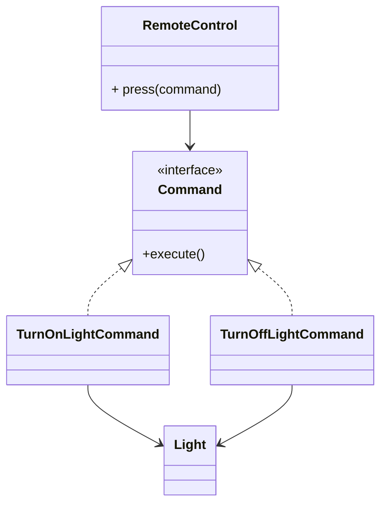

### 🔹 Java Structure

```java
interface Command { void execute(); }

class Light { void turnOn() { ... } }

class TurnOnLightCommand implements Command {
    private final Light light;
    public void execute() { light.turnOn(); }
}
```

### 🔹 How My Implementation Works

This repo has:

- `designpattern.tier2.CommandPatternExample.Command`
- `Light`
- `TurnOnLightCommand`
- `TurnOffLightCommand`
- `RemoteControl`

The invoker is:

```java
RemoteControl remote = new RemoteControl();
remote.press(new TurnOnLightCommand(light));
remote.press(new TurnOffLightCommand(light));
```

The command object wraps the operation and isolates the caller from the receiver details.

### 🔹 Real-World Analogy

Think of a remote control. You press a button, but the remote does not care exactly how the device turns on or off. It just invokes the command it represents.

### 🔹 When Should I Use It?

Use Command when:

- operations should be queued or logged
- you need undo/redo or deferred execution
- you want to decouple sender and receiver

### 🔹 When Should I NOT Use It?

Do not use it when:

- the operation is simple and direct
- a method call is clearer than a full command object

### 🔹 Interview Recognition

Look for:

- “request object”
- “queue/schedule/undo”
- “invoker and receiver separated”
- “execute() method”

### 🔹 Advantages

- Decouples sender from receiver
- Easy to queue and log actions
- Supports undo/redo patterns

### 🔹 Disadvantages

- One class per task can increase code volume
- Can be overkill for simple operations

### 🔹 Common Interview Mistakes

- Confusing Command with Strategy
- Forgetting that the command encapsulates a request, not just a behavior selection
- Ignoring the invoker/receiver separation

### 🔹 Related Patterns

- Command vs Strategy
  - Strategy chooses behavior used directly by the client.
  - Command encapsulates a task as an object that may be queued, logged, or delayed.

### 🔹 30-Second Interview Answer

> Command pattern wraps an operation in a command object so the caller invokes a uniform interface instead of directly calling the receiver. This decouples the sender from the executor and enables features like queuing, logging, and undo/redo. It is useful when requests should be treated as objects rather than direct method calls.

---

## 17. Chain of Responsibility Pattern

### 🔹 Intent

Pass a request through a chain of handlers until one of them processes it.

### 🔹 Example

Example: an expense request is approved by the team lead up to 1000, then by a manager up to 10000, and otherwise escalates further.

### 🔹 The Problem

Multiple handlers might be able to process the same request, and the sender should not choose the specific handler directly.

### 🔹 The Core Idea

Each handler decides whether it can handle the request or forwards it to the next link in the chain.

### 🔹 Structure / Diagram

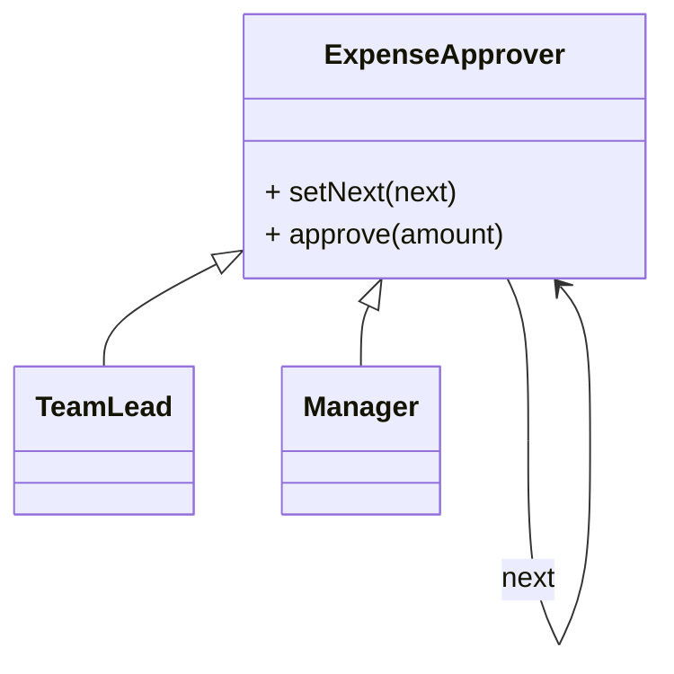

### 🔹 Java Structure

```java
abstract class ExpenseApprover {
    private ExpenseApprover next;
    public ExpenseApprover setNext(ExpenseApprover next) { this.next = next; return next; }

    public void approve(double amount) {
        if (canApprove(amount)) { ... }
        else if (next != null) { next.approve(amount); }
    }
}
```

### 🔹 How My Implementation Works

This repo has:

- `designpattern.tier3.ChainOfResponsibilityPatternExample.ExpenseApprover`
- `TeamLead`
- `Manager`

The chain is built like this:

```java
ExpenseApprover teamLead = new TeamLead();
teamLead.setNext(new Manager());
```

Then approval flows through the chain until a handler accepts it or the request falls through.

### 🔹 Real-World Analogy

Think of expense approval in a company. A small expense might be approved by a team lead, a larger one by a manager, and a very large one by a board or finance team.

### 🔹 When Should I Use It?

Use Chain of Responsibility when:

- multiple handlers may process the same request
- the sender should not know the exact handler
- the logic is naturally a sequence of approvals, checks, or filters

### 🔹 When Should I NOT Use It?

Do not use it when:

- there is only one clear handler
- a simple conditional or direct call is enough
- the chain would be too long and hard to reason about

### 🔹 Interview Recognition

Look for:

- “pass through multiple handlers”
- “approval, authorization, filters, routing”
- “next in chain”
- “sender doesn’t know which handler handles it”

### 🔹 Advantages

- Loose coupling between sender and handler
- Flexible chain composition
- Easy to add or reorder handlers

### 🔹 Disadvantages

- Request may fall through without being handled
- Debugging can be harder when the chain is long

### 🔹 Common Interview Mistakes

- Forgetting that the sender does not explicitly select the handler
- Confusing chain-of-responsibility with an if-else chain
- Not explaining the `next` pointer or chain order

### 🔹 Related Patterns

- Chain of Responsibility vs Decorator
  - Chain passes requests forward to determine handling.
  - Decorator wraps an object to add behavior around it.

### 🔹 30-Second Interview Answer

> Chain of Responsibility passes a request through a sequence of handlers until one of them can handle it. This decouples the requester from specific handlers and allows flexible policies like approval chains or layered filters. It is useful when a request may need multiple checks or escalations before it is accepted.

---

## 18. Iterator Pattern

### 🔹 Intent

Traverse a collection without exposing how it is stored internally.

### 🔹 Example

Example: `for (String song : playlist)` iterates through the playlist without exposing the array or index logic.

### 🔹 The Problem

Different collections may have different internal storage rules, and clients should not depend on those details.

### 🔹 The Core Idea

The collection returns an iterator that keeps the traversal state and exposes standard operations like `hasNext()` and `next()`.

### 🔹 Structure / Diagram

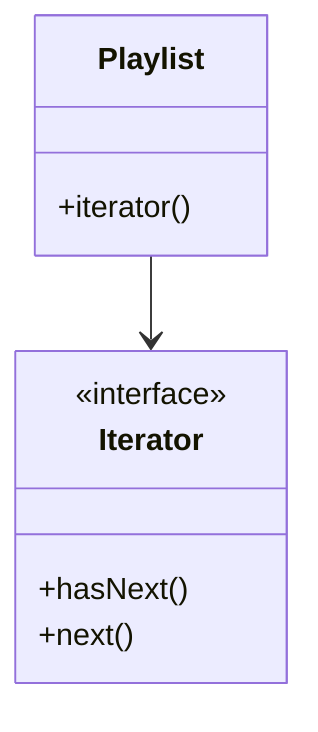

### 🔹 Java Structure

```java
class Playlist implements Iterable<String> {
    @Override
    public Iterator<String> iterator() {
        return new Iterator<String>() {
            private int index = 0;
            public boolean hasNext() { return index < songs.length; }
            public String next() { return songs[index++]; }
        };
    }
}
```

### 🔹 How My Implementation Works

This repository contains:

- `designpattern.tier3.IteratorPatternExample.Playlist`
- `Iterable<String>`

The example uses Java’s enhanced loop:

```java
for (String song : playlist) {
    System.out.println(song);
}
```

The traversal logic is hidden inside the iterator implementation, so the client operates on the collection interface without knowing the storage structure.

### 🔹 Real-World Analogy

Think of reading the songs in a playlist. You do not care how the playlist is stored internally; you just iterate through it in order.

### 🔹 When Should I Use It?

Use Iterator when:

- you want a standard traversal API for a custom collection
- you need to hide storage details from clients
- multiple collection types share one traversal style

### 🔹 When Should I NOT Use It?

Do not use it when:

- the collection is simple and a built-in Java collection is enough
- you are not traversing data abstractly at all

### 🔹 Interview Recognition

Look for:

- “iterate through elements”
- “hasNext/next”
- “do not expose internal representation”
- “custom collection”

### 🔹 Advantages

- Uniform traversal API
- Encapsulates internal collection structure
- Reduces client coupling to storage details

### 🔹 Disadvantages

- Some extra code for custom iterators
- Not needed for built-in collections when a simple loop is enough

### 🔹 Common Interview Mistakes

- Confusing an iterator with a for-each loop itself
- Forgetting that the iterator owns traversal state
- Thinking Iterator is only for arrays

### 🔹 Related Patterns

- Iterator vs Composite
  - Iterator is about traversal.
  - Composite is about tree structure and uniform operations.

### 🔹 30-Second Interview Answer

> Iterator provides a standard way to traverse a collection without exposing its internal storage design. It keeps track of the current position and lets the client use a consistent `hasNext()/next()` interface. This is useful when collections vary in implementation but need the same traversal behavior.

---

## 19. Mediator Pattern

### 🔹 Intent

Centralize communication between multiple related objects so they do not directly depend on each other.

### 🔹 Example

Example: in a chat room, Alice sends a message to the `ChatRoom`, and the mediator delivers it to Bob and Charlie without direct peer-to-peer messaging.

### 🔹 The Problem

When many objects talk to one another, the communication logic becomes complex and tightly coupled.

### 🔹 The Core Idea

A mediator sits between colleagues and directs their communication.

### 🔹 Structure / Diagram

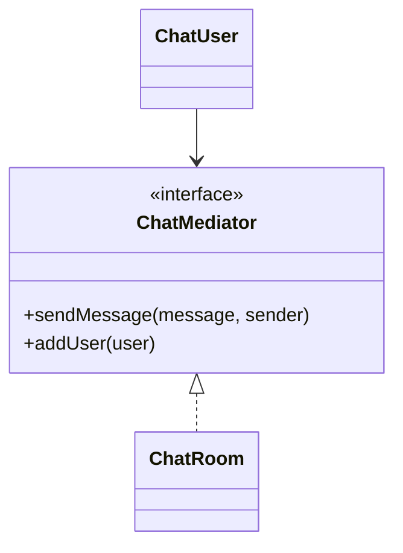

### 🔹 Java Structure

```java
interface ChatMediator {
    void sendMessage(String message, ChatUser sender);
    void addUser(ChatUser user);
}

class ChatRoom implements ChatMediator {
    private List<ChatUser> users = new ArrayList<>();
    public void sendMessage(String message, ChatUser sender) {
        for (ChatUser user : users) {
            if (user != sender) user.receiveMessage(message);
        }
    }
}
```

### 🔹 How My Implementation Works

This repo uses:

- `designpattern.tier3.MediatorPatternExample.ChatMediator`
- `ChatRoom`
- `ChatUser`

The flow is:

```java
ChatMediator chatRoom = new ChatRoom();
ChatUser alice = new ChatUser("Alice", chatRoom);
ChatUser bob = new ChatUser("Bob", chatRoom);
chatRoom.addUser(alice);
chatRoom.addUser(bob);
alice.sendMessage("Hello everyone!");
```

The `ChatRoom` mediates the exchange between users. They do not talk directly to one another.

### 🔹 Real-World Analogy

Think of a group chat room. Every participant sends messages to the room, and the room delivers them to the others.

### 🔹 When Should I Use It?

Use Mediator when:

- many objects depend on each other for communication
- direct object-to-object links are becoming difficult to manage
- a central coordinator makes sense

### 🔹 When Should I NOT Use It?

Do not use it when:

- there are only a few objects and direct communication is simple
- the mediator would become a giant “god class” with too much logic

### 🔹 Interview Recognition

Look for:

- “central hub”
- “many-to-many communication”
- “messages routed through one object”
- “reduce direct dependencies”

### 🔹 Advantages

- Reduced object coupling
- Cleaner communication logic
- Easier to change or extend communication rules

### 🔹 Disadvantages

- Mediator can become complex over time
- Centralized logic can become a bottleneck or monolith

### 🔹 Common Interview Mistakes

- Using Mediator when a simpler direct relationship would do
- Forgetting that the mediator is a central orchestrator
- Thinking it is just another version of Observer

### 🔹 Related Patterns

- Observer vs Mediator
  - Observer is about publisher-subscriber broadcast.
  - Mediator is about many objects interacting through one coordinator.

### 🔹 30-Second Interview Answer

> Mediator centralizes communication between related objects, reducing direct coupling and making interactions easier to manage. Instead of every object talking to every other object, they talk through a mediator. This is helpful in complex systems like chat rooms, UI dialogs, or coordination logic where many components depend on each other.

---

# Pattern Comparison Sections

## Factory vs Abstract Factory

| Aspect | Factory | Abstract Factory |
|---|---|---|
| Goal | Create one product | Create a family of related products |
| Typical output | `Vehicle` | `Button` + `CheckBox` |
| Client dependency | Product interface | Abstract factory + product interfaces |
| Best for | One type of object creation | Theme/platform-specific product families |

## Factory vs Builder

| Aspect | Factory | Builder |
|---|---|---|
| Purpose | Select and create product | Assemble complex object step by step |
| Construction | Typically one call | Many configuration steps |
| Use case | Product selection | Large or optional object creation |

## Builder vs Prototype

| Aspect | Builder | Prototype |
|---|---|---|
| Starts from | Empty object | Existing object |
| Main operation | Build | Copy |
| Ideal when | Many optional params | cloning configured objects is cheap |

## Adapter vs Facade

| Aspect | Adapter | Facade |
|---|---|---|
| Main goal | Make interfaces compatible | Simplify a complex subsystem |
| Change | Converts interface | Hides complexity |
| Works with | Incompatible existing APIs | Existing subsystem orchestration |

## Adapter vs Decorator

| Aspect | Adapter | Decorator |
|---|---|---|
| Purpose | Match interfaces | Add responsibilities |
| Target | Compatibility | Behavior enhancement |
| Shape of object | Wraps to provide new API | Wraps to augment behavior |

## Decorator vs Proxy

| Aspect | Decorator | Proxy |
|---|---|---|
| Add behavior? | Yes | Usually no, but controls access |
| Main purpose | Enhance object | Protect or mediate access |
| Typical use | Logging, features, wrappers | Authorization, lazy loading, caching |

## Facade vs Mediator

| Aspect | Facade | Mediator |
|---|---|---|
| Main goal | Hide subsystem complexity | Coordinate object-to-object communication |
| Scope | One subsystem | Many interacting colleagues |

## Strategy vs State

| Aspect | Strategy | State |
|---|---|---|
| Intent | Encapsulate interchangeable algorithms | Represent internal modes of a context |
| Who chooses change? | Client or caller | Context transitions internally |
| Typical use case | Payment methods, routing | Vending machine, order lifecycle |
| Interview clue | “Multiple algorithms” | “Finite states” |

## Strategy vs Template Method

| Aspect | Strategy | Template Method |
|---|---|---|
| Variation | Composition-based | Inheritance-based |
| Main idea | Choose algorithm dynamically | Fixed process, customizable steps |

## Observer vs Mediator

| Aspect | Observer | Mediator |
|---|---|---|
| Relationship | Subject and listeners | Colleagues and mediator |
| Communication | Broadcast to subscribers | Central router |
| Main issue solved | Notify many | Reduce direct coupling |

## Chain of Responsibility vs Decorator

| Aspect | Chain of Responsibility | Decorator |
|---|---|---|
| Main goal | Request handling across chain | Add behavior around an object |
| Flow | Forward until handled | Wrap and delegate |

## Command vs Strategy

| Aspect | Command | Strategy |
|---|---|---|
| Encapsulates | Request/task | Algorithm/behavior |
| Typical use | Queue, undo, execute later | Runtime algorithm selection |

## Command vs Memento

| Aspect | Command | Memento |
|---|---|---|
| Role | Encapsulates operation | Captures state snapshot |
| Common use | Undo/redo actions | Restore previous state |

## Singleton vs Dependency Injection

| Aspect | Singleton | DI |
|---|---|---|
| Lifecycle | Global single instance | Managed by caller/container |
| Testability | Often weaker | Usually better |
| Best for | Truly unique shared resources | Most application services |

---

# How to Identify the Pattern in an Interview

| Interview Scenario | Pattern to Consider | Why |
|---|---|---|
| Multiple interchangeable algorithms | Strategy | Same operation can be implemented in different ways |
| Object creation is complex | Factory / Builder | Creation logic should be centralized or stepwise |
| Need to notify many objects | Observer | One event should update many listeners |
| Need to add behavior without modifying class | Decorator | Wrap object and augment behavior |
| Need to convert incompatible interfaces | Adapter | Bridge mismatched interfaces |
| Need to simplify a complex subsystem | Facade | One interface hides low-level work |
| Request should pass through multiple handlers | Chain of Responsibility | Not all handlers are equal; chain decides |
| Need to encapsulate a request as an object | Command | Requests are treated as objects |
| Object has many internal modes | State | Behavior changes with state |
| Need to treat a tree uniformly | Composite | Leaf and group share one interface |
| Need to control access to a resource | Proxy | Stand-in object controls visibility or access |
| Need one global object | Singleton | Only one instance is allowed |

> Interview tip: these are not absolute rules. Requirements matter. A system may appear to use one pattern, but if the actual need is different, the real design may differ.

---

# Design Patterns in LLD Questions

Low-level design interviews often embed a pattern in a real domain. The key is not to force the pattern, but to recognize when the requirement fits.

| LLD Problem | Possible Patterns | Why |
|---|---|---|
| Parking Lot | Factory, Strategy | Vehicle types and pricing/slot selection |
| Snake & Ladder | Strategy, Factory | Dice behavior and game entities |
| Tic Tac Toe | Strategy, Factory | Player creation and move logic |
| Elevator System | Strategy, State, Observer | Elevator mode and updates |
| Scheduling / Task Runner | Strategy, Factory | Different task execution strategies |
| Payment System | Strategy, Factory | Payment method selection |
| Notification System | Observer, Strategy, Factory | Channels and event notifications |
| Vending Machine | State, Factory | States and item creation |
| Logger | Chain of Responsibility, Singleton | Multiple log sinks and global logger |
| ATM | State, Strategy | Different ATM states and operations |
| Chess | Strategy, Factory | Piece movement and creation |

> Important: Do not force a pattern into a problem just because it is popular. Ask: “Does the requirement truly need this structure?” If the answer is no, a different design may be cleaner.

---

# Quick Revision Cheat Sheet

| Pattern | Category | Core Problem | Core Idea | Interview Trigger |
|---|---|---|---|---|
| Singleton | Creational | One shared instance | Global access through one instance | “Only one instance” |
| Factory | Creational | Hide object creation decisions | Return common product type | “Create based on type” |
| Factory Method | Creational | Vary object creation by subclass | Subclass chooses concrete product | “Workflow fixed, object varies” |
| Abstract Factory | Creational | Create related families | Return a family of related objects | “Theme/platform family” |
| Builder | Creational | Many optional fields | Step-by-step assembly | “Long constructor/list of params” |
| Prototype | Creational | Replace expensive re-creation | Clone/configure existing instance | “copy existing object” |
| Adapter | Structural | Incompatible interfaces | Wrap to expose needed interface | “different API” |
| Decorator | Structural | Add responsibilities dynamically | Wrap object with extra behavior | “stack features dynamically” |
| Facade | Structural | Simplify subsystem usage | One interface over many classes | “complex operations behind a simple API” |
| Composite | Structural | Treat tree uniformly | Common interface for nodes and groups | “tree/hierarchy” |
| Proxy | Structural | Control access | Stand-in for protected or remote object | “security/lazy loading” |
| Strategy | Behavioral | Interchangeable algorithms | Encapsulate behavior behind interface | “multiple algorithms” |
| Observer | Behavioral | Notify many dependents | Subject broadcasts to subscribers | “publish/subscribe” |
| State | Behavioral | Object behaves based on state | State object delegates behavior | “finite states” |
| Template Method | Behavioral | Shared algorithm skeleton | Fixed order, customize steps | “same process, different steps” |
| Command | Behavioral | Represent actions as objects | Invoker calls command object | “queue/undo/execute later” |
| Chain of Responsibility | Behavioral | Multiple handlers available | Forward request until handled | “approval chain/filter chain” |
| Iterator | Behavioral | Standard traversal | Separate traversal state from collection | “iterate without exposing internals” |
| Mediator | Behavioral | Complex object communication | Central communication coordinator | “many objects talk to each other” |

> Patterns marked as “not implemented in this repository” are intentionally omitted here because this project’s actual examples are the main source of truth.

---

# How to Prepare Design Patterns for Interviews

### Level 1 — Understand

For each pattern, be able to answer:

1. What problem does it solve?
2. What is the core idea?
3. Which classes participate?
4. How do objects interact?
5. What are the tradeoffs?

### Level 2 — Implement

Without looking at the code, you should be able to write a minimal version from scratch for:

- Strategy
- Factory
- Builder
- Observer
- Adapter
- Decorator
- Facade
- Command
- Chain of Responsibility
- State

### Level 3 — Recognize

Given a scenario, answer:

- Is there a family of related products?
- Are multiple behaviors interchangeable?
- Is there a hierarchy or tree?
- Is there a need to notify listeners?
- Is there a state machine?

### Level 4 — Explain

Practice giving a 30–60 second explanation that includes:

- intent
- why the pattern exists
- participating classes
- one real example
- tradeoffs

### Level 5 — Apply

Use patterns inside LLD problems. For example:

- Payment methods → Strategy
- Vending machine → State
- Notification service → Observer
- Order workflow with checks → Facade/Chain of Responsibility
- UI family/theme → Abstract Factory

> Interview tip: explaining when not to use a pattern is just as important as explaining when to use it.

---

## Final Interview Reminder

The best pattern explanation is not “I know the textbook definition.” The best explanation is:

- simple and concrete
- tied to a real use case
- easy to map to class relationships
- clear about responsibilities and tradeoffs

This project already gives you a strong foundation. The main job during interviews is to recognize the real need behind the pattern, not to memorize it abstractly.

---

## Repository-based pattern map

This handbook is derived from the code in this project, especially from the following implementations:

- `designpattern.tier1.SingletonPatternExample`
- `designpattern.tier1.FactoryPatternExample`
- `designpattern.tier1.FactoryMethodAbstractFactoryExample`
- `designpattern.tier1.BuilderPatternExample`
- `designpattern.tier1.ObserverPatternExample`
- `designpattern.tier1.StrategyPatternExample`
- `designpattern.tier2.DecoratorPatternExample`
- `designpattern.tier2.StatePatternExample`
- `designpattern.tier2.TemplateMethodPatternExample`
- `designpattern.tier2.CommandPatternExample`
- `designpattern.tier3.AdapterPatternExample`
- `designpattern.tier3.ChainOfResponsibilityPatternExample`
- `designpattern.tier3.CompositePatternExample`
- `designpattern.tier3.FacadePatternExample`
- `designpattern.tier3.IteratorPatternExample`
- `designpattern.tier3.MediatorPatternExample`
- `designpattern.tier3.PrototypePatternExample`
- `designpattern.tier3.ProxyPatternExample`

This list covers the design patterns actually implemented in the project’s `designpattern.*` packages.
