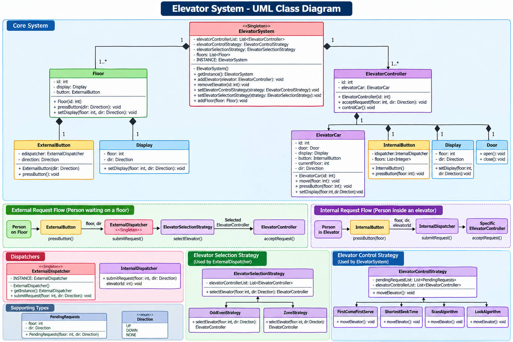

# Elevator System — Low-Level Design



## Revision Snapshot

| Lens | Recall |
| --- | --- |
| Core model | Hall call + elevator car + per-car pending stops |
| Design leverage | Selection assigns a car; control strategy orders that car's stops |
| Hard problem | Preserve direction-aware calls through faults while keeping safety independent of dispatch optimization |

## 1. Main Requirements

* Multiple floors and multiple elevators.
* User can:

  * Press **UP/DOWN** on a floor → external request.
  * Press a destination floor inside elevator → internal request.
* Elevators can be added/removed.
* Elevator selection algorithm should be replaceable.
* Elevator movement/control algorithm should also be replaceable.

---

## 2. Main Classes

#### ElevatorSystem

* Central system / **Singleton**.
* Maintains:

  * `List<ElevatorController>`
  * `List<Floor>`
  * `ElevatorSelectionStrategy`
  * `ElevatorControlStrategy`
* Adds/removes elevators and floors.
* Allows strategies to be changed dynamically.

#### ElevatorController

* One controller corresponds to one `ElevatorCar`.
* Receives a request and passes it to the selected `ElevatorControlStrategy`.

#### ElevatorCar

Represents the actual elevator.

Contains:

* `id`
* `Door`
* `Display`
* `InternalButton`
* `currentFloor`
* `Direction`

Responsibilities:

* Move to a floor.
* Accept internal button requests.
* Update display.
* Open/close door.

#### Floor

Contains:

* Floor ID
* Display
* External button

When UP/DOWN is pressed, it sends an external request.

#### Door

* `open()`
* `close()`

#### Display

Shows:

* Current floor
* Current direction (`UP`, `DOWN`, `NONE`)

---

## 3. Buttons & Dispatchers

### ExternalButton

Used by a person waiting on a floor.

```text
Floor
  ↓
ExternalButton
  ↓
ExternalDispatcher
  ↓
Select Elevator
```

### InternalButton

Used by a person inside an elevator.

```text
ElevatorCar
  ↓
InternalButton
  ↓
InternalDispatcher
  ↓
Specific ElevatorController
```

#### ExternalDispatcher

* Singleton.
* Receives an external request.
* Uses `ElevatorSelectionStrategy` to decide which elevator should handle it.
* Sends the request to that elevator's controller.

#### InternalDispatcher

* Finds the requested elevator using `elevatorId`.
* Sends the request directly to its controller.

---

## 4. Elevator Selection Strategy

This answers:

> **"Which elevator should handle this request?"**

Base class:

```text
ElevatorSelectionStrategy
        ↑
   ┌────┴─────┐
   │          │
OddEven     Zone
Strategy   Strategy
```

#### OddEvenStrategy

Conceptually assigns elevators based on odd/even elevator IDs and can consider whether the elevator is moving in the requested direction or is idle.

#### ZoneStrategy

Divides the building into zones and assigns elevators according to those zones.

**Important:** This strategy is about **choosing the elevator**, not deciding how the elevator moves.

---

## 5. Elevator Control Strategy

This answers:

> **"Once an elevator receives requests, how should it serve them?"**

```text
ElevatorControlStrategy
          ↑
 ┌────────┼───────────────┬──────────────┐
 │        │               │              │
FCFS   Shortest Seek     SCAN           LOOK
       Time
```

The controller maintains pending requests using `PendingRequests(floor, direction)`.

---

## 6. First Come First Serve — FCFS

Requests are processed in the order they arrive.

Example:

```text
Requests: 8 → 2 → 10 → 5
```

Elevator serves:

```text
8 → 2 → 10 → 5
```

#### Problem

The elevator may continuously change direction.

This can cause:

* Inefficient movement
* Higher waiting time

---

## 7. Shortest Seek Time — SST

Choose the request whose floor is **closest to the elevator's current floor**.

Example:

```text
Current floor = 5

Requests = 2, 6, 12

Distances:
2 → 3 floors
6 → 1 floor
12 → 7 floors

Next → 6
```

Usually implemented using a **Min Heap** based on distance.

#### Problem

A far-away request can suffer **starvation** if nearby requests keep arriving.

---

## 8. SCAN Algorithm

Think of SCAN like an elevator behaving like a **disk head**.

The elevator continues in one direction, serving requests along the way.

Example:

```text
Current = 5
Direction = UP

Requests:
7, 9, 12

        12 ← serve
         ↑
         9 ← serve
         ↑
         7 ← serve
         ↑
         5 ← current
```

The elevator continues toward the **end of the building**, then reverses direction.

#### Important idea

```text
UP requests   → UP array
DOWN requests → DOWN array
```

While moving UP:

* Serve UP requests.
* Continue toward the top/end.
* Then reverse.

While moving DOWN:

* Serve DOWN requests.
* Continue toward the bottom/end.
* Then reverse.

#### Advantage

* Avoids frequent direction changes.
* For a fixed, finite set of requests, a sweep eventually serves each compatible request.

#### Disadvantage

Suppose the building has 100 floors:

```text
Current = 5
Last UP request = 15
Top floor = 100
```

SCAN may still travel:

```text
5 → 7 → 10 → 15 → ... → 100
```

even though nobody requested floors after 15.

**This unnecessary movement is what LOOK improves.**

---

## 9. LOOK Algorithm

LOOK is similar to SCAN, but it **does not travel all the way to the building's end**.

Instead:

> Reverse direction when there are no more requests in the current direction.

Example:

```text
Current = 5
Direction = UP

Requests: 7, 9, 15
```

LOOK does:

```text
5 → 7 → 9 → 15
             ↓
             9 → 7 → ...
```

It reverses at **15**, because 15 is the last requested floor in that direction.

It does NOT unnecessarily travel to floor 100.

#### Typical data structures

**Min Heap**

* Requests that can be served while moving UP.

**Max Heap**

* Requests that can be served while moving DOWN.

**Queue**

* Requests that cannot currently be served in the current direction.

#### LOOK advantages

* Less unnecessary movement than SCAN.
* Avoids frequent direction changes.
* Can reduce starvation for a fixed workload, but does not guarantee a wait-time bound under continuous arrivals.
* More efficient because it travels only as far as needed by requests.

#### LOOK limitation

It does not prioritize requests based on urgency or importance.

---

## 10. SCAN vs LOOK

|                      | SCAN                      | LOOK                                    |
| -------------------- | ------------------------- | --------------------------------------- |
| Direction            | Continues to building end | Continues to last requested floor       |
| Reverses when        | End is reached            | No request remains in current direction |
| Unnecessary movement | More                      | Less                                    |
| Starvation           | No guaranteed wait bound under continuous arrivals | No guaranteed wait bound under continuous arrivals |
| Main idea            | Full sweep                | Request-based sweep                     |

#### Easy way to remember

**SCAN:**

> "I'll go all the way to the end, then come back."

**LOOK:**

> "I'll go only until the last request, then come back."

---

## 11. Overall Request Flow

#### External request

```text
Floor
 ↓
ExternalButton
 ↓
ExternalDispatcher
 ↓
ElevatorSelectionStrategy
 ↓
Selected ElevatorController
 ↓
ElevatorControlStrategy
 ↓
ElevatorCar
 ↓
Move + Door + Display
```

#### Internal request

```text
ElevatorCar
 ↓
InternalButton
 ↓
InternalDispatcher
 ↓
Specific ElevatorController
 ↓
ElevatorControlStrategy
 ↓
ElevatorCar
```

---

## 12. Design Patterns

#### Singleton

Used for centralized objects such as:

* `ElevatorSystem`
* `ExternalDispatcher`

Singleton is optional, not a requirement of dispatch. Prefer one dispatcher per `ElevatorSystem`, injected into buttons/controllers; a process-wide singleton complicates multiple buildings, tests, and lifecycle management. An internal dispatcher can be shared per system or omitted when each car already holds its controller reference.

#### Strategy Pattern

Used at two different levels:

**1. Elevator Selection**

```text
ElevatorSelectionStrategy
→ OddEvenStrategy
→ ZoneStrategy
```

**2. Elevator Control**

```text
ElevatorControlStrategy
→ FCFS
→ ShortestSeekTime
→ SCAN
→ LOOK
```

This makes the algorithms **interchangeable without changing the main elevator classes**.

---

### Interview One-Liner

> "I separate **which elevator to select** from **how that elevator should move** using two Strategy hierarchies. External requests go through the selection strategy, while the selected elevator processes pending requests using a control strategy such as FCFS, SST, SCAN, or LOOK."

---

## 13. Staff-Level Deep Dive: Dispatch Is Not Safety

Keep the optimizer out of the safety path. Dispatch strategies may estimate arrival time, load, direction, zone, and fairness; independent safety controllers must enforce door interlocks, overspeed protection, braking, overload limits, and fault handling. A strategy bug may make service inefficient, but it must never make unsafe motion possible.

Treat a hall call as `(floor, requestedDirection)` and an in-car destination as a distinct request. Coalesce duplicate hall calls, but do not merge opposite directions: a car passing floor 8 while moving UP has not necessarily served a DOWN call at floor 8. When an elevator becomes unavailable, reassign its unserved hall calls and preserve their original wait timestamps.

Evaluate dispatch using p95/p99 wait time, maximum wait, stops per trip, energy, and reassignment rate. Average wait alone can hide a small group waiting indefinitely. SCAN/LOOK describe movement order; neither, by itself, is a fairness or latency guarantee for an online workload.
