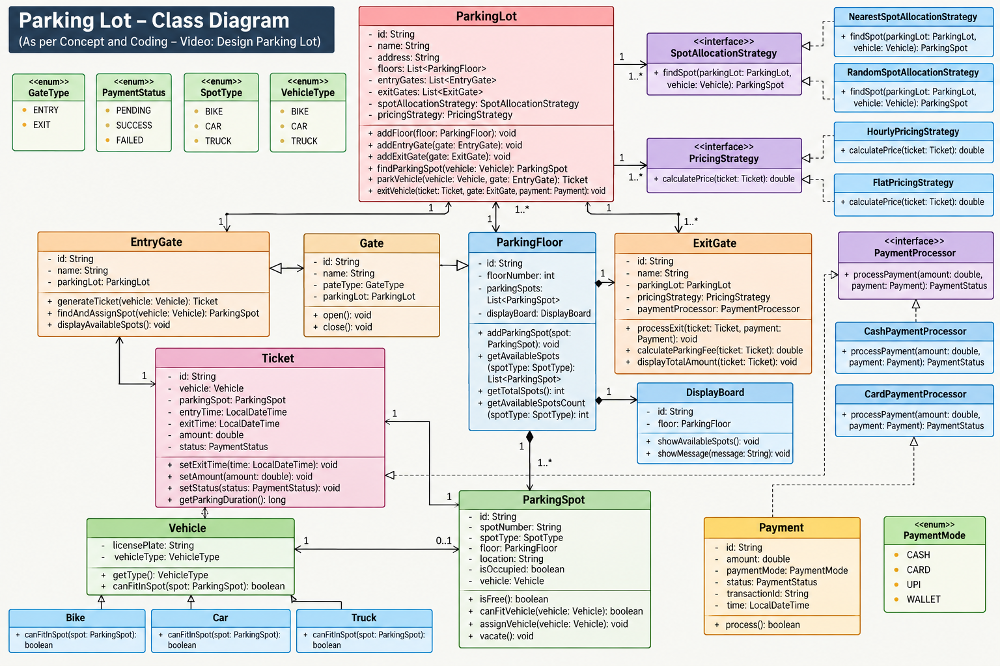

# Parking Lot — Low-Level Design



## 1. Problem Understanding

We need to design a parking-lot system that can:

* Support multiple parking floors.
* Support different types of vehicles.
* Assign an appropriate parking spot to a vehicle.
* Generate a parking ticket at entry.
* Track the vehicle and its parking spot.
* Display available parking spots.
* Calculate parking charges at exit.
* Process payments.
* Support different pricing strategies.
* Support different parking-spot allocation strategies.
* Support multiple entry and exit gates.

The important design goal is **extensibility**.

For example, adding:

* a new vehicle type,
* a new pricing model,
* a new payment processor,
* a new parking-spot allocation algorithm

should require minimal changes to existing code.

---

# 2. High-Level Architecture

The system can be viewed as:

```text
                         ParkingLot
                              |
              +---------------+---------------+
              |               |               |
        ParkingFloor      EntryGate        ExitGate
              |
        ParkingSpot
              |
           Vehicle


Entry Flow:

Vehicle
   ↓
EntryGate
   ↓
Find ParkingSpot
   ↓
SpotAllocationStrategy
   ↓
ParkingSpot
   ↓
Ticket
   ↓
Vehicle enters


Exit Flow:

Vehicle
   ↓
Ticket
   ↓
ExitGate
   ↓
PricingStrategy
   ↓
Calculate Amount
   ↓
Payment
   ↓
PaymentProcessor
   ↓
Free ParkingSpot
```

---

# 3. Core Classes

## ParkingLot

`ParkingLot` is the main aggregate/root object.

### Responsibilities

* Maintain parking floors.
* Maintain entry gates.
* Maintain exit gates.
* Find an appropriate parking spot.
* Add/remove floors and gates.
* Coordinate vehicle entry and exit.
* Maintain parking allocation strategy.
* Maintain pricing strategy.

### Important fields

```java
class ParkingLot {

    String id;
    String name;
    String address;

    List<ParkingFloor> floors;

    List<EntryGate> entryGates;
    List<ExitGate> exitGates;

    SpotAllocationStrategy spotAllocationStrategy;
    PricingStrategy pricingStrategy;
}
```

### Important methods

```java
addFloor(ParkingFloor floor)
addEntryGate(EntryGate gate)
addExitGate(ExitGate gate)

findParkingSpot(Vehicle vehicle)

parkVehicle(Vehicle vehicle,
            Gate entryGate): Ticket

exitVehicle(Ticket ticket,
            ExitGate gate,
            Payment payment)
```

### Design observation

`ParkingLot` coordinates the system but should **not implement every algorithm itself**.

For example:

```java
findParkingSpot()
```

should delegate to:

```java
SpotAllocationStrategy
```

Similarly, pricing should delegate to:

```java
PricingStrategy
```

This prevents `ParkingLot` from becoming a huge God class.

---

# 4. ParkingFloor

Represents one floor of the parking lot.

```java
class ParkingFloor {

    String id;
    int floorNumber;

    List<ParkingSpot> parkingSpots;

    DisplayBoard displayBoard;
}
```

### Responsibilities

* Maintain parking spots on the floor.
* Add parking spots.
* Find available spots.
* Count available spots.
* Update/display parking availability.

### Methods

```java
addParkingSpot(ParkingSpot spot)

getAvailableSpots(SpotType spotType)

getTotalSpots()

getAvailableSpotsCount(SpotType spotType)
```

### Relationship

```text
ParkingLot
    |
    | 1
    |
    | 1..*
    ↓
ParkingFloor
```

One parking lot contains multiple floors.

---

# 5. ParkingSpot

Represents an individual parking space.

```java
class ParkingSpot {

    String id;
    String spotNumber;

    SpotType spotType;

    ParkingFloor floor;

    String location;

    boolean isOccupied;

    Vehicle vehicle;
}
```

### Responsibilities

* Know whether the spot is free.
* Know which vehicle occupies it.
* Validate whether a vehicle can fit.
* Assign a vehicle.
* Release the spot.

### Methods

```java
isFree()

canFitVehicle(Vehicle vehicle)

assignVehicle(Vehicle vehicle)

vacate()
```

---

# 6. SpotType

An enum describing the type of parking spot.

```java
enum SpotType {
    BIKE,
    CAR,
    TRUCK
}
```

Depending on the implementation, this can be extended with:

```text
COMPACT
LARGE
HANDICAPPED
ELECTRIC
...
```

### Why enum?

Because spot types are a fixed set of known categories.

---

# 7. Vehicle

`Vehicle` represents a vehicle entering the parking lot.

```java
class Vehicle {

    String licensePlate;

    VehicleType vehicleType;
}
```

### Methods

```java
getType()

canFitInSpot(ParkingSpot spot)
```

The base class contains common vehicle information.

---

# 8. Vehicle Inheritance

Different vehicles can have different parking requirements.

```text
                 Vehicle
                    ▲
          ┌─────────┼─────────┐
          │         │         │
        Bike       Car      Truck
```

### Bike

```java
class Bike extends Vehicle {

    canFitInSpot(ParkingSpot spot)
}
```

### Car

```java
class Car extends Vehicle {

    canFitInSpot(ParkingSpot spot)
}
```

### Truck

```java
class Truck extends Vehicle {

    canFitInSpot(ParkingSpot spot)
}
```

---

# 9. Why Vehicle Uses Inheritance?

Suppose:

```java
vehicle.canFitInSpot(spot);
```

The caller does not need to know whether the vehicle is a:

```text
Bike
Car
Truck
```

Polymorphism determines the correct behavior.

For example:

```java
Vehicle vehicle = new Car();

vehicle.canFitInSpot(spot);
```

The `Car` implementation is executed.

This follows the **Open/Closed Principle** better than writing:

```java
if (vehicleType == BIKE) {
    ...
} else if (vehicleType == CAR) {
    ...
} else if (vehicleType == TRUCK) {
    ...
}
```

everywhere.

---

# 10. Gate

`Gate` represents common functionality/properties of parking gates.

```java
class Gate {

    String id;
    String name;

    GateType gateType;

    ParkingLot parkingLot;
}
```

### Common methods

```java
open()
close()
```

---

# 11. Gate Inheritance

```text
                 Gate
                  ▲
             ┌────┴────┐
             │         │
         EntryGate   ExitGate
```

This is useful because entry and exit gates share common properties but have different responsibilities.

---

# 12. EntryGate

The entry gate handles vehicle entry.

```java
class EntryGate extends Gate {

    Ticket generateTicket(Vehicle vehicle)

    ParkingSpot findAndAssignSpot(Vehicle vehicle)

    void displayAvailableSpots()
}
```

### Entry flow

```text
Vehicle arrives
      ↓
EntryGate
      ↓
Find suitable spot
      ↓
Assign spot
      ↓
Generate ticket
      ↓
Vehicle enters
```

---

# 13. ExitGate

The exit gate handles vehicle exit.

```java
class ExitGate extends Gate {

    void processExit(Ticket ticket, Payment payment)

    double calculateParkingFee(Ticket ticket)

    void displayTotalAmount(Ticket ticket)
}
```

### Exit flow

```text
Vehicle arrives at ExitGate
          ↓
Read Ticket
          ↓
Calculate duration
          ↓
Calculate parking fee
          ↓
Process payment
          ↓
Free parking spot
          ↓
Vehicle exits
```

---

# 14. Why Separate EntryGate and ExitGate?

Entry and exit have fundamentally different workflows.

### Entry

```text
Find spot
Assign spot
Generate ticket
```

### Exit

```text
Calculate fee
Process payment
Release spot
```

Putting everything into `Gate` would make the base class unnecessarily large.

This is an example of keeping classes focused on their responsibilities.

---

# 15. Ticket

A ticket represents a parking session.

```java
class Ticket {

    String id;

    Vehicle vehicle;

    ParkingSpot parkingSpot;

    LocalDateTime entryTime;
    LocalDateTime exitTime;

    double amount;

    PaymentStatus status;
}
```

### Responsibilities

* Track the vehicle.
* Track the assigned parking spot.
* Record entry time.
* Record exit time.
* Store parking amount.
* Store payment status.

### Methods

```java
setExitTime(LocalDateTime time)

setAmount(double amount)

setStatus(PaymentStatus status)

getParkingDuration()
```

---

# 16. Why Ticket Is Important

The ticket acts as the link between:

```text
Vehicle
   ↓
ParkingSpot
   ↓
Parking Session
   ↓
Payment
```

At entry:

```text
Ticket created
entryTime = current time
parkingSpot = assigned spot
vehicle = current vehicle
```

At exit:

```text
exitTime = current time

duration =
    exitTime - entryTime

amount =
    pricingStrategy.calculatePrice(ticket)
```

---

# 17. Payment

Represents a payment transaction.

```java
class Payment {

    String id;

    double amount;

    PaymentMode paymentMode;

    PaymentStatus status;

    String transactionId;

    LocalDateTime time;
}
```

### Method

```java
process()
```

---

# 18. PaymentMode

```java
enum PaymentMode {

    CASH,
    CARD,
    UPI,
    WALLET
}
```

This makes adding another supported payment mode straightforward.

---

# 19. PaymentStatus

```java
enum PaymentStatus {

    PENDING,
    SUCCESS,
    FAILED
}
```

Typical lifecycle:

```text
PENDING
   |
   +----> SUCCESS
   |
   +----> FAILED
```

---

# 20. PaymentProcessor

Payment processing is separated behind an interface.

```java
interface PaymentProcessor {

    PaymentStatus processPayment(
        double amount,
        Payment payment
    );
}
```

This is a very important design decision.

---

# 21. Payment Processor Implementations

```text
             PaymentProcessor
                    ▲
             ┌──────┴──────┐
             │             │
     CashPaymentProcessor  CardPaymentProcessor
```

Example:

```java
class CashPaymentProcessor
        implements PaymentProcessor {

    PaymentStatus processPayment(
        double amount,
        Payment payment
    ) {
        ...
    }
}
```

and:

```java
class CardPaymentProcessor
        implements PaymentProcessor {

    PaymentStatus processPayment(
        double amount,
        Payment payment
    ) {
        ...
    }
}
```

---

# 22. Why PaymentProcessor Is an Interface?

Without an interface, the exit gate might contain:

```java
if (paymentMode == CASH) {
    ...
}
else if (paymentMode == CARD) {
    ...
}
else if (paymentMode == UPI) {
    ...
}
```

This becomes difficult to maintain.

With an interface:

```java
PaymentProcessor processor;
```

we can inject the appropriate implementation.

```text
ExitGate
   |
   ↓
PaymentProcessor
   |
   ├── CashPaymentProcessor
   ├── CardPaymentProcessor
   └── UPIPaymentProcessor
```

Adding UPI doesn't require changing the existing processors.

---

# 23. PricingStrategy

Parking charges can change depending on business requirements.

Therefore pricing is modeled as a strategy.

```java
interface PricingStrategy {

    double calculatePrice(Ticket ticket);
}
```

---

# 24. Pricing Implementations

```text
             PricingStrategy
                   ▲
             ┌─────┴─────┐
             │           │
     HourlyPricing     FlatPricing
```

### Hourly

```java
class HourlyPricingStrategy
        implements PricingStrategy {

    double calculatePrice(Ticket ticket) {
        ...
    }
}
```

### Flat

```java
class FlatPricingStrategy
        implements PricingStrategy {

    double calculatePrice(Ticket ticket) {
        ...
    }
}
```

---

# 25. Why PricingStrategy?

Suppose today the parking lot charges:

```text
₹50/hour
```

Tomorrow the business changes it to:

```text
First 2 hours → ₹50
Next 3 hours → ₹30/hour
After 5 hours → ₹20/hour
```

Or:

```text
Weekend → different pricing
```

Or:

```text
Electric vehicle → discounted pricing
```

We should not modify `ParkingLot`, `ExitGate`, or `Ticket`.

Instead:

```text
PricingStrategy
       |
       +── HourlyPricingStrategy
       |
       +── FlatPricingStrategy
       |
       +── WeekendPricingStrategy
       |
       +── EVDiscountPricingStrategy
```

This is the **Strategy Design Pattern**.

---

# 26. SpotAllocationStrategy

The system also needs to decide **which available parking spot should be assigned**.

```java
interface SpotAllocationStrategy {

    ParkingSpot findSpot(
        ParkingLot parkingLot,
        Vehicle vehicle
    );
}
```

---

# 27. Allocation Implementations

```text
             SpotAllocationStrategy
                      ▲
                ┌─────┴──────┐
                │            │
         NearestSpot      RandomSpot
```

### Nearest Spot

```java
class NearestSpotAllocationStrategy
        implements SpotAllocationStrategy {

    ParkingSpot findSpot(
        ParkingLot parkingLot,
        Vehicle vehicle
    ) {
        ...
    }
}
```

### Random Spot

```java
class RandomSpotAllocationStrategy
        implements SpotAllocationStrategy {

    ParkingSpot findSpot(
        ParkingLot parkingLot,
        Vehicle vehicle
    ) {
        ...
    }
}
```

---

# 28. Why SpotAllocationStrategy?

Consider different parking businesses.

One may want:

```text
Nearest available spot
```

Another may want:

```text
Random spot
```

Another may want:

```text
Nearest spot to elevator
```

Another may want:

```text
Spot on lowest floor
```

Another may want:

```text
Reserve premium spots for premium users
```

All of these can be implemented independently.

---

# 29. DisplayBoard

A floor can have a display board showing availability.

```java
class DisplayBoard {

    String id;

    ParkingFloor floor;

    void showAvailableSpots()

    void showMessage(String message)
}
```

Example:

```text
-------------------------
 PARKING FLOOR 2
-------------------------

Bike : 10
Car  : 23
Truck: 4

-------------------------
```

The display board depends on parking-floor information but doesn't need to control parking allocation.

---

# 30. Complete Relationship Structure

The main relationships can be visualized as:

```text
                         ParkingLot
                              |
                 +------------+------------+
                 |            |            |
                 ↓            ↓            ↓
          ParkingFloor   EntryGate     ExitGate
                 |
                 |
                 ↓
           ParkingSpot
                 |
                 ↓
              Vehicle


EntryGate
    |
    ↓
  Ticket
    |
    +----------→ Vehicle
    |
    +----------→ ParkingSpot


ExitGate
    |
    +----------→ Ticket
    |
    +----------→ PricingStrategy
    |
    +----------→ PaymentProcessor
                     |
              +------+------+
              ↓             ↓
           Cash           Card
```

---

# 31. Composition vs Association

This is an important interview topic.

## ParkingLot → ParkingFloor

A parking lot owns its floors.

Conceptually:

```text
ParkingLot ◆──── ParkingFloor
```

If the parking lot is destroyed, its floors are generally part of that parking lot.

Similarly:

```text
ParkingFloor ◆──── ParkingSpot
```

A parking spot belongs to a particular floor.

---

# 32. Strategy Relationship

`ParkingLot` uses:

```java
SpotAllocationStrategy
PricingStrategy
```

This is generally better represented as **dependency/association**, not inheritance.

```text
ParkingLot
    |
    +----> SpotAllocationStrategy
    |
    +----> PricingStrategy
```

ParkingLot **has a strategy**, but it is not a strategy.

---

# 33. Inheritance vs Composition

### Inheritance

Used where there is a genuine **is-a** relationship.

```text
Car IS-A Vehicle
Bike IS-A Vehicle
Truck IS-A Vehicle

EntryGate IS-A Gate
ExitGate IS-A Gate
```

### Composition / Association

Used for **has-a / uses-a** relationships.

```text
ParkingLot HAS ParkingFloor

ParkingFloor HAS ParkingSpot

ParkingFloor HAS DisplayBoard

ParkingLot USES PricingStrategy

ParkingLot USES SpotAllocationStrategy

ExitGate USES PaymentProcessor
```

---

# 34. Complete Entry Flow

Let's walk through the system as an interviewer would expect.

### Step 1

Vehicle arrives.

```java
Vehicle vehicle = new Car(...);
```

### Step 2

Vehicle reaches:

```java
EntryGate
```

### Step 3

Entry gate asks the parking lot to find a spot.

```java
parkingLot.findParkingSpot(vehicle);
```

### Step 4

Parking lot delegates to:

```java
SpotAllocationStrategy
```

```java
spotAllocationStrategy.findSpot(
    parkingLot,
    vehicle
);
```

### Step 5

Strategy finds a suitable `ParkingSpot`.

### Step 6

Spot is assigned.

```java
spot.assignVehicle(vehicle);
```

### Step 7

Ticket is generated.

```text
Ticket
 ├── vehicle
 ├── parkingSpot
 └── entryTime
```

### Final state

```text
Vehicle
   ↓
ParkingSpot
   ↓
Ticket
```

---

# 35. Complete Exit Flow

### Step 1

Vehicle reaches `ExitGate`.

### Step 2

Ticket is provided.

```java
Ticket ticket;
```

### Step 3

Exit time is recorded.

```java
ticket.setExitTime(now);
```

### Step 4

Pricing strategy calculates the amount.

```java
double amount =
    pricingStrategy.calculatePrice(ticket);
```

### Step 5

Payment object is created.

```text
Payment
 ├── amount
 ├── paymentMode
 └── status
```

### Step 6

Payment processor processes it.

```java
paymentProcessor.processPayment(
    amount,
    payment
);
```

### Step 7

If payment succeeds:

```java
ticket.setStatus(SUCCESS);
```

### Step 8

Parking spot is released.

```java
ticket.getParkingSpot().vacate();
```

### Step 9

Vehicle exits.

---

# 36. Design Patterns Used

## 1. Strategy Pattern

Used for:

```text
PricingStrategy
SpotAllocationStrategy
```

The algorithm can be changed at runtime without changing the client.

---

## 2. Strategy through PaymentProcessor

Payment processing also follows a strategy-like polymorphic design:

```text
PaymentProcessor
       |
       +── Cash
       +── Card
       +── UPI
```

Different processing algorithms are hidden behind a common interface.

---

## 3. Polymorphism

Vehicle behavior:

```java
vehicle.canFitInSpot(spot);
```

works differently for:

```text
Bike
Car
Truck
```

without the caller checking the concrete type.

---

# 37. SOLID Principles

## Single Responsibility Principle

Classes have focused responsibilities.

```text
ParkingSpot → manages one spot

Ticket → manages parking session

Payment → manages payment information

PricingStrategy → calculates price

PaymentProcessor → processes payment

SpotAllocationStrategy → chooses spot
```

---

## Open/Closed Principle

The system should be open for extension but closed for modification.

Example:

Adding:

```java
UPIPaymentProcessor
```

should not require changing:

```text
CashPaymentProcessor
CardPaymentProcessor
```

Similarly:

```java
WeekendPricingStrategy
```

can be added without changing the existing pricing implementations.

---

## Liskov Substitution Principle

A `Car` should be usable wherever a `Vehicle` is expected.

```java
Vehicle vehicle = new Car();
```

Similarly:

```java
Gate gate = new EntryGate();
```

provided the subtype respects the base-class contract.

---

## Interface Segregation Principle

Instead of one giant interface:

```java
ParkingSystemOperations
```

we use focused abstractions:

```text
PricingStrategy
SpotAllocationStrategy
PaymentProcessor
```

---

## Dependency Inversion Principle

High-level components should depend on abstractions.

Instead of:

```java
ParkingLot → HourlyPricingStrategy
```

use:

```java
ParkingLot → PricingStrategy
```

Then:

```text
PricingStrategy
     ↑
     |
HourlyPricingStrategy
FlatPricingStrategy
```

---

# 38. Important Interview Design Decision

### Bad design

```java
class ParkingLot {

    void calculatePrice() {
        if (...) {
            ...
        }
    }

    void findSpot() {
        if (...) {
            ...
        }
    }

    void processPayment() {
        if (...) {
            ...
        }
    }
}
```

This creates a large class with many reasons to change.

### Better design

```text
ParkingLot
   |
   +── SpotAllocationStrategy
   |
   +── PricingStrategy
   |
   +── PaymentProcessor
```

Each changing business rule is isolated.

---

# 39. Extending the System

A good LLD keeps the allocation, pricing, and payment policies replaceable while preserving the invariants at the lot boundary.

---

# 40. Staff-Level Deep Dive: Atomic Spot Allocation

With multiple entry gates, “find a free spot, then mark it occupied” is a race. Model allocation as an atomic claim:

```text
FREE -> HELD(ticketId, expiresAt) -> OCCUPIED(ticketId) -> FREE
```

The claim should be one conditional database update (or equivalent compare-and-set): update only when the spot is still `FREE`, then inspect the affected-row count. If no row changed, retry with another candidate. A short-lived hold handles a gate crash before ticket issuance; expiration must be safe to run more than once. Ticket creation and the successful claim should commit together where they share a database.

At exit, release the spot only after payment reaches a terminal success state, and make both payment callbacks and release idempotent. A payment timeout is unknown, not failed. Display boards can be eventually consistent; the allocation path must always consult authoritative spot state.

Pricing also needs explicit policy: represent money in minor units, define duration rounding/time zone rules, and snapshot the applied rate version on the ticket. That makes later disputes reproducible even after prices change.
