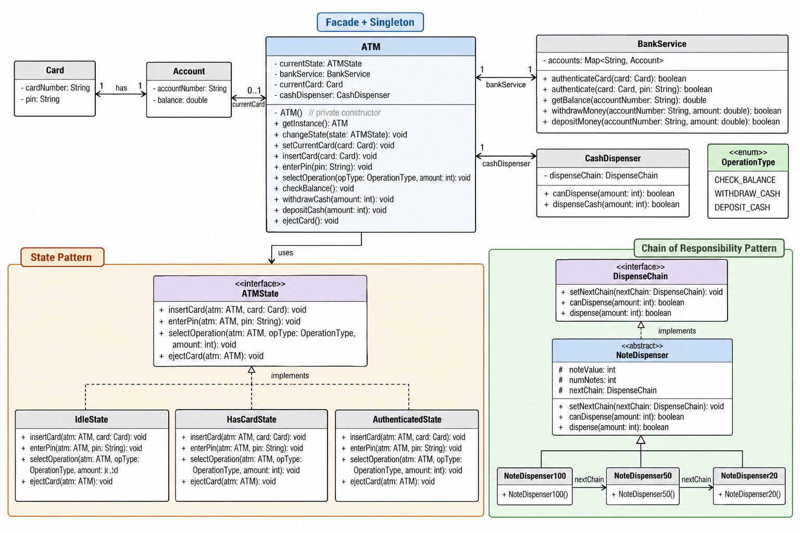

# ATM — Low-Level Design



## Revision Snapshot

| Lens | Recall |
| --- | --- |
| Core model | ATM state machine + bank service + denomination dispenser chain |
| Design leverage | State controls valid session actions; Chain of Responsibility delegates note dispensing |
| Hard problem | Bank debit and physical cash delivery cannot share one atomic transaction; make ambiguous outcomes reconcilable |

## 1. Problem Statement

Design an ATM that supports:

* Card insertion
* PIN authentication
* Balance inquiry
* Cash withdrawal
* Cash deposit
* Cash dispensing using available denominations
* Card ejection
* Different ATM states during a user session

The important design challenge is not the UI. It is modeling:

1. **ATM session state**
2. **Authentication**
3. **Bank/account interaction**
4. **Cash inventory**
5. **Cash dispensing**
6. **Extensibility for new operations/states/denominations**

---

## 2. High-Level Architecture

```text
                         ┌──────────────┐
                         │     Card     │
                         └──────┬───────┘
                                │
                                ▼
┌──────────────┐        ┌─────────────────────┐
│    Client    │───────▶│        ATM          │
└──────────────┘        │  Facade + Singleton │
                        └──────┬───────┬──────┘
                               │       │
                    ┌──────────┘       └──────────┐
                    ▼                             ▼
              ┌───────────┐                ┌──────────────┐
              │ ATMState  │                │ BankService  │
              └─────┬─────┘                └──────┬───────┘
                    │                             │
          ┌─────────┼──────────┐          ┌──────┴──────┐
          ▼         ▼          ▼          ▼             ▼
       Idle     HasCard   Authenticated  Card         Account


                        ATM
                         │
                         ▼
                  ┌──────────────┐
                  │CashDispenser │
                  └──────┬───────┘
                         │
                         ▼
                  DispenseChain
                         │
             ┌───────────┼───────────┐
             ▼           ▼           ▼
        ₹100/$100      ₹50/$50      ₹20/$20
```

The reference design explicitly separates the ATM state machine from the cash-dispensing chain. ([Rohan Handore Portfolio][1])

---

## 3. Core Classes

### `ATM`

This is the **central coordinator**.

#### Responsibilities

* Maintain current ATM state
* Maintain current card/session
* Delegate operations to current state
* Communicate with `BankService`
* Trigger cash dispensing
* Change state

```java
class ATM {

    private ATMState currentState;
    private Card currentCard;

    private BankService bankService;
    private CashDispenser cashDispenser;

    public void insertCard(Card card);
    public void enterPin(String pin);

    public void selectOperation(
        OperationType operation,
        int amount
    );

    public void checkBalance();
    public void withdrawCash(int amount);
    public void depositCash(int amount);

    public void ejectCard();

    public void changeState(ATMState state);
}
```

#### Important design point

`ATM` should **not contain a giant switch statement based on state**.

Bad:

```java
if (state == IDLE) {
    ...
} else if (state == HAS_CARD) {
    ...
} else if (state == AUTHENTICATED) {
    ...
}
```

Instead:

```java
currentState.insertCard(this, card);
currentState.enterPin(this, pin);
currentState.selectOperation(this, operation, amount);
```

This is the core reason for using the **State Pattern**.

---

## 4. ATM State Machine

The ATM has three important states:

```text
                insertCard()
                    │
                    ▼
              ┌──────────┐
              │ HasCard  │
              └────┬─────┘
                   │
                enterPin()
                   │
                   ▼
          ┌─────────────────┐
          │ Authenticated   │
          └───────┬─────────┘
                  │
            operation
                  │
                  ▼
             ejectCard()
                  │
                  ▼
              ┌───────┐
              │ Idle  │
              └───────┘
```

#### State transition table

| Current State        | Action               | Next State           |
| -------------------- | -------------------- | -------------------- |
| `IdleState`          | Insert card          | `HasCardState`       |
| `HasCardState`       | Correct PIN          | `AuthenticatedState` |
| `HasCardState`       | Wrong PIN            | `IdleState`          |
| `AuthenticatedState` | Transaction complete | `IdleState`          |
| `AuthenticatedState` | Eject card           | `IdleState`          |

---

## 5. `ATMState` Interface

The common contract:

```java
interface ATMState {

    void insertCard(ATM atm, Card card);

    void enterPin(ATM atm, String pin);

    void selectOperation(
        ATM atm,
        OperationType operation,
        int amount
    );

    void ejectCard(ATM atm);
}
```

The key idea is:

> Every state supports the same interface, but each state decides what those operations mean.

For example:

```text
IdleState
    enterPin()
        → "Insert card first"

HasCardState
    enterPin()
        → authenticate PIN

AuthenticatedState
    enterPin()
        → "Already authenticated"
```

This is **polymorphism replacing conditional logic**.

---

## 6. `IdleState`

Initial state of the ATM.

```java
class IdleState implements ATMState {

    @Override
    public void insertCard(ATM atm, Card card) {
        atm.setCurrentCard(card);
        atm.changeState(new HasCardState());
    }

    @Override
    public void enterPin(ATM atm, String pin) {
        // Invalid operation
    }

    @Override
    public void selectOperation(
        ATM atm,
        OperationType operation,
        int amount
    ) {
        // Invalid operation
    }

    @Override
    public void ejectCard(ATM atm) {
        // No card
    }
}
```

#### Valid operation

```text
insertCard()
```

Everything else is invalid.

---

## 7. `HasCardState`

The card is inserted but the user hasn't authenticated yet.

```java
class HasCardState implements ATMState {

    @Override
    public void enterPin(ATM atm, String pin) {

        boolean authenticated =
            atm.getBankService()
               .authenticate(atm.getCurrentCard(), pin);

        if (authenticated) {
            atm.changeState(
                new AuthenticatedState()
            );
        } else {
            atm.ejectCard();
        }
    }
}
```

#### State responsibility

It owns the authentication transition:

```text
HasCardState
      │
      │ correct PIN
      ▼
AuthenticatedState
```

Wrong PIN:

```text
HasCardState
      │
      │ incorrect PIN
      ▼
IdleState
```

---

## 8. `AuthenticatedState`

This state represents an authenticated session.

Supported operations:

```text
CHECK_BALANCE
WITHDRAW_CASH
DEPOSIT_CASH
```

Example:

```java
class AuthenticatedState implements ATMState {

    @Override
    public void selectOperation(
        ATM atm,
        OperationType operation,
        int amount
    ) {

        switch (operation) {

            case CHECK_BALANCE:
                atm.checkBalance();
                break;

            case WITHDRAW_CASH:
                atm.withdrawCash(amount);
                break;

            case DEPOSIT_CASH:
                atm.depositCash(amount);
                break;
        }

        atm.ejectCard();
    }
}
```

The important architectural point is that **the state controls whether an operation is allowed**, while `ATM` performs the actual subsystem coordination.

---

## 9. `OperationType`

Use an enum instead of strings.

```java
enum OperationType {

    CHECK_BALANCE,
    WITHDRAW_CASH,
    DEPOSIT_CASH
}
```

Advantages:

* Type safety
* No magic strings
* Easy to extend
* Clear intent

For example:

```java
atm.selectOperation(
    OperationType.WITHDRAW_CASH,
    500
);
```

---

## 10. Card

```java
class Card {

    private String cardNumber;
    private String pin;
}
```

#### Responsibility

The card represents the physical/payment credential.

It should not:

* Modify account balance
* Dispense cash
* Manage ATM state

Those responsibilities belong elsewhere.

---

## 11. Account

```java
class Account {

    private String accountNumber;
    private double balance;

    public double getBalance();

    public boolean withdraw(double amount);

    public void deposit(double amount);
}
```

#### Responsibility

Own the financial balance.

```text
Account
   │
   ├── balance
   ├── withdraw()
   └── deposit()
```

The ATM should not directly manipulate:

```java
account.balance -= amount;
```

Instead:

```java
account.withdraw(amount);
```

This preserves encapsulation.

---

## 12. BankService

`BankService` acts as the ATM's interface to the banking backend.

```java
class BankService {

    public boolean authenticate(
        Card card,
        String pin
    );

    public double getBalance(
        String accountNumber
    );

    public boolean withdrawMoney(
        String accountNumber,
        double amount
    );

    public boolean depositMoney(
        String accountNumber,
        double amount
    );
}
```

Conceptually:

```text
ATM
 │
 ▼
BankService
 │
 ├── authenticate
 ├── getBalance
 ├── withdraw
 └── deposit
      │
      ▼
   Account
```

#### Why have this abstraction?

Because the ATM shouldn't know how the bank stores accounts.

Today:

```text
ATM → BankService → in-memory DB
```

Tomorrow:

```text
ATM → BankService → REST/gRPC → Banking Platform → DB
```

The ATM design doesn't need to change.

---

## 13. Cash Dispensing

This is the most interesting part of the design.

Suppose the ATM has:

```text
₹100 notes
₹50 notes
₹20 notes
```

User requests:

```text
₹270
```

The ATM needs to determine:

```text
100 + 100 + 50 + 20 = 270
```

This is modeled using the **Chain of Responsibility Pattern**.

---

## 14. `DispenseChain`

```java
interface DispenseChain {

    void setNextChain(
        DispenseChain nextChain
    );

    void dispense(int amount);

    boolean canDispense(int amount);
}
```

Each node has the same interface.

---

## 15. `NoteDispenser`

Common implementation:

```java
abstract class NoteDispenser
        implements DispenseChain {

    protected int noteValue;
    protected int numberOfNotes;

    protected DispenseChain nextChain;

    public void setNextChain(
        DispenseChain nextChain
    ) {
        this.nextChain = nextChain;
    }

    public void dispense(int amount) {
        // dispense own denomination
        // forward remaining amount
    }

    public boolean canDispense(int amount) {
        // determine whether chain can fulfill request
    }
}
```

---

## 16. Concrete Dispensers

```java
class NoteDispenser100
        extends NoteDispenser {

    public NoteDispenser100(int count) {
        noteValue = 100;
        numberOfNotes = count;
    }
}
```

```java
class NoteDispenser50
        extends NoteDispenser {

    public NoteDispenser50(int count) {
        noteValue = 50;
        numberOfNotes = count;
    }
}
```

```java
class NoteDispenser20
        extends NoteDispenser {

    public NoteDispenser20(int count) {
        noteValue = 20;
        numberOfNotes = count;
    }
}
```

Chain:

```text
NoteDispenser100
        │
        ▼
NoteDispenser50
        │
        ▼
NoteDispenser20
```

---

## 17. How Chain of Responsibility Works

Suppose:

```text
Withdrawal = ₹270
```

Request enters:

```text
100 dispenser
```

It takes:

```text
₹100 × 2
```

Remaining:

```text
₹70
```

Pass to next:

```text
50 dispenser
```

It takes:

```text
₹50 × 1
```

Remaining:

```text
₹20
```

Pass to next:

```text
20 dispenser
```

It takes:

```text
₹20 × 1
```

Remaining:

```text
₹0
```

Final:

```text
₹100 × 2
₹50  × 1
₹20  × 1
```

---

## 18. Why Chain of Responsibility?

Without the pattern:

```java
if (amount >= 100) {
   ...
}

if (amount >= 50) {
   ...
}

if (amount >= 20) {
   ...
}
```

This becomes increasingly difficult to maintain.

With the chain:

```text
100 → 50 → 20
```

Adding a denomination becomes:

```text
100 → 50 → 20 → 10
```

Existing classes don't need to change.

This follows the **Open/Closed Principle**.

---

## 19. `CashDispenser`

`CashDispenser` is the higher-level abstraction over the chain.

```java
class CashDispenser {

    private DispenseChain dispenseChain;

    public boolean canDispense(int amount);

    public void dispenseCash(int amount);
}
```

Relationship:

```text
ATM
 │
 ▼
CashDispenser
 │
 ▼
DispenseChain
 │
 ├── 100
 ├── 50
 └── 20
```

The ATM doesn't need to know:

```text
How many ₹100 notes?
How many ₹50 notes?
How many ₹20 notes?
```

It simply asks:

```java
cashDispenser.dispenseCash(amount);
```

---

## 20. Complete Class Responsibility Map

| Class                | Responsibility               |
| -------------------- | ---------------------------- |
| `ATM`                | Main coordinator/facade      |
| `ATMState`           | State contract               |
| `IdleState`          | Waiting for card             |
| `HasCardState`       | Card inserted, awaiting PIN  |
| `AuthenticatedState` | Authenticated transaction    |
| `Card`               | Card credentials             |
| `Account`            | Balance + account operations |
| `BankService`        | Banking operations           |
| `CashDispenser`      | Cash dispensing facade       |
| `DispenseChain`      | Cash dispenser contract      |
| `NoteDispenser`      | Common denomination logic    |
| `NoteDispenser100`   | ₹/$100 notes                 |
| `NoteDispenser50`    | ₹/$50 notes                  |
| `NoteDispenser20`    | ₹/$20 notes                  |
| `OperationType`      | Supported ATM operations     |

---

## 21. Design Patterns Used

## 1. State Pattern

Used for:

```text
Idle
HasCard
Authenticated
```

#### Problem solved

Without it:

```java
if (state == IDLE) ...
else if (state == HAS_CARD) ...
else if (state == AUTHENTICATED) ...
```

With it:

```java
currentState.enterPin(...);
```

#### Benefit

Adding a new state doesn't require modifying the central `ATM` class.

---

## 2. Chain of Responsibility

Used for:

```text
100 → 50 → 20
```

#### Problem solved

Delegates responsibility for dispensing different denominations.

#### Benefit

Easy to add:

```text
10
5
2
1
```

without rewriting existing dispenser logic.

---

## 3. Facade Pattern

`ATM` provides a simple API:

```java
insertCard()
enterPin()
selectOperation()
ejectCard()
```

Internally it coordinates:

```text
ATMState
BankService
Account
CashDispenser
DispenseChain
```

The client doesn't need to know these details.

---

## 4. Singleton

If modeling one physical ATM controller:

```java
ATM.getInstance()
```

ensures one controller instance.

Typical implementation:

```java
private ATM() {}

private static ATM instance;

public static ATM getInstance() {

    if (instance == null) {
        instance = new ATM();
    }

    return instance;
}
```

#### Interview discussion

Don't blindly defend Singleton.

An interview-ready trade-off is:

> "For a physical ATM, there is naturally one controller per machine, but I would avoid using a process-wide Singleton if the service may eventually model multiple ATM machines. In that case, an ATM instance should represent one physical machine."

That's a strong architectural trade-off.

---

## 22. End-to-End Withdrawal Flow

Suppose:

```text
Card = C1
PIN = 1234
Withdrawal = ₹570
```

#### Step 1 — Insert card

```text
Client
  │
  ▼
ATM.insertCard()
  │
  ▼
IdleState.insertCard()
  │
  ▼
HasCardState
```

#### Step 2 — Enter PIN

```text
ATM.enterPin()
       │
       ▼
HasCardState.enterPin()
       │
       ▼
BankService.authenticate()
       │
       ▼
AuthenticatedState
```

#### Step 3 — Select withdrawal

```text
ATM.selectOperation(WITHDRAW_CASH, 570)
              │
              ▼
AuthenticatedState
              │
              ▼
ATM.withdrawCash(570)
```

#### Step 4 — Check balance

```text
ATM
 │
 ▼
BankService
 │
 ▼
Account
```

If balance is insufficient:

```text
Withdrawal rejected
```

#### Step 5 — Check ATM cash

```text
CashDispenser.canDispense(570)
```

#### Step 6 — Debit account

```text
BankService.withdrawMoney(...)
```

#### Step 7 — Dispense

```text
CashDispenser
      │
      ▼
100 dispenser
      │
      ▼
50 dispenser
      │
      ▼
20 dispenser
```

Potential result:

```text
100 × 5 = 500
50  × 1 = 50
20  × 1 = 20

Total = 570
```

#### Step 8 — End session

```text
AuthenticatedState
        │
        ▼
ejectCard()
        │
        ▼
IdleState
```

---

## 23. Important Failure Scenarios

These are useful **staff-level discussion points**.

#### Invalid card

```text
insertCard()
     ↓
Card not recognized
     ↓
Reject/eject
```

---

#### Wrong PIN

```text
HasCardState
      ↓
authenticate()
      ↓
FAIL
      ↓
ejectCard()
      ↓
IdleState
```

In a production system, you would additionally discuss:

* retry count
* card blocking
* fraud detection
* audit logging

---

#### Insufficient account balance

```text
Account.balance < withdrawal
```

Don't dispense cash.

---

#### ATM doesn't have enough cash

```text
cashDispenser.canDispense(amount)
       ↓
false
```

Reject before debiting the account.

---

#### Amount cannot be represented

For denominations:

```text
100, 50, 20
```

An amount such as:

```text
₹30
```

can be represented:

```text
20 + 10
```

only if ₹10 exists.

If only:

```text
100, 50, 20
```

then:

```text
₹30 → impossible
```

Therefore `canDispense()` is important.

---

## 24. Critical Consistency Problem

An important interview discussion:

```text
Debit account
      ↓
Dispense cash
```

What happens if:

```text
Account successfully debited
             ↓
Cash dispenser fails
```

You have:

```text
Account: -₹500
Customer: received ₹0
```

That's a serious consistency problem.

The reference implementation addresses this at the simplified design level by checking whether cash can be dispensed before withdrawal and compensating the account if dispensing subsequently fails. ([Rohan Handore Portfolio][1])

Conceptually:

```text
1. Validate balance
2. Validate ATM cash availability
3. Debit account
4. Dispense cash
5. If dispensing fails → compensate/reverse debit
```

For a production banking system, I'd discuss this further as a **transaction/saga-style problem**, because ATM hardware and the bank backend are separate systems.

---

## 25. Atomicity Discussion

Withdrawal isn't really one operation.

It consists of:

```text
Authenticate
     ↓
Check balance
     ↓
Check cash inventory
     ↓
Debit account
     ↓
Dispense physical cash
     ↓
Record transaction
```

The challenge is that the bank database and physical cash dispenser cannot participate in one normal ACID transaction.

Therefore, production systems need mechanisms such as:

```text
Transaction ID
Idempotency
Audit log
Reconciliation
Compensation
Hardware status
Journal
```

For example:

```text
Transaction T123

DEBIT_STARTED
      ↓
ACCOUNT_DEBITED
      ↓
DISPENSE_STARTED
      ↓
CASH_DISPENSED
      ↓
TRANSACTION_COMPLETED
```

If the ATM crashes after:

```text
ACCOUNT_DEBITED
```

but before:

```text
CASH_DISPENSED
```

the transaction journal can be reconciled.

---

## 26. Idempotency

Suppose the ATM sends:

```text
withdraw(T123, ₹500)
```

and the bank successfully processes it.

Network response is lost.

ATM retries:

```text
withdraw(T123, ₹500)
```

Without idempotency:

```text
₹500 debit
+
₹500 debit
=
₹1000 deducted
```

With:

```text
transactionId = T123
```

the bank recognizes the duplicate request.

```text
T123 → already processed
```

and returns the previous result.

**This is a useful staff-level point.**

---

## 27. Concurrency

Two transactions must not simultaneously consume the same cash inventory.

For example:

```text
ATM has:
₹100 × 1
```

Two users request:

```text
User A → ₹100
User B → ₹100
```

Without synchronization:

```text
A sees 1 note
B sees 1 note

A dispenses
B dispenses

Inventory becomes -1
```

So cash inventory needs concurrency control.

Possible approaches:

```text
synchronized methods
locks
atomic counters
database-backed inventory
single-threaded hardware command queue
```

The reference implementation also uses locking around account balance and dispenser inventory operations. ([Rohan Handore Portfolio][1])

---

## 28. Extensibility

#### New operation

Current:

```text
CHECK_BALANCE
WITHDRAW_CASH
DEPOSIT_CASH
```

Potential:

```text
TRANSFER_MONEY
CHANGE_PIN
MINI_STATEMENT
CASH_WITHDRAWAL_LIMIT
```

A clean design can introduce additional operation strategies/services rather than allowing `AuthenticatedState` to become a giant switch.

For example:

```text
Operation
   │
   ├── CheckBalanceOperation
   ├── WithdrawOperation
   ├── DepositOperation
   └── TransferOperation
```

This is a potential evolution of the basic design.

---

## 29. Adding New Cash Denomination

Current:

```text
100
 ↓
50
 ↓
20
```

Add ₹10:

```text
100
 ↓
50
 ↓
20
 ↓
10
```

Create:

```java
class NoteDispenser10
        extends NoteDispenser {

    public NoteDispenser10(int count) {
        super(10, count);
    }
}
```

No modification to:

```text
NoteDispenser100
NoteDispenser50
NoteDispenser20
```

This demonstrates **Open/Closed Principle** nicely.

---

## 30. SOLID Analysis

#### Single Responsibility

Good separation:

```text
ATM              → orchestration
BankService      → banking interaction
Account          → balance
ATMState         → session behavior
CashDispenser    → dispensing
NoteDispenser    → denomination handling
```

---

#### Open/Closed

Add:

```text
NoteDispenser10
```

without modifying existing dispensers.

Add:

```text
NewATMState
```

without modifying existing state implementations.

---

#### Liskov Substitution

Every:

```text
IdleState
HasCardState
AuthenticatedState
```

can be used wherever:

```text
ATMState
```

is expected.

Likewise:

```text
NoteDispenser100
NoteDispenser50
NoteDispenser20
```

can be treated as:

```text
NoteDispenser
```

---

#### Dependency Inversion

`ATM` depends conceptually on abstractions:

```text
ATMState
DispenseChain
```

rather than concrete implementations.

A production implementation can go further by injecting:

```java
BankService
CashDispenser
```

instead of constructing them inside `ATM`.

---

## 31. Interview-Level Design Improvements

If you're targeting **Staff/SDE3**, don't stop at the basic class diagram.

Discuss these as extensions:

#### Security

```text
PIN encryption
PIN retry limits
Card blocking
Session timeout
Audit logging
Tamper detection
```

#### Reliability

```text
Idempotency
Transaction journal
Reconciliation
Retry policies
Compensation
Hardware failure handling
```

#### Concurrency

```text
Account locking
Cash inventory locking
Transaction serialization
```

#### Distributed architecture

```text
ATM
 │
 ▼
ATM Gateway
 │
 ├── Authentication Service
 ├── Account Service
 ├── Transaction Service
 └── Fraud/Risk Service
```

#### Observability

```text
Transaction ID
Correlation ID
Structured logs
Metrics
Tracing
Hardware health metrics
```

---

## 32. Staff-Level Interview Summary

A concise explanation:

> "I model the ATM as a facade over several subsystems. The ATM session lifecycle is modeled using the State pattern, so behavior such as inserting a card, entering a PIN, and selecting an operation is delegated to the current state instead of using conditional state checks. Banking operations are abstracted behind BankService so the ATM isn't coupled to account persistence. Cash dispensing is modeled separately using a Chain of Responsibility, where each denomination handles as much of the requested amount as possible and forwards the remainder. This makes denominations independently extensible. For production, I would additionally address withdrawal atomicity, idempotency, concurrency around cash inventory, transaction journaling, reconciliation, and hardware failure."

That is the **core story of the design**.

([Rohan Handore Portfolio][1])

[1]: https://rohanhandore.com/LLD%20interview%20questions/MEDIUM/Design%20Atm%20%EF%BD%9C%20LLD%20%EF%BD%9C%20AlgoMaster.io%20%2830_12_2025%2018%EF%BC%9A19%EF%BC%9A35%29.html "Design Atm | LLD | AlgoMaster.io"
