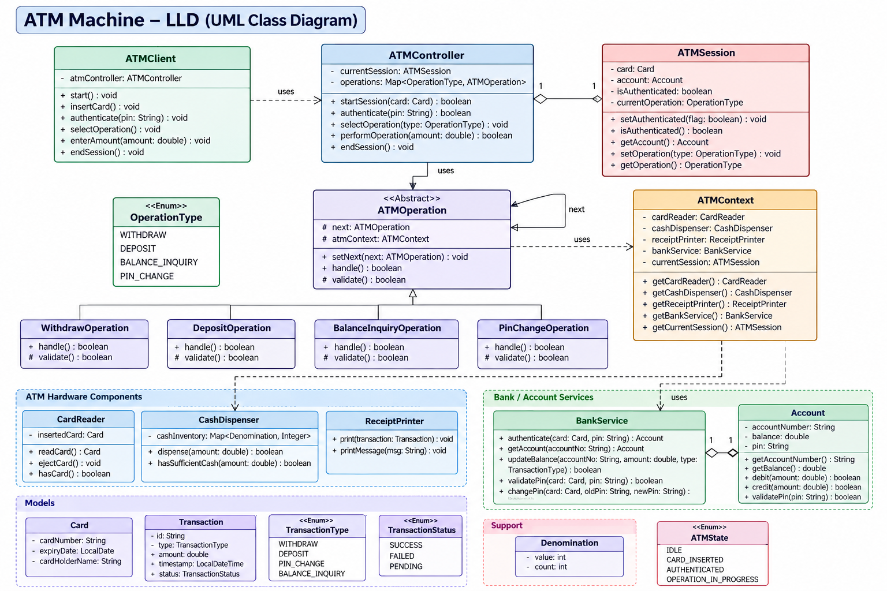

# ATM Machine — Low Level Design



## 1. Problem Statement

Design an ATM system that supports:

* Card insertion and ejection
* PIN authentication
* Cash withdrawal
* Cash deposit
* Balance inquiry
* PIN change
* Cash dispensing
* Receipt printing
* Transaction recording
* Interaction with the bank/account service
* Multiple ATM operations
* Validation of operations before execution

The design should be:

* **Extensible** — adding a new ATM operation should require minimal changes.
* **Maintainable** — hardware, banking logic, and transaction logic should remain separated.
* **Testable** — individual operations should be independently testable.
* **Loosely coupled** — ATM controller should not know implementation details of every operation.

---

# 2. High-Level Architecture

The system can be divided into six major areas:

```text
ATMClient
    |
    v
ATMController
    |
    +---- ATMSession
    |
    +---- ATMOperation Chain
              |
              +-- WithdrawOperation
              +-- DepositOperation
              +-- BalanceInquiryOperation
              +-- PinChangeOperation
    |
    v
ATMContext
    |
    +-- CardReader
    +-- CashDispenser
    +-- ReceiptPrinter
    +-- BankService
    |
    v
Account / Transaction / Card
```

The key idea is that **ATMController orchestrates the flow**, while specialized classes perform individual responsibilities.

---

# 3. Core Classes

## ATMClient

Represents the external actor interacting with the ATM.

```java
class ATMClient {
    private ATMController atmController;

    public void start();
    public void insertCard(Card card);
    public void authenticate(String pin);
    public void selectOperation(OperationType type);
    public void enterAmount(double amount);
    public void endSession();
}
```

### Responsibility

ATMClient simulates the user interaction.

It should **not contain ATM business logic**.

For example:

```text
ATMClient
   |
   | insert card
   v
ATMController
   |
   | authenticate
   v
ATMController
```

---

# 4. ATMController

The controller acts as the **orchestrator**.

```java
class ATMController {

    private ATMOperation currentOperation;
    private ATMOperation operations;
    private ATMSession currentSession;

    public boolean startSession(Card card);

    public boolean authenticatePin(String pin);

    public void selectOperation(OperationType type);

    public boolean performOperation(double amount);

    public void endSession();
}
```

### Responsibilities

* Start ATM session
* Authenticate card/PIN
* Select operation
* Delegate operation execution
* End session

### Important design principle

`ATMController` should **not implement withdrawal, deposit, PIN change, etc. itself.**

Bad:

```java
if (operation == WITHDRAW) {
    // withdrawal logic
} else if (operation == DEPOSIT) {
    // deposit logic
}
```

This creates a large controller and violates the **Open/Closed Principle**.

Instead:

```text
ATMController
      |
      v
ATMOperation
      |
      +---- WithdrawOperation
      +---- DepositOperation
      +---- BalanceInquiryOperation
      +---- PinChangeOperation
```

---

# 5. ATMOperation — Operation Handler

An ATM operation is best modeled as a command/operation handler. The controller resolves the user's `OperationType` to one handler, then executes it.

```java
abstract class ATMOperation {

    protected ATMContext atmContext;

    public abstract boolean handle();

    protected boolean validate();
}
```

Dispatch can use a registry or factory:

```text
OperationType -> ATMOperation
WITHDRAW      -> WithdrawOperation
DEPOSIT       -> DepositOperation
BALANCE       -> BalanceInquiryOperation
PIN_CHANGE    -> PinChangeOperation
```

This is not Chain of Responsibility: the request is selected by its operation type rather than offered to handlers until one accepts it. A validation pipeline may use Chain of Responsibility, but dispatch and validation are separate concerns.

### Why this boundary?

It keeps the controller small and lets each operation own its workflow. A registry makes the mapping explicit and testable; adding an operation requires registering its handler.

For example:

```text
Existing:

Withdraw
Deposit
Balance
PIN Change

New:

MiniStatementOperation
TransferOperation
BillPaymentOperation
```

We can introduce:

```java
class MiniStatementOperation extends ATMOperation {
    @Override
    public boolean handle() {
        ...
    }
}
```

without putting all the logic inside `ATMController`.

---

# 6. Why use `ATMOperation` as an Abstract Class?

Common functionality belongs in the base class:

```java
abstract class ATMOperation {

    protected ATMContext atmContext;

    protected boolean validate() {
        return true;
    }

    public abstract boolean handle();
}
```

Concrete operations implement their own behavior.

```java
class WithdrawOperation extends ATMOperation {

    @Override
    public boolean handle() {
        if (!validate()) {
            return false;
        }

        // withdrawal logic
        return true;
    }
}
```

This gives us:

* Polymorphism
* Common validation structure
* Extensibility
* Loose coupling

---

# 7. ATMContext

`ATMContext` contains the hardware and services required during an ATM operation.

```java
class ATMContext {

    private CardReader cardReader;
    private CashDispenser cashDispenser;
    private ReceiptPrinter receiptPrinter;
    private BankService bankService;
    private ATMSession currentSession;
}
```

### Why Context?

Without `ATMContext`, every operation could receive many dependencies:

```java
withdraw(
    cardReader,
    cashDispenser,
    receiptPrinter,
    bankService,
    session
);
```

That becomes messy.

Instead:

```java
withdrawOperation
        |
        v
    ATMContext
   /    |      \
card  cash    bank
reader dispenser service
```

The operation receives one well-defined context.

---

# 8. ATM Session

An ATM session represents the current interaction with the machine.

```java
class ATMSession {

    private Card card;
    private Account account;

    private boolean authenticated;

    private OperationType currentOperation;

    public void setAuthenticated(boolean flag);

    public boolean isAuthenticated();

    public Account getAccount();

    public void setOperation(OperationType type);
}
```

### Session lifecycle

```text
IDLE
 |
 | insert card
 v
CARD_INSERTED
 |
 | valid PIN
 v
AUTHENTICATED
 |
 | select operation
 v
OPERATION_IN_PROGRESS
 |
 | complete
 v
AUTHENTICATED
 |
 | eject card
 v
IDLE
```

This is essentially a **state-machine concept**.

---

# 9. ATM State

A useful extension is:

```java
enum ATMState {
    IDLE,
    CARD_INSERTED,
    AUTHENTICATED,
    OPERATION_IN_PROGRESS
}
```

The state determines which actions are valid.

For example:

```text
IDLE
    insertCard()       -> CARD_INSERTED

CARD_INSERTED
    authenticate()     -> AUTHENTICATED

AUTHENTICATED
    withdraw()         -> OPERATION_IN_PROGRESS

OPERATION_IN_PROGRESS
    complete()         -> AUTHENTICATED
```

This prevents invalid sequences such as:

```text
withdraw()
```

before authentication.

---

# 10. CardReader

Hardware abstraction for reading cards.

```java
class CardReader {

    private Card insertedCard;

    public Card readCard();

    public void ejectCard();

    public boolean hasCard();
}
```

### Why abstraction?

The controller should not care whether the ATM uses:

* Magnetic stripe
* Chip
* Contactless/NFC

The implementation can change while the controller remains unchanged.

---

# 11. CashDispenser

Responsible only for dispensing cash.

```java
class CashDispenser {

    private Map<Denomination, Integer> cashInventory;

    public boolean hasSufficientCash(double amount);

    public boolean dispense(double amount);
}
```

### Important separation

The cash dispenser should **not modify the bank account**.

Correct flow:

```text
WithdrawOperation
       |
       +---- BankService -> debit account
       |
       +---- CashDispenser -> dispense cash
       |
       +---- ReceiptPrinter -> print receipt
```

The dispenser only deals with physical cash.

---

# 12. ReceiptPrinter

```java
class ReceiptPrinter {

    public void print(Transaction transaction);

    public void printMessage(String message);
}
```

Its only responsibility is printing.

It should not:

* Validate PIN
* Debit account
* Decide withdrawal amount

This follows **Single Responsibility Principle**.

---

# 13. BankService

The ATM should not directly manipulate the account database.

```java
class BankService {

    public Account authenticate(Card card, String pin);

    public Account getAccount(String accountNumber);

    public boolean updateBalance(
        String accountNumber,
        double amount,
        TransactionType type
    );

    public boolean validatePin(Card card, String pin);

    public boolean changePin(
        Card card,
        String oldPin,
        String newPin
    );
}
```

### Why?

The ATM is a client of the bank.

```text
ATM
 |
 | API/service call
 v
BankService
 |
 v
Bank / Account System
```

The ATM should not know:

```text
SQL
Database schema
Account tables
Transaction tables
```

---

# 14. Account

```java
class Account {

    private String accountNumber;
    private double balance;
    private String pin;

    public String getAccountNumber();

    public double getBalance();

    public boolean debit(double amount);

    public boolean credit(double amount);

    public boolean validatePin(String pin);
}
```

### Important interview point

In a real system, **PIN should not be stored as plaintext**.

Instead:

```text
PIN
 |
 v
Hash / secure verification
 |
 v
Authentication service
```

The simplified LLD uses `String pin` only for demonstrating the object model.

---

# 15. WithdrawOperation

```java
class WithdrawOperation extends ATMOperation {

    @Override
    protected boolean validate() {
        // authenticated?
        // valid amount?
        // sufficient account balance?
        // ATM has sufficient cash?
        return true;
    }

    @Override
    public boolean handle() {

        if (!validate()) {
            return false;
        }

        atmContext.getBankService()
                  .updateBalance(...);

        atmContext.getCashDispenser()
                  .dispense(...);

        atmContext.getReceiptPrinter()
                  .print(...);

        return true;
    }
}
```

### Withdrawal flow

```text
User
 |
 | withdraw ₹10,000
 v
ATMController
 |
 v
WithdrawOperation
 |
 +--> Validate session
 |
 +--> Validate amount
 |
 +--> Check account balance
 |
 +--> Check ATM cash
 |
 +--> Debit bank account
 |
 +--> Dispense cash
 |
 +--> Print receipt
 |
 v
Success
```

---

# 16. DepositOperation

```java
class DepositOperation extends ATMOperation {

    @Override
    public boolean handle() {
        // validate
        // accept cash
        // credit account
        // print receipt
        return true;
    }
}
```

The important difference:

```text
Withdrawal:
Account balance -= amount
ATM cash -= amount

Deposit:
Account balance += amount
ATM cash += amount
```

A production system would additionally need to deal with cash validation, denomination counting, counterfeit detection, and deposit reconciliation.

---

# 17. BalanceInquiryOperation

```java
class BalanceInquiryOperation extends ATMOperation {

    @Override
    public boolean handle() {

        Account account =
            atmContext.getCurrentSession().getAccount();

        double balance = account.getBalance();

        atmContext.getReceiptPrinter()
                  .printMessage(
                      "Balance: " + balance
                  );

        return true;
    }
}
```

This operation generally does not modify account state.

---

# 18. PinChangeOperation

```java
class PinChangeOperation extends ATMOperation {

    @Override
    public boolean handle() {

        // validate old PIN
        // validate new PIN
        // call BankService
        // print confirmation

        return true;
    }
}
```

PIN-change logic belongs behind `BankService`, rather than inside the ATM hardware layer.

---

# 19. Models

## Card

```java
class Card {

    private String cardNumber;
    private LocalDate expiryDate;
    private String cardHolderName;
}
```

---

## Transaction

```java
class Transaction {

    private String id;
    private TransactionType type;
    private double amount;
    private LocalDateTime timestamp;
    private TransactionStatus status;
}
```

---

## TransactionType

```java
enum TransactionType {
    WITHDRAW,
    DEPOSIT,
    PIN_CHANGE,
    BALANCE_INQUIRY
}
```

---

## TransactionStatus

```java
enum TransactionStatus {
    SUCCESS,
    FAILED,
    PENDING
}
```

---

# 20. Denomination

Represents physical cash denominations.

```java
class Denomination {

    private int value;
    private int count;
}
```

For example:

```text
₹500 -> 100 notes
₹200 -> 50 notes
₹100 -> 80 notes
```

The `CashDispenser` can use this information to determine whether an amount can actually be dispensed.

---

# 21. Design Patterns Used

## 1. Command / operation handler

Each operation encapsulates one use case; a registry maps the requested operation type to its handler. Use Chain of Responsibility only for an actual ordered validation pipeline.

```text
ATMOperation
      |
      +--> WithdrawOperation
      |
      +--> DepositOperation
      |
      +--> BalanceInquiryOperation
      |
      +--> PinChangeOperation
```

### Benefit

New operations can be added without making `ATMController` a giant conditional class.

---

## 2. State Pattern / State Machine

ATM has different states:

```text
IDLE
CARD_INSERTED
AUTHENTICATED
OPERATION_IN_PROGRESS
```

The validity of an action depends on the current state.

This prevents invalid workflows.

---

## 3. Strategy Pattern — Possible Extension

Different cash-dispensing strategies can be represented as strategies.

```java
interface CashDispensingStrategy {
    List<Denomination> calculateNotes(double amount);
}
```

Implementations:

```java
class GreedyCashStrategy
        implements CashDispensingStrategy {
}

class OptimizedCashStrategy
        implements CashDispensingStrategy {
}
```

This is useful when the ATM supports different denomination-selection algorithms.

---

## 4. Facade-like Role of ATMController

`ATMController` provides a simple interface to the client:

```java
startSession()
authenticatePin()
selectOperation()
performOperation()
endSession()
```

The client does not need to understand the internal ATM components.

---

# 22. SOLID Principles

## Single Responsibility Principle

Each component has one primary responsibility.

```text
CardReader       -> read card
CashDispenser    -> dispense cash
ReceiptPrinter   -> print receipt
BankService      -> banking operations
ATMController    -> orchestration
WithdrawOperation -> withdrawal workflow
```

---

## Open/Closed Principle

Adding:

```text
MiniStatement
FundTransfer
BillPayment
```

should primarily require new operation classes.

```java
class MiniStatementOperation
        extends ATMOperation {
}
```

Existing operations remain unchanged.

---

## Liskov Substitution Principle

Every concrete operation should be usable through:

```java
ATMOperation
```

For example:

```java
ATMOperation operation =
        new WithdrawOperation();
```

The controller should not need to know the concrete type.

---

## Interface Segregation Principle

Instead of one massive hardware interface:

```java
ATMHardware {
    readCard();
    dispenseCash();
    printReceipt();
    ...
}
```

we keep focused abstractions:

```text
CardReader
CashDispenser
ReceiptPrinter
```

---

## Dependency Inversion Principle

High-level classes should depend on abstractions rather than concrete implementations.

For example:

```java
BankService
```

could eventually become:

```java
interface BankService {
    Account authenticate(...);
    boolean updateBalance(...);
}
```

Then:

```java
RealBankService
MockBankService
```

can implement it.

This makes unit testing much easier.

---

# 23. Main Withdrawal Sequence

A typical interview sequence diagram can be explained as:

```text
Customer
   |
   | insertCard()
   v
ATMController
   |
   | readCard()
   v
CardReader
   |
   | authenticate(pin)
   v
BankService
   |
   | Account
   v
ATMController
   |
   | selectOperation(WITHDRAW)
   v
WithdrawOperation
   |
   +---- check account balance
   |
   +---- check ATM cash
   |
   +---- debit account
   |
   +---- dispense cash
   |
   +---- print receipt
   |
   v
Transaction SUCCESS
```

---

# 24. Withdrawal Validation

Withdrawal should validate multiple conditions.

```text
                    Withdrawal
                        |
              +---------+---------+
              |                   |
        Session valid?       Amount valid?
              |                   |
              +---------+---------+
                        |
                 Account balance?
                        |
                 ATM cash available?
                        |
                 Denomination valid?
                        |
                     SUCCESS
```

Possible failures:

```text
Invalid PIN
Insufficient account balance
Insufficient ATM cash
Invalid amount
ATM hardware failure
Bank service unavailable
Transaction timeout
```

---

# 25. Important Transaction Consistency Problem

One of the most important interview discussions is:

> What happens if the account is debited but the ATM fails to dispense cash?

Example:

```text
Bank account
₹50,000

        |
        | debit ₹10,000
        v

₹40,000

        |
        | ATM dispenser fails
        v

Customer receives ₹0
```

This creates a serious consistency problem.

A robust system needs a transaction/reconciliation mechanism.

Possible approach:

```text
START TRANSACTION

Reserve/debit amount
        |
        v
Dispense cash
        |
   +----+----+
   |         |
Success     Failure
   |         |
Commit      Rollback /
            compensate

        |
        v
Record transaction
```

In a distributed ATM/bank environment, this is generally handled through **transaction states, idempotency, reconciliation, and compensating operations**, rather than assuming a single ACID transaction spans the physical ATM and bank system.

---

# 26. Idempotency

Suppose the ATM sends:

```text
Debit ₹10,000
```

but the network times out.

The ATM doesn't know whether the bank processed it.

If it retries blindly:

```text
Debit ₹10,000
Debit ₹10,000
```

the customer could lose ₹20,000.

Therefore every transaction should have a unique ID:

```text
transactionId = TXN12345
```

The bank can guarantee:

```text
TXN12345 -> processed only once
```

This is an important real-world distributed-systems consideration.

---

# 27. Failure Handling

Possible failure scenarios:

### Invalid PIN

```text
PIN incorrect
    |
increment failed attempts
    |
if threshold exceeded
    |
card blocked / retained
```

### Insufficient balance

```text
BankService
    |
balance < requested amount
    |
FAIL
```

### Insufficient ATM cash

```text
CashDispenser
    |
cash unavailable
    |
FAIL
```

### Network failure

```text
ATM
 |
BankService unavailable
 |
transaction = PENDING / FAILED
```

### Hardware failure

```text
CashDispenser failure
ReceiptPrinter failure
CardReader failure
```

These should be handled separately from business validation.

---

# 28. Concurrency Considerations

Consider two requests against the same account:

```text
Balance = ₹10,000

ATM A -> withdraw ₹8,000
ATM B -> withdraw ₹8,000
```

Without concurrency control:

```text
ATM A sees ₹10,000
ATM B sees ₹10,000

Both withdraw ₹8,000

Final balance = -₹6,000
```

The bank service must provide concurrency-safe balance updates.

For example:

```sql
UPDATE Account
SET balance = balance - 8000
WHERE account_number = ?
AND balance >= 8000;
```

Then check affected rows.

Or use appropriate transactional locking/optimistic concurrency mechanisms.

---

# 29. Thread Safety

ATM hardware is generally sequential from the perspective of one physical machine, but the bank service is shared across many ATMs.

Therefore:

```text
ATM 1 ----\
ATM 2 -----\
ATM 3 ------> BankService ---> Account
ATM 4 -----/
```

`BankService` and the underlying account store must be thread-safe and transactionally consistent.

The ATM itself should also prevent multiple operations from being executed simultaneously for the same session.

---

# 30. Extending the Design

Suppose tomorrow we add:

```text
Transfer Money
Mini Statement
Bill Payment
Mobile Recharge
Cheque Deposit
```

We can create:

```java
class TransferOperation
        extends ATMOperation {
}

class MiniStatementOperation
        extends ATMOperation {
}

class BillPaymentOperation
        extends ATMOperation {
}
```

The existing architecture remains largely unchanged.

This is one of the biggest advantages of the design.

---

# 31. How to Explain the Design in an Interview

A good explanation order is:

### Step 1 — Identify actors

```text
Customer
ATM
Bank
```

### Step 2 — Identify hardware

```text
CardReader
CashDispenser
ReceiptPrinter
```

### Step 3 — Identify domain objects

```text
Card
Account
Transaction
```

### Step 4 — Identify operations

```text
Withdraw
Deposit
BalanceInquiry
PINChange
```

### Step 5 — Introduce controller

```text
ATMController
```

### Step 6 — Introduce extensibility

Explain:

> I don't want ATMController to contain separate logic for every ATM operation, so I model operations using a common ATMOperation abstraction.

### Step 7 — Introduce operation dispatch

Map `OperationType` to an `ATMOperation` handler with a registry or factory. Use Chain of Responsibility only if validation is an ordered pipeline where each validator can reject or forward the request.

```text
ATMOperation
     |
     +--> Withdraw
     +--> Deposit
     +--> Balance
     +--> PIN Change
```

### Step 8 — Discuss state

```text
IDLE
CARD_INSERTED
AUTHENTICATED
OPERATION_IN_PROGRESS
```

### Step 9 — Discuss failure cases

Especially:

```text
Debit succeeded
Cash dispensing failed
```

### Step 10 — Discuss concurrency/idempotency

This demonstrates system-design maturity beyond basic class diagrams.

---

# 32. Interview-Level Design Summary

The most important relationships are:

```text
ATMClient
    |
    v
ATMController
    |
    +--------> ATMOperation
    |               |
    |               +--> WithdrawOperation
    |               +--> DepositOperation
    |               +--> BalanceInquiryOperation
    |               +--> PinChangeOperation
    |
    +--------> ATMSession
    |
    +--------> ATMContext
                    |
                    +--> CardReader
                    +--> CashDispenser
                    +--> ReceiptPrinter
                    +--> BankService
                              |
                              v
                           Account
```

### Patterns

| Pattern / Principle     | Where                   | Why                                         |
| ----------------------- | ----------------------- | ------------------------------------------- |
| Command / operation handler | `ATMOperation`       | Isolate each ATM use case                    |
| State                   | ATM lifecycle           | Control valid actions by state              |
| Strategy                | Cash dispensing         | Pluggable denomination algorithms           |
| SRP                     | Hardware/services       | Separate responsibilities                   |
| OCP                     | ATM operations          | Add operations without modifying controller |
| DIP                     | BankService abstraction | Easier testing and loose coupling           |
| Facade-like Controller  | `ATMController`         | Simplify client interaction                 |

---

# 33. What I'd Improve in a Production Version

The diagram is suitable for an **LLD interview**, but a production-grade design would additionally introduce:

* `BankService` interface
* `TransactionService`
* `TransactionRepository`
* `ATMInventoryService`
* Secure PIN verification
* Transaction IDs and idempotency
* Distributed transaction/reconciliation handling
* Hardware failure recovery
* Audit logging
* Rate limiting / PIN attempt limits
* ATM cash inventory management
* Card retention
* Session timeout
* Monitoring and telemetry
* Currency/denomination abstraction
* Concurrency control
* External bank API timeout/retry policies

The key interview distinction is:

> **LLD should model the object interactions cleanly; it should not turn into a production distributed-system implementation unless the interviewer asks for those concerns.**

---

# 34. Staff-Level Deep Dive: Cash Withdrawal Recovery

The hard boundary is physical cash: a bank API and a dispenser cannot share one ACID transaction. Treat withdrawal as a durable workflow, not a sequence of booleans.

```text
CREATED -> DEBIT_PENDING -> DEBITED -> DISPENSE_PENDING
                                      |             |
                                      v             v
                                  DISPENSED     EXCEPTION_PENDING
                                      |             |
                                      v             v
                                  COMPLETED   RECONCILIATION
```

* Assign one stable transaction ID before the first network call. The bank must make debit/status requests idempotent for that ID; a timeout means “unknown,” not “failed.”
* Persist each state transition and the dispenser's command/result. On restart, query bank status and reconcile dispenser counters/sensors before retrying or reversing anything.
* Never automatically credit the account just because dispense timed out: cash may have been presented even if the acknowledgment was lost. Route ambiguous cases to reconciliation and retain an auditable trail.
* Expose transaction status to the customer as pending when the outcome is uncertain. Exactly-once physical dispensing is not a safe assumption unless the hardware itself supports durable deduplication and confirmation.

The interview signal is recognizing the boundary and defining recovery ownership, not claiming a distributed transaction can make the hardware atomic.
