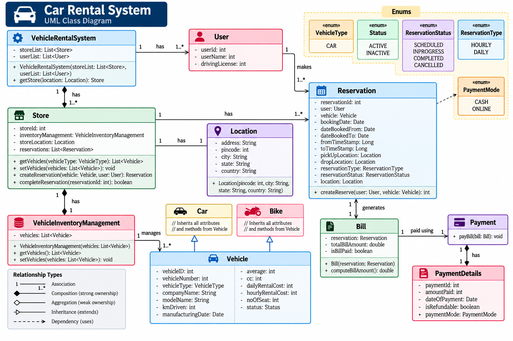

# Car Rental System — Low-Level Design



## Revision Snapshot

| Lens | Recall |
| --- | --- |
| Core model | Store + time-bounded vehicle reservation + quote + payment |
| Design leverage | Pricing/payment policies are replaceable; reservation owns the booking interval |
| Hard problem | Search is advisory; atomically prevent overlapping confirmed reservations and reconcile payment outcomes |

## 1. Problem Overview

A Car Rental System allows users to:

1. Search for available vehicles.
2. Select a vehicle.
3. Create a reservation.
4. Specify pickup/drop locations and rental duration.
5. Generate a bill.
6. Make a payment.
7. Complete or cancel the reservation.

The system should support multiple stores, vehicle types, users, reservations and payment methods.

#### Core entities

```text
VehicleRentalSystem
        │
        ├── Users
        │
        └── Stores
              │
              ├── Location
              ├── VehicleInventoryManagement
              │       └── Vehicles
              │              ├── Car
              │              └── Bike
              │
              └── Reservations
                       │
                       └── Bill
                              │
                              └── Payment
                                      │
                                      └── PaymentDetails
```

---

## 2. Main Classes

### VehicleRentalSystem

#### Responsibility

Acts as the **top-level entry point/facade** for the rental system.

It maintains:

```text
storeList : List<Store>
userList  : List<User>
```

#### Important operations

```text
VehicleRentalSystem(storeList, userList)

getStore(location) : Store
```

#### Why this class exists

The client should not need to directly know how stores are maintained.

Instead:

```text
Client
   │
   ▼
VehicleRentalSystem
   │
   ▼
Store
```

This provides a single entry point into the system.

---

## 3. User

Represents the customer renting a vehicle.

#### Fields

```text
userId          : int
userName        : String
drivingLicense  : int
```

#### Relationship

```text
VehicleRentalSystem 1 ─────── 1..* User
```

One rental system maintains multiple users.

A user can make multiple reservations:

```text
User 1 ─────── 1..* Reservation
```

#### Important interview point

The `User` should be associated with a reservation rather than duplicating user information inside the reservation.

---

## 4. Store

A physical rental location where vehicles are managed and reservations are handled.

#### Fields

```text
storeId               : int
inventoryManagement   : VehicleInventoryManagement
storeLocation         : Location
reservations          : List<Reservation>
```

#### Operations

```text
getVehicles(vehicleType)
setVehicles(vehicles)

createReservation(vehicle, user)

completeReservation(reservationId)
```

#### Relationships

```text
VehicleRentalSystem
        │
        │ has
        ▼
      Store
        │
        ├── Location
        │
        ├── VehicleInventoryManagement
        │
        └── Reservations
```

#### Important responsibility

The `Store` coordinates the rental operation.

It does **not** need to know how individual vehicle objects are implemented.

---

## 5. Location

Represents a physical location.

#### Fields

```text
address
pincode
city
state
country
```

#### Constructor

```text
Location(pincode, city, state, country)
```

#### Used by

* Store
* Reservation pickup location
* Reservation drop location

This avoids representing locations as plain strings throughout the system.

---

## 6. VehicleInventoryManagement

Responsible for maintaining vehicles available at a store.

#### Field

```text
vehicles : List<Vehicle>
```

#### Operations

```text
VehicleInventoryManagement(vehicles)

getVehicles()
setVehicles(vehicles)
```

#### Relationship

```text
Store
  │
  │ manages
  ▼
VehicleInventoryManagement
  │
  │ manages
  ▼
1..* Vehicle
```

#### Why separate inventory management?

Without this class, `Store` would become responsible for:

* Maintaining vehicles
* Searching vehicles
* Updating vehicles
* Checking availability

Separating inventory gives us **better separation of responsibility**.

---

## 7. Vehicle

`Vehicle` is the base class representing a rentable vehicle.

### Fields

```text
vehicleId
vehicleNumber
vehicleType
companyName
modelName
kmDriven
manufacturingDate
average
cc
dailyRentalCost
hourlyRentalCost
noOfSeat
status
```

#### Important fields

```text
vehicleType : VehicleType
status      : Status
```

These are represented using enums rather than arbitrary strings.

---

## 8. VehicleType

Enum representing the category of vehicle.

```text
VehicleType

CAR
```

The design can easily be extended:

```text
CAR
BIKE
SUV
TRUCK
...
```

Using an enum prevents invalid string values such as:

```text
"Cars"
"car"
"CAR "
```

---

## 9. Status

Represents vehicle availability/state.

```text
Status

ACTIVE
INACTIVE
```

For example:

```text
ACTIVE
   ↓
Vehicle can potentially be rented

INACTIVE
   ↓
Vehicle should not be offered for rental
```

---

## 10. Car and Bike

Both specialize `Vehicle`.

```text
             Vehicle
                ▲
          ┌─────┴─────┐
          │           │
         Car         Bike
```

This is an example of **inheritance/generalization**.

Common vehicle properties remain in `Vehicle`.

Specific vehicle behavior/properties can be added to subclasses later.

#### Why inheritance here?

Because:

```text
Car IS-A Vehicle
Bike IS-A Vehicle
```

This represents an **IS-A relationship**.

---

## 11. Reservation

Reservation is the central entity in the rental workflow.

### Fields

```text
reservationId
user
vehicle
bookingDate
dateBookedFrom
dateBookedTo
fromTimeStamp
toTimeStamp
pickUpLocation
dropLocation
reservationType
reservationStatus
location
```

#### Key relationships

```text
User
  │
  │ makes
  ▼
Reservation
  │
  ├── Vehicle
  ├── Pickup Location
  ├── Drop Location
  ├── ReservationType
  └── ReservationStatus
```

---

## 12. ReservationType

Defines how the vehicle is rented.

```text
ReservationType

HOURLY
DAILY
```

Example:

```text
HOURLY
2 hours × hourlyRentalCost
```

versus:

```text
DAILY
3 days × dailyRentalCost
```

This distinction becomes important during bill calculation.

---

## 13. ReservationStatus

Represents the lifecycle of a reservation.

```text
SCHEDULED
INPROGRESS
COMPLETED
CANCELLED
```

#### Typical lifecycle

```text
SCHEDULED
    │
    ▼
INPROGRESS
    │
    ▼
COMPLETED
```

Alternative:

```text
SCHEDULED
    │
    ▼
CANCELLED
```

This is effectively a **state machine**.

#### Interview point

A real production design could encapsulate these transitions inside a dedicated state machine or state classes if the lifecycle becomes more complex.

---

## 14. Reservation Creation

The store exposes:

```text
createReservation(vehicle, user)
```

The reservation contains references to:

```text
User
Vehicle
Location
ReservationType
ReservationStatus
```

Conceptually:

```text
User + Vehicle + Rental Details
              │
              ▼
        Reservation
```

The reservation is the central object connecting the rental transaction.

---

## 15. Bill

A `Bill` represents the amount payable for a reservation.

#### Fields

```text
reservation
totalBillAmount
isBillPaid
```

#### Operations

```text
Bill(reservation)

computeBillAmount()
```

#### Relationship

```text
Reservation
     │
     │ generates
     ▼
    Bill
```

Typically:

```text
Rental Duration
       +
Vehicle Rental Rate
       ↓
computeBillAmount()
       ↓
totalBillAmount
```

---

## 16. Bill Calculation

The calculation depends on the reservation type.

#### Hourly rental

```text
hours × hourlyRentalCost
```

#### Daily rental

```text
days × dailyRentalCost
```

Conceptually:

```text
Reservation
     │
     ├── reservationType
     ├── date/time
     └── vehicle
            │
            ├── hourlyRentalCost
            └── dailyRentalCost
                    │
                    ▼
            computeBillAmount()
```

#### Interview improvement

For a more extensible design, bill calculation can be moved into a strategy:

```text
BillingStrategy
      ▲
      │
 ┌────┴────┐
 │         │
Hourly   Daily
Strategy Strategy
```

This avoids a large `if/else` when rental types grow.

---

## 17. Payment

`Payment` is responsible for processing the bill.

#### Operation

```text
payBill(bill)
```

Relationship:

```text
Bill
 │
 │ paid using
 ▼
Payment
```

Payment should ideally be separated from the `Bill`.

Why?

Because:

```text
Bill = How much should be paid?

Payment = How was the amount paid?
```

These are different responsibilities.

---

## 18. PaymentDetails

Contains information about an individual payment.

#### Fields

```text
paymentId
amountPaid
dateOfPayment
isRefundable
paymentMode
```

#### Relationship

```text
Payment
   │
   │ has
   ▼
PaymentDetails
```

This separation allows payment processing logic and payment information to evolve independently.

---

## 19. PaymentMode

Enum representing the payment mechanism.

```text
PaymentMode

CASH
ONLINE
```

Can later be extended:

```text
CASH
ONLINE
UPI
CARD
NET_BANKING
WALLET
```

---

## 20. Complete Relationship Map

The complete system can be mentally visualized as:

```text
                   VehicleRentalSystem
                    /              \
                   /                \
                  ▼                  ▼
               Store               User
                │                   │
                │                   │ makes
                │                   ▼
                │              Reservation
                │               /    │    \
                │              /     │     \
                ▼             ▼      ▼      ▼
 VehicleInventoryManagement Vehicle Location Location
                │                    │
                │ manages            │
                ▼                    │
             Vehicle                 │
              ▲  ▲                   │
              │  │                   │
             Car Bike                │
                                     │
                           ReservationType
                           ReservationStatus
                                     │
                                     ▼
                                    Bill
                                     │
                                     │ paid using
                                     ▼
                                  Payment
                                     │
                                     ▼
                              PaymentDetails
                                     │
                                     ▼
                                PaymentMode
```

---

## 21. Complete Rental Flow

### Step 1 — Find Store

```text
User
 │
 ▼
VehicleRentalSystem
 │
 ▼
getStore(location)
 │
 ▼
Store
```

The system identifies the appropriate rental store.

---

### Step 2 — Search Vehicles

```text
Store
 │
 ▼
VehicleInventoryManagement
 │
 ▼
getVehicles(vehicleType)
 │
 ▼
Available Vehicles
```

The inventory component provides vehicles matching the requested type.

---

### Step 3 — Select Vehicle

```text
User
 │
 ▼
Vehicle
```

The user selects a vehicle based on availability, price, type, etc.

---

### Step 4 — Create Reservation

```text
User
   +
Vehicle
   +
Rental Details
   │
   ▼
Reservation
```

The reservation stores the complete rental context.

---

### Step 5 — Generate Bill

```text
Reservation
     │
     ▼
    Bill
     │
     ▼
computeBillAmount()
     │
     ▼
totalBillAmount
```

---

### Step 6 — Payment

```text
Bill
 │
 ▼
Payment
 │
 ▼
PaymentDetails
 │
 ▼
PaymentMode
```

---

### Step 7 — Complete Reservation

After the vehicle is returned:

```text
INPROGRESS
     │
     ▼
COMPLETED
```

The store can complete the reservation.

---

## 22. Why These Relationships Exist

### Composition

Example:

```text
VehicleRentalSystem ◆── Store
Store ◆── VehicleInventoryManagement
```

Composition implies strong ownership.

If the owner conceptually disappears, the owned component doesn't have an independent lifecycle in the context of this model.

---

### Association

Example:

```text
User ─── Reservation
Reservation ─── Vehicle
Reservation ─── Location
```

These objects know about each other but don't necessarily own each other's lifecycle.

---

### Inheritance

```text
Vehicle
   ▲
   ├── Car
   └── Bike
```

Use inheritance because both are vehicles and share common properties.

---

### Dependency

Enums and other types are used by classes:

```text
Vehicle ──→ VehicleType
Vehicle ──→ Status

Reservation ──→ ReservationType
Reservation ──→ ReservationStatus

PaymentDetails ──→ PaymentMode
```

---

## 23. Important OOP Concepts Demonstrated

### Encapsulation

Data belongs to the class responsible for it.

For example:

```text
Vehicle
 ├── vehicleId
 ├── rentalCost
 ├── status
 └── vehicle information
```

---

### Abstraction

The client does not need to understand internal inventory management.

It can simply request:

```text
store.getVehicles(vehicleType)
```

---

### Inheritance

```text
Vehicle
  ▲
  ├── Car
  └── Bike
```

---

### Composition

```text
Store
  └── VehicleInventoryManagement
```

The store coordinates its inventory component.

---

## 24. Separation of Responsibilities

A key interview discussion is:

| Class                      | Primary Responsibility          |
| -------------------------- | ------------------------------- |
| VehicleRentalSystem        | Overall system/store access     |
| User                       | Customer information            |
| Store                      | Rental operation at a location  |
| Location                   | Physical location               |
| VehicleInventoryManagement | Vehicle inventory               |
| Vehicle                    | Vehicle information             |
| Car/Bike                   | Vehicle specialization          |
| Reservation                | Rental booking                  |
| Bill                       | Amount payable                  |
| Payment                    | Payment processing              |
| PaymentDetails             | Payment transaction information |
| Enums                      | Controlled domain states        |

This prevents one giant `CarRentalSystem` class.

---

## 25. Why Not Put Everything Inside Store?

A common bad design would be:

```text
Store
 ├── vehicles
 ├── searchVehicle()
 ├── calculateBill()
 ├── processPayment()
 ├── createReservation()
 ├── cancelReservation()
 ├── manageUsers()
 └── manageLocations()
```

This creates a **God Object**.

Instead:

```text
Store
 ├── InventoryManagement
 ├── Reservation
 └── Location

Reservation
 └── Bill

Bill
 └── Payment
```

Each component has a clearer responsibility.

---

## 26. SOLID Discussion

### Single Responsibility Principle

Classes have focused responsibilities.

```text
Inventory → vehicles
Reservation → booking
Bill → billing
Payment → payment
```

---

### Open/Closed Principle

The vehicle hierarchy allows new vehicle types to be introduced without changing the base vehicle model.

For example:

```text
Vehicle
   ├── Car
   ├── Bike
   └── SUV
```

Similarly, payment modes can be extended.

---

### Liskov Substitution Principle

A `Car` or `Bike` should be usable wherever a `Vehicle` is expected.

```java
Vehicle vehicle = new Car();
```

or:

```java
Vehicle vehicle = new Bike();
```

---

### Interface Segregation

Not heavily demonstrated in the current model, but becomes relevant when payment/inventory implementations grow.

For example:

```text
PaymentProcessor
       ▲
       │
 ┌─────┴─────┐
 │           │
CashPayment OnlinePayment
```

---

### Dependency Inversion

The current design can be improved further by depending on abstractions for external services such as:

```text
PaymentGateway
NotificationService
VehicleRepository
ReservationRepository
```

rather than concrete implementations.

---

## 27. Design Patterns That Naturally Fit

The current design is simple, but an interview can evolve it.

### Strategy Pattern — Pricing

Instead of:

```java
if (type == HOURLY) {
    ...
} else if (type == DAILY) {
    ...
}
```

Use:

```text
PricingStrategy
      ▲
      │
 ┌────┴────┐
 │         │
Hourly    Daily
Pricing   Pricing
```

This makes adding weekly/monthly pricing easier.

---

### Factory Pattern — Vehicle Creation

Instead of directly constructing vehicles everywhere:

```java
new Car(...)
new Bike(...)
```

Use:

```text
VehicleFactory
      │
      ├── createCar()
      └── createBike()
```

Useful when vehicle creation becomes complex.

---

### Strategy Pattern — Payment

```text
PaymentStrategy
      ▲
      │
 ┌────┴────────┐
 │             │
CashPayment  OnlinePayment
```

This is especially useful when payment providers are introduced.

---

## 28. Important Edge Cases

A production-level design must consider:

#### Vehicle unavailable

Two users should not successfully reserve the same vehicle for overlapping periods.

```text
User A ── Reservation ── Vehicle X
User B ── Reservation ── Vehicle X
                    ↑
             overlapping time
```

The system needs an availability check.

---

#### Concurrent reservations

Two requests can arrive simultaneously.

Therefore:

```text
Check availability
       ↓
Reserve vehicle
```

must be protected against race conditions.

Possible solutions:

* Database transaction
* Optimistic locking
* Pessimistic locking
* Distributed lock

---

#### Cancellation

```text
SCHEDULED
    │
    ▼
CANCELLED
```

The vehicle must become available again.

---

#### Vehicle return

On completion:

```text
Reservation → COMPLETED
Vehicle      → ACTIVE / AVAILABLE
```

The exact vehicle state model should ideally distinguish:

```text
ACTIVE
AVAILABLE
RESERVED
RENTED
MAINTENANCE
```

rather than only `ACTIVE/INACTIVE`.

---

#### Payment failure

Payment processing should not leave the reservation in an inconsistent state.

For example:

```text
Reservation created
        ↓
Payment failed
        ↓
Reservation should not
be considered fully confirmed
```

A production system may therefore use explicit states such as:

```text
PAYMENT_PENDING
CONFIRMED
PAYMENT_FAILED
CANCELLED
```

---

## 29. Interview-Level Improvements

If the interviewer asks:

> "How would you make this production ready?"

Discuss these areas.

#### Availability

Move from:

```text
List<Vehicle>
```

towards a repository/query capable of efficiently finding vehicles available during a time range.

---

#### Persistence

Introduce:

```text
VehicleRepository
ReservationRepository
UserRepository
StoreRepository
```

---

#### Payment Gateway

Introduce:

```text
PaymentGateway
       ▲
       │
 ┌─────┴─────────┐
 │               │
Stripe          Razorpay
```

The rental system should not directly depend on a specific payment provider.

---

#### Notifications

Introduce:

```text
NotificationService
       ▲
       │
 ┌─────┴─────┐
 │           │
Email       SMS
```

Reservation confirmation can trigger notifications.

---

#### Pricing

Introduce:

```text
PricingStrategy
       ▲
 ┌─────┼─────┐
 │     │     │
Hourly Daily Weekly
```

---

## 30. Key Interview Takeaways

When explaining this design, remember these five layers:

```text
1. SYSTEM
   VehicleRentalSystem

2. STORE / INVENTORY
   Store
   VehicleInventoryManagement
   Location

3. VEHICLE
   Vehicle
   ├── Car
   └── Bike

4. RENTAL
   User
   Reservation
   Bill

5. PAYMENT
   Payment
   PaymentDetails
```

The most important flow is:

```text
User
 ↓
Store
 ↓
Inventory
 ↓
Vehicle
 ↓
Reservation
 ↓
Bill
 ↓
Payment
 ↓
PaymentDetails
```

And the most important design relationships are:

```text
Vehicle
   ▲
   ├── Car
   └── Bike

Store
   └── Inventory

User
   └── Reservation

Reservation
   └── Bill

Bill
   └── Payment

Payment
   └── PaymentDetails
```

#### What to be ready to explain in an interview

1. Why `Vehicle` is the parent of `Car` and `Bike`.
2. Why inventory management is separated from `Store`.
3. Why `Reservation` is the central rental entity.
4. Why `Bill` and `Payment` are separate.
5. How hourly vs daily pricing works.
6. How vehicle availability is checked.
7. How concurrent reservations are prevented.
8. How cancellation works.
9. How payment failures are handled.
10. How Strategy/Factory patterns could make the design extensible.
11. How repositories and external payment gateways would be introduced.
12. How the design changes when the system becomes distributed.

---

### One-line mental model

> **Store manages inventory, User makes a Reservation, Reservation generates a Bill, and Payment settles the Bill.**

---

## 31. Staff-Level Deep Dive: Time-Based Inventory

A vehicle is not simply `AVAILABLE` or `RENTED`; it is available for a requested interval. For half-open intervals `[start, end)`, two bookings overlap when:

```text
existing.start < requested.end
AND existing.end > requested.start
```

Search is advisory. The reservation command must atomically claim the vehicle so two concurrent requests cannot both confirm it. Use a database exclusion constraint for overlapping intervals where supported, or lock the vehicle's availability record and recheck inside the transaction. If payment is asynchronous, create a short-lived `HELD` reservation with an expiry; confirm it on payment success and release it on definitive failure. A timeout is unknown: query the provider by idempotency key before releasing the hold.

Keep the price quote immutable on the reservation: rate-plan version, currency, taxes, fees, and quoted interval. A later rate change must not silently reprice an existing booking; extensions or late returns should create explicit additional charges under documented rules.

For provider calls, persist payment/reservation state and publish confirmation through an outbox. This avoids sending a customer confirmation for a booking whose database transaction rolled back, while keeping retries idempotent.
