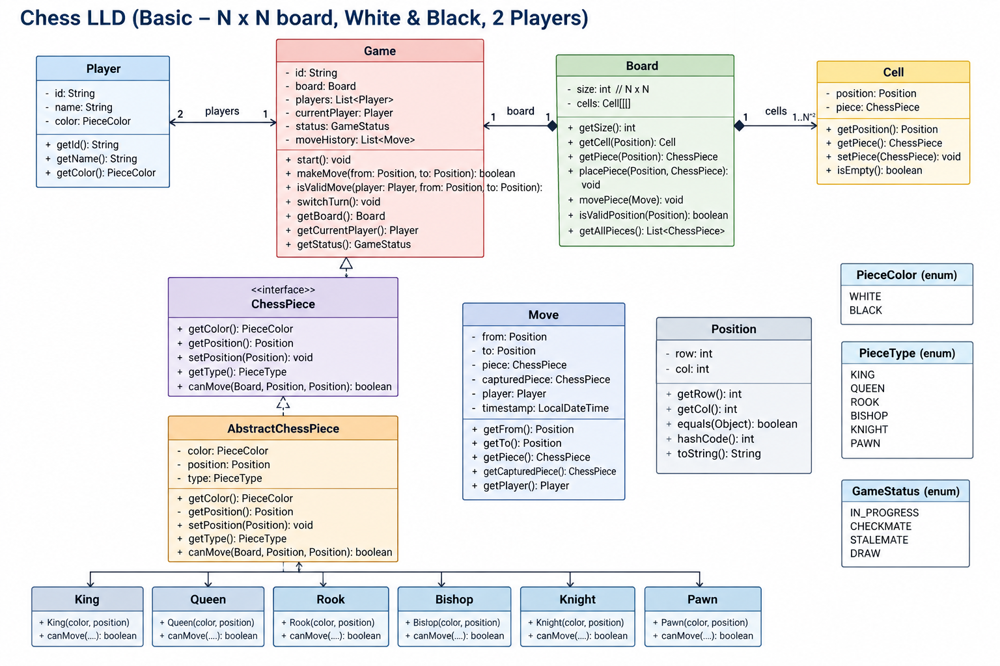

# Chess — Low-Level Design



## Revision Snapshot

| Lens | Recall |
| --- | --- |
| Core model | Game + board + positions + moves + polymorphic pieces |
| Design leverage | Piece movement is separate from whole-game legality and turn orchestration |
| Hard problem | A legal move must preserve king safety; concurrency and retries need game-version checks |

## 1. Scope

Design a basic two-player chess game:

* Board is `N × N`.
* Exactly two players.
* Players are `WHITE` and `BLACK`.
* Each player owns multiple chess pieces.
* Players take turns.
* A move is valid only if:

  * It is the current player's turn.
  * Source position contains the player's piece.
  * Destination is valid.
  * The piece's movement rule allows the move.
  * The move does not violate game rules that we choose to support.

#### Out of scope for a basic version

Unless explicitly asked:

* Castling
* En passant
* Pawn promotion
* Threefold repetition
* Fifty-move rule
* Draw by insufficient material
* AI opponent
* Networking / multiplayer service
* Persistence

State these explicitly so the interviewer knows what is intentionally omitted.

---

## 2. Core Design

```text
                    Game
                     |
        +------------+------------+
        |                         |
      Board                    Players
        |
      Cell[N][N]
        |
    ChessPiece
        |
 AbstractChessPiece
        |
 +------+------+------+------+------+------+
 |      |      |      |      |      |
King  Queen   Rook  Bishop Knight  Pawn
```

The major responsibilities are deliberately separated:

| Component            | Responsibility                          |
| -------------------- | --------------------------------------- |
| `Game`               | Orchestrates the game and manages turns |
| `Board`              | Owns the board and piece placement      |
| `Cell`               | Represents one board location           |
| `ChessPiece`         | Defines piece behavior contract         |
| `AbstractChessPiece` | Stores common piece state/behavior      |
| Concrete pieces      | Implement movement rules                |
| `Player`             | Represents a player and their color     |
| `Move`               | Represents a move/event                 |
| `Position`           | Represents row/column                   |
| `GameStatus`         | Represents current game state           |

---

## 3. Interface + Abstract Class

This is an important design discussion.

```java
interface ChessPiece {

    boolean canMove(
        Board board,
        Position from,
        Position to
    );
}
```

The interface defines the **contract**.

Then:

```java
abstract class AbstractChessPiece
        implements ChessPiece {

    protected PieceColor color;
    protected Position position;

    // common behavior

    public abstract boolean canMove(
        Board board,
        Position from,
        Position to
    );
}
```

#### Why both?

The interface provides:

* Polymorphism
* Loose coupling
* A clear contract
* Ability to introduce another implementation later

The abstract class provides:

* Shared state
* Shared implementation
* Avoids duplicating `color`, `position`, etc.

For example:

```text
ChessPiece
    ▲
    │ implements
    │
AbstractChessPiece
    ▲
    │ extends
    ├── King
    ├── Queen
    ├── Rook
    ├── Bishop
    ├── Knight
    └── Pawn
```

This is preferable to putting all behavior directly into one huge `ChessPiece` class.

---

## 4. Why Movement Logic Belongs to Pieces

Avoid:

```java
if (piece instanceof Rook) {
    ...
} else if (piece instanceof Bishop) {
    ...
}
```

inside `Game`.

Instead:

```java
piece.canMove(board, from, to);
```

The caller doesn't need to know what type of piece it is.

This follows:

* Polymorphism
* Open/Closed Principle
* Single Responsibility Principle

Adding a new piece becomes localized.

```text
Game
  |
  | canMove()
  ↓
ChessPiece
  |
  +── Rook
  +── Bishop
  +── Queen
  +── Knight
```

The `Game` class doesn't change when a new piece is introduced.

---

## 5. Board Responsibility

`Board` owns the physical state of the chess board.

```java
class Board {

    private int size;
    private Cell[][] cells;

    public Cell getCell(Position position);

    public void placePiece(
        Position position,
        ChessPiece piece
    );

    public void movePiece(
        Position from,
        Position to
    );
}
```

#### Important design principle

`Game` should not directly manipulate:

```java
board.cells[2][3] = piece;
```

because that exposes board internals.

Instead:

```java
board.movePiece(from, to);
```

This preserves encapsulation.

---

## 6. Why Have Cell?

Instead of:

```java
Map<Position, ChessPiece>
```

we can represent the board as:

```text
Board
 |
 +-- Cell
      |
      +-- Position
      +-- ChessPiece
```

A `Cell` represents the state of one location.

```java
class Cell {

    private Position position;
    private ChessPiece piece;

    public boolean isEmpty();

    public ChessPiece getPiece();

    public void setPiece(ChessPiece piece);
}
```

This becomes useful if later we add:

* Highlighted cells
* Terrain
* Special board positions
* Cell metadata
* Attack information
* UI state

For a very simple implementation, `ChessPiece[][]` can also be sufficient. `Cell` is useful when the domain model is expected to evolve.

---

## 7. Position as a Value Object

Instead of passing:

```java
int row;
int col;
```

everywhere:

```java
Position position;
```

Example:

```java
class Position {

    private int row;
    private int col;

    // equals()
    // hashCode()
}
```

This improves readability:

```java
move(from, to);
```

instead of:

```java
move(fromRow, fromCol, toRow, toCol);
```

#### Important

`Position` should ideally be immutable.

```java
final class Position {

    private final int row;
    private final int col;
}
```

This makes it a good **value object**.

---

## 8. Move as a Domain Object

Instead of passing multiple parameters around:

```java
makeMove(
    player,
    from,
    to,
    piece
);
```

represent the operation:

```java
class Move {

    private Position from;
    private Position to;
    private ChessPiece piece;
    private ChessPiece capturedPiece;
    private Player player;
}
```

Benefits:

* Easier logging
* Move history
* Undo
* Replay
* Auditing
* Persistence
* Debugging

For example:

```text
Move
 ├── player
 ├── piece
 ├── from
 ├── to
 └── capturedPiece
```

This is an example of making an important domain concept explicit.

---

## 9. Game as the Orchestrator

`Game` coordinates the workflow.

Typical flow:

```text
Player
   |
   | request move
   ↓
Game.makeMove()
   |
   +── validate player turn
   |
   +── get piece
   |
   +── validate piece ownership
   |
   +── validate movement
   |
   +── validate destination
   |
   +── handle capture
   |
   +── Board.movePiece()
   |
   +── update game state
   |
   +── switch turn
```

The `Game` should coordinate these operations rather than implementing every piece's movement algorithm.

---

## 10. Move Validation

A clean validation pipeline:

```text
makeMove(player, from, to)
          |
          ↓
Is game active?
          |
          ↓
Is it player's turn?
          |
          ↓
Is source position valid?
          |
          ↓
Does source contain a piece?
          |
          ↓
Does piece belong to player?
          |
          ↓
Is destination valid?
          |
          ↓
Can piece move there?
          |
          ↓
Is path clear?
          |
          ↓
Is destination occupied by same color?
          |
          ↓
Does move leave own king in check?
          |
          ↓
Execute move
```

This is a useful area to discuss during an interview.

---

## 11. Piece Movement

Different pieces have different movement strategies.

#### Rook

```text
Same row OR same column
```

Need to ensure there is no blocking piece between source and destination.

#### Bishop

```text
abs(row1 - row2)
==
abs(col1 - col2)
```

Again, path must be clear.

#### Queen

```text
Rook movement OR Bishop movement
```

#### Knight

```text
(2,1) OR (1,2)
```

Knight can jump over pieces.

#### King

```text
max(
    abs(row1-row2),
    abs(col1-col2)
) == 1
```

Additional chess rules determine whether the destination is safe.

#### Pawn

Pawn is special because its movement depends on:

* Color/direction
* Forward movement
* Diagonal capture
* First move
* Promotion
* En passant

Therefore, Pawn usually has significantly more specialized logic.

---

## 12. Path Validation

For sliding pieces:

```text
Rook
Bishop
Queen
```

the piece movement rule and path validation can be separated.

For example:

```java
isValidGeometry(from, to)
```

checks whether the movement shape is valid.

Then:

```java
isPathClear(from, to)
```

checks whether pieces block the path.

This avoids duplicating traversal logic across Rook, Bishop, and Queen.

Possible abstraction:

```java
class Board {

    public boolean isPathClear(
        Position from,
        Position to
    );
}
```

---

## 13. Capturing

Suppose:

```text
White Rook → Black Pawn
```

The destination contains an opponent piece.

The board can perform:

```java
movePiece(from, to);
```

where the existing piece at `to` is replaced.

The captured piece should also be preserved in `Move`:

```java
Move {
    piece = whiteRook
    capturedPiece = blackPawn
}
```

This is useful for undo/history.

---

## 14. Turn Management

`Game` owns the current player:

```java
private Player currentPlayer;
```

After a successful move:

```java
currentPlayer =
    currentPlayer == white
        ? black
        : white;
```

Important:

**Switch the turn only after a successful move.**

Do not switch it after an invalid move.

---

## 15. Game State

Use an enum:

```java
enum GameStatus {
    IN_PROGRESS,
    CHECK,
    CHECKMATE,
    STALEMATE,
    DRAW
}
```

This is better than multiple booleans:

```java
boolean isCheck;
boolean isCheckmate;
boolean isDraw;
```

because multiple booleans can create invalid combinations.

For example:

```text
CHECKMATE = true
IN_PROGRESS = true
```

would be contradictory.

An enum makes the state explicit.

---

## 16. Ownership

A piece should have a color:

```java
enum PieceColor {
    WHITE,
    BLACK
}
```

A player also has a color:

```java
class Player {
    private PieceColor color;
}
```

Move validation:

```java
piece.getColor() == player.getColor()
```

This ensures players cannot move the opponent's pieces.

---

## 17. Encapsulation

Avoid exposing mutable collections or board internals.

Bad:

```java
public Cell[][] getCells() {
    return cells;
}
```

because callers can do:

```java
board.getCells()[2][3] = ...
```

and bypass validation.

Prefer:

```java
public Cell getCell(Position position)
```

and controlled operations:

```java
board.placePiece(...)
board.movePiece(...)
```

The Board becomes the **single owner of board mutation**.

---

## 18. Dependency Direction

A good dependency direction is:

```text
Game
 ↓
Board
 ↓
Cell
 ↓
ChessPiece
```

while movement logic uses:

```text
ChessPiece → Board
```

for checking occupancy/path.

Avoid unnecessary dependencies such as:

```text
Cell → Game
Player → Game
Piece → Player
```

unless the domain actually requires them.

Keep the object graph simple.

---

## 19. Open/Closed Principle

Suppose tomorrow we introduce:

```text
AmazonPiece
WizardPiece
CustomPiece
```

We should ideally be able to add:

```java
class Wizard extends AbstractChessPiece {
    ...
}
```

without modifying:

```text
Game
Board
Player
Move
```

This is one of the strongest arguments for polymorphic piece behavior.

---

## 20. Strategy Pattern — When to Introduce It

For the basic chess LLD, separate classes are enough:

```text
Rook
Bishop
Queen
...
```

Do **not** introduce Strategy unnecessarily.

However, if movement rules become configurable:

```java
interface MovementStrategy {
    boolean canMove(Board board, Position from, Position to);
}
```

then:

```text
ChessPiece
    |
    +── MovementStrategy
            |
            +── RookMovement
            +── BishopMovement
            +── KnightMovement
```

This becomes useful if:

* Movement behavior is dynamically configurable.
* Different game variants exist.
* The same movement behavior is reused by multiple pieces.

For a basic interview problem, this may be unnecessary abstraction.

---

## 21. State Pattern — When to Introduce It

For a basic chess implementation:

```java
enum GameStatus
```

is usually sufficient.

If the game has substantial state-specific behavior:

```text
InProgress
Check
Checkmate
Stalemate
Draw
```

then State Pattern could be considered.

But don't use State Pattern merely because an enum exists.

A good interview answer:

> "I'll start with an enum because the state transitions are simple. If each state develops significant behavior, I can migrate to the State pattern."

This demonstrates pragmatic design.

---

## 22. Concurrency

For an in-memory basic chess game, assume:

```text
one game
    ↓
one active move at a time
```

If exposed as a backend service, concurrency becomes important.

Example:

```text
Player A                 Player B
   |                        |
   | move                  | move
   +----------+-------------+
              |
             Game
```

Two requests could attempt to move simultaneously.

Possible solution:

```java
synchronized makeMove(...)
```

or a per-game lock:

```text
Game ID → Lock
```

For distributed systems:

```text
Game Service
     |
Distributed Lock
     |
Game State
```

However, prefer optimistic concurrency/versioning where appropriate:

```text
gameId
version = 42

UPDATE game
SET version = 43
WHERE gameId = X
AND version = 42
```

Only one concurrent request succeeds.

---

## 23. Idempotency

If the API is:

```http
POST /games/{gameId}/moves
```

the client may retry due to timeout.

Without idempotency:

```text
Client
  |
  | Move A
  ↓
Server executes
  |
  X response lost
  |
  | retry Move A
  ↓
Server executes again
```

Use:

```text
idempotencyKey
```

or a unique move ID.

```text
Game
 └── processedMoveIds
```

The server can safely return the original result for a duplicate request.

---

## 24. Persistence

If the game must survive service restarts:

```text
Game
 ├── gameId
 ├── players
 ├── board state
 ├── currentPlayer
 ├── status
 └── move history
```

Possible architecture:

```text
API
 |
GameService
 |
GameRepository
 |
Database
```

For a basic LLD interview, keep persistence outside the core domain model unless specifically asked.

---

## 25. Event / History Model

A move can become an event:

```text
MoveMade
 ├── gameId
 ├── playerId
 ├── from
 ├── to
 ├── piece
 └── timestamp
```

This enables:

* Move history
* Audit
* Replay
* Analytics
* Notifications
* Debugging

Potential architecture:

```text
Game
 |
Move
 |
EventPublisher
 |
 +── Audit Service
 +── Notification Service
 +── Analytics
```

For the basic LLD, this is an extension rather than a requirement.

---

## 26. Error Handling

Use domain-specific errors rather than generic exceptions.

Examples:

```text
InvalidMove
NotPlayersTurn
InvalidPosition
PieceNotOwned
DestinationOccupied
PathBlocked
GameAlreadyFinished
```

An API layer can translate these into appropriate responses.

Example:

```text
InvalidMove
      ↓
HTTP 400
```

while:

```text
GameNotFound
      ↓
HTTP 404
```

Keep transport concerns outside the domain model.

---

## 27. Important Design Trade-offs

#### `Cell[][]` vs `Map<Position, ChessPiece>`

For a fixed N×N board:

```text
Cell[][]
```

is simple and provides O(1) access.

A map is useful when:

* Board is sparse.
* Board dimensions are huge.
* Positions are irregular.

For standard chess-like boards, an array is natural.

---

#### `PieceColor` vs `Player` reference inside Piece

Simpler:

```java
piece.color
```

More object-oriented:

```java
piece.owner
```

Using `Player` gives direct ownership semantics but creates stronger coupling.

For basic chess:

```java
PieceColor
```

is sufficient.

---

## 28. Testing Strategy

Test movement independently.

#### Rook

```text
Same row       → valid
Same column    → valid
Diagonal       → invalid
Blocked path   → invalid
```

#### Bishop

```text
Diagonal       → valid
Straight       → invalid
Blocked path   → invalid
```

#### Knight

```text
L-shape        → valid
Can jump       → valid
```

#### Game

```text
Correct turn
Wrong turn
Own piece
Opponent piece
Capture
Invalid position
Game over
```

#### Important integration test

```text
White moves
      ↓
Black turn
      ↓
Black moves
      ↓
White turn
```

---

## 29. Complexity

For a board of size `N × N`:

#### Position lookup

```text
O(1)
```

#### Rook/Bishop/Queen path validation

Worst case:

```text
O(N)
```

because we may scan the path.

#### Knight

```text
O(1)
```

#### Board initialization

```text
O(N²)
```

#### Space

```text
O(N²)
```

for the board.

---

## 30. Staff-Level Discussion Points

If the interviewer asks:

#### "How would you make this production ready?"

Discuss:

```text
API Layer
    ↓
Game Service
    ↓
Domain Model
    ↓
Repository
    ↓
Database
```

Then cover:

1. Concurrency control
2. Idempotency
3. Persistence
4. Game recovery
5. Move history
6. Validation
7. Authentication / authorization
8. Observability
9. Rate limiting
10. WebSocket notifications
11. Horizontal scaling
12. Failure handling

---

## 31. If Scaling to Online Chess

A possible architecture:

```text
                Load Balancer
                      |
              +-------+-------+
              |               |
         Game Service     Game Service
              |               |
              +-------+-------+
                      |
                 Game Store
                      |
             +--------+--------+
             |                 |
           Redis             Database
             |
       Active Game State
```

For real-time gameplay:

```text
Player
  |
WebSocket
  |
Game Gateway
  |
Game Service
```

Use a game ID as the routing/sharding key so requests for the same game can be handled consistently.

---

## 32. Interviewer's Likely Follow-ups

Be prepared for:

#### Design

* Why interface + abstract class?
* Why is `Game` responsible for turn management?
* Why do we need `Cell`?
* Why do we need `Move`?
* Why not put movement logic in `Game`?
* Why not use Strategy for every piece?
* How would you add a new piece?

#### Correctness

* How do you validate a move?
* How do you detect check?
* How do you detect checkmate?
* How do you prevent moving through another piece?
* How do you handle capture?
* How do you handle pawn promotion?

#### Production

* What happens if two move requests arrive simultaneously?
* How do you make `makeMove()` idempotent?
* How do you persist a game?
* How do you recover after service failure?
* How would you scale millions of games?
* How would you notify the opponent?

---

## 33. Strong Interview Closing

A good way to summarize the design:

> "The core design keeps game orchestration, board state, and piece-specific movement separate. `Game` manages turns and the lifecycle of a match, `Board` owns board mutations, and `ChessPiece` provides polymorphic movement behavior. I use an interface plus an abstract base class to combine a stable contract with shared piece state. I would keep the initial implementation intentionally simple and introduce patterns such as Strategy or State only when additional requirements justify them. For a production service, I would then address concurrency, idempotency, persistence, and real-time communication separately from the core domain model."
