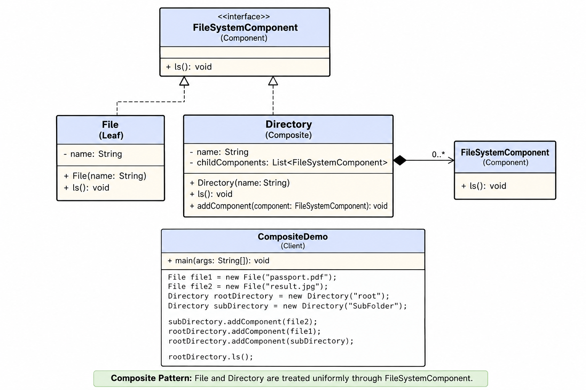

# File System — Low-Level Design



## Revision Snapshot

| Lens | Recall |
| --- | --- |
| Core model | A tree of file leaves and directory composites |
| Design leverage | Composite provides uniform traversal; mutation belongs behind directory/repository APIs |
| Hard problem | Define path, permission, link/cycle, and consistency semantics before exposing operations |

## 1. Problem Statement

Design a **File System** where both **Files** and **Directories** can be treated uniformly.

A directory can contain:

* Files
* Other directories
* Nested directories containing more files/directories

Example:

```text
root/
├── resume.pdf
├── photo.jpg
└── documents/
    ├── design.pdf
    └── notes.txt
```

The key requirement is that the client should be able to perform operations such as `ls()` on both a **File** and a **Directory** without needing to know their concrete type.

---

## 2. Core Design Idea — Composite Pattern

The **Composite Design Pattern** allows us to compose objects into tree structures and treat:

> Individual objects and compositions of objects uniformly.

In this problem:

```text
                FileSystemComponent
                       ▲
                 ┌─────┴─────┐
                 │           │
               File       Directory
              (Leaf)      (Composite)
                              │
                              │ contains
                              ▼
                    List<FileSystemComponent>
```

This is the Composite pattern's core structure.

---

## 3. Class Diagram

The important classes are:

```text
                 <<interface>>
              FileSystemComponent
                       │
             ┌─────────┴─────────┐
             │                   │
             ▼                   ▼
           File              Directory
          (Leaf)             (Composite)
                                 │
                                 │ 0..*
                                 ▼
                       FileSystemComponent
```

---

## 4. FileSystemComponent

This is the **Component** in the Composite pattern.

```java
interface FileSystemComponent {

    void ls();
}
```

It defines the common operation that both `File` and `Directory` must support.

#### Why interface?

Because the client should not care whether it is dealing with:

```java
File
```

or

```java
Directory
```

It can simply work with:

```java
FileSystemComponent
```

For example:

```java
FileSystemComponent component;

component.ls();
```

The actual implementation is resolved polymorphically.

---

## 5. File — Leaf

`File` represents an individual file.

A file **cannot contain other FileSystemComponents**, so it is a **Leaf**.

```java
class File implements FileSystemComponent {

    private String name;

    public File(String name) {
        this.name = name;
    }

    @Override
    public void ls() {
        System.out.println(name);
    }
}
```

#### Responsibilities

* Maintain file information
* Implement `FileSystemComponent`
* Perform file-specific behavior

Example:

```java
File file = new File("resume.pdf");

file.ls();
```

Output:

```text
resume.pdf
```

---

## 6. Directory — Composite

`Directory` is the **Composite**.

Unlike a file, it can contain multiple components.

```java
class Directory implements FileSystemComponent {

    private String name;

    private List<FileSystemComponent> childComponents =
            new ArrayList<>();

    public Directory(String name) {
        this.name = name;
    }

    @Override
    public void ls() {
        System.out.println(name);

        for (FileSystemComponent component : childComponents) {
            component.ls();
        }
    }

    public void addComponent(FileSystemComponent component) {
        childComponents.add(component);
    }
}
```

The important relationship is:

```text
Directory
    │
    │ contains
    ▼
List<FileSystemComponent>
```

Notice that the list does **not** contain only `File`.

It contains:

```java
List<FileSystemComponent>
```

Therefore a directory can contain:

```text
File
Directory
File
Directory
...
```

This is what enables arbitrary nesting.

---

## 7. Why `List<FileSystemComponent>`?

This is the most important design decision in the LLD.

Suppose we had:

```java
List<File> files;
```

Then a directory couldn't contain another directory.

Instead:

```java
List<FileSystemComponent> children;
```

allows:

```text
Directory
 ├── File
 ├── File
 ├── Directory
 │    ├── File
 │    └── File
 └── Directory
      └── File
```

So the structure naturally becomes a **tree**.

---

## 8. Recursive `ls()`

The power of Composite appears in `Directory.ls()`.

```java
@Override
public void ls() {

    System.out.println(name);

    for (FileSystemComponent component : childComponents) {
        component.ls();
    }
}
```

Suppose:

```text
root
├── file1
└── subDirectory
    └── file2
```

Then:

```java
root.ls();
```

results in:

```text
root
file1
subDirectory
file2
```

Why?

Because:

```text
root.ls()
   |
   +--> file1.ls()
   |
   +--> subDirectory.ls()
             |
             +--> file2.ls()
```

The recursion happens naturally through **polymorphism**.

`Directory` doesn't need to know whether a child is a file or another directory.

It simply calls:

```java
component.ls();
```

---

## 9. Client

The client creates the hierarchy.

Example:

```java
File file1 = new File("passport.pdf");
File file2 = new File("result.jpg");

Directory rootDirectory = new Directory("root");
Directory subDirectory = new Directory("SubFolder");

subDirectory.addComponent(file2);

rootDirectory.addComponent(file1);
rootDirectory.addComponent(subDirectory);

rootDirectory.ls();
```

Hierarchy:

```text
root
├── passport.pdf
└── SubFolder
    └── result.jpg
```

The client doesn't need special logic like:

```java
if (component instanceof File) {
    ...
} else if (component instanceof Directory) {
    ...
}
```

That's one of the major benefits of Composite.

---

## 10. Object Structure

At runtime, the objects look like:

```text
                 root : Directory
                       │
              ┌────────┴────────┐
              │                 │
              ▼                 ▼
     passport.pdf : File    SubFolder : Directory
                                  │
                                  ▼
                           result.jpg : File
```

Or conceptually:

```text
Directory
   |
   +---- File
   |
   +---- Directory
            |
            +---- File
```

This structure can continue indefinitely.

---

## 11. Composite Pattern Roles

| Composite Role | File System Class     |
| -------------- | --------------------- |
| Component      | `FileSystemComponent` |
| Leaf           | `File`                |
| Composite      | `Directory`           |
| Client         | `CompositeDemo`       |

#### Component

Defines the common interface.

```java
FileSystemComponent
```

#### Leaf

Represents an individual object.

```java
File
```

#### Composite

Contains other Components.

```java
Directory
```

#### Client

Builds and uses the object tree.

```java
CompositeDemo
```

---

## 12. Why Composite Is Appropriate Here

Without Composite, the client might need to know the hierarchy.

For example:

```java
if (object instanceof File) {
    // file logic
}

if (object instanceof Directory) {
    // directory logic
}
```

This creates tight coupling.

With Composite:

```java
FileSystemComponent component;
component.ls();
```

The client only knows the abstraction.

This gives:

* Polymorphism
* Recursive structures
* Loose coupling
* Uniform treatment of File and Directory
* Easy addition of new component types

---

## 13. Extensibility

Suppose tomorrow we introduce:

```text
SymbolicLink
```

We can simply implement:

```java
class SymbolicLink implements FileSystemComponent {

    @Override
    public void ls() {
        // symbolic link behavior
    }
}
```

The existing `Directory` doesn't need modification.

It already stores:

```java
List<FileSystemComponent>
```

Therefore:

```java
directory.addComponent(symbolicLink);
```

works automatically.

This demonstrates the **Open/Closed Principle**.

---

## 14. Important Design Principle

The most important abstraction is:

```java
FileSystemComponent
```

not:

```java
File
```

and not:

```java
Directory
```

The hierarchy is based on the common behavior:

```text
FileSystemComponent
       |
       +---- File
       |
       +---- Directory
```

This allows the tree to contain heterogeneous objects.

---

## 15. Composition Relationship

`Directory` has a **composition** relationship with its children.

Conceptually:

```text
Directory ◆──────── 0..* FileSystemComponent
```

The diamond represents composition.

A directory owns its child collection.

For example:

```java
private List<FileSystemComponent> childComponents;
```

This relationship is important because a directory is the natural owner of the components directly contained within it.

---

## 16. Tree Properties

The resulting data structure is a tree.

Each node is:

```text
File
```

or

```text
Directory
```

Directories can have children:

```text
Directory → children
```

Files are terminal nodes:

```text
File → no children
```

Therefore:

```text
                 Directory
                 /       \
              File      Directory
                         /      \
                      File      File
```

---

## 17. Complexity

Assume there are `N` components under a directory.

For:

```java
root.ls();
```

every reachable component is visited once.

#### Time

```text
O(N)
```

#### Auxiliary Space

Because `ls()` is recursive:

```text
O(H)
```

where `H` is the maximum directory depth.

For example:

```text
root
 └── A
      └── B
           └── C
                └── D
```

Here:

```text
H = 5
```

The recursion stack is proportional to the tree depth.

---

## 18. Interview-Level Discussion

For a Staff/Senior LLD interview, don't stop at the class diagram.

Discuss the following.

## 1. What pattern are you using?

> Composite Design Pattern.

## 2. Why?

> File and Directory need to be treated uniformly while still allowing a Directory to contain both Files and other Directories.

## 3. Why does Directory contain `List<FileSystemComponent>`?

> Because children can be either Leaf or Composite objects, enabling recursive tree composition.

## 4. Why isn't `Directory` containing `List<File>`?

Because that would prevent:

```text
Directory → Directory
```

relationships.

## 5. Why doesn't the client use `instanceof`?

Because the common `FileSystemComponent` abstraction and polymorphism eliminate the need for type-specific branching.

---

## 19. Potential Production Extensions

This minimal design is intentional. A production file system needs additional metadata and operations.

#### File metadata

```java
class File {
    String name;
    long size;
    Instant createdAt;
    Instant modifiedAt;
    String owner;
    Permission permission;
}
```

#### Directory operations

```java
add()
remove()
getChild()
find()
```

#### File operations

```java
read()
write()
delete()
rename()
```

#### Common operations

Depending on requirements:

```java
getName()
getSize()
delete()
getPath()
```

For example:

```java
interface FileSystemComponent {

    String getName();

    long getSize();

    void delete();
}
```

But these methods should be introduced only when they represent meaningful common behavior.

---

## 20. Handling Unsupported Operations

A classic Composite design question is:

> What if an operation makes sense for Directory but not File?

For example:

```java
addComponent()
```

makes sense for `Directory`, but not `File`.

There are two common approaches.

#### Approach 1 — Keep only common operations

```java
interface FileSystemComponent {
    void ls();
}
```

And expose:

```java
addComponent()
```

only on `Directory`.

This is the clean approach used in the basic design.

#### Approach 2 — Put child-management operations in Component

```java
interface FileSystemComponent {

    void ls();

    void add(FileSystemComponent component);

    void remove(FileSystemComponent component);
}
```

Then `File` must somehow handle unsupported operations.

For example:

```java
throw new UnsupportedOperationException();
```

This can make the abstraction less clean.

**For an interview, Approach 1 is generally easier to defend when the requirements don't demand uniform `add/remove` operations.**

---

## 21. What If We Need `getSize()`?

This is a useful Composite interview extension.

For `File`:

```java
@Override
public long getSize() {
    return size;
}
```

For `Directory`:

```java
@Override
public long getSize() {

    long total = 0;

    for (FileSystemComponent component : children) {
        total += component.getSize();
    }

    return total;
}
```

Now the same method has different implementations:

```text
File
 └── returns its own size

Directory
 └── recursively sums children's sizes
```

Example:

```text
root
├── A.txt       10 KB
├── B.txt       20 KB
└── docs/
    ├── C.pdf   50 KB
    └── D.pdf   20 KB
```

Then:

```text
docs.getSize() = 70 KB

root.getSize() = 100 KB
```

This demonstrates why Composite is extremely powerful for hierarchical calculations.

---

## 22. Key Interview Trade-off

Composite gives uniformity, with an important trade-off.

If we keep adding methods to:

```java
FileSystemComponent
```

the interface can become bloated.

For example:

```java
read()
write()
add()
remove()
move()
getSize()
compress()
execute()
```

Some operations may not make sense for every component.

So the design should be driven by **common behavior**, not by blindly putting every possible operation into the interface.

---

## 23. Complete Minimal Implementation

```java
import java.util.*;

interface FileSystemComponent {

    void ls();
}

class File implements FileSystemComponent {

    private final String name;

    public File(String name) {
        this.name = name;
    }

    @Override
    public void ls() {
        System.out.println(name);
    }
}

class Directory implements FileSystemComponent {

    private final String name;

    private final List<FileSystemComponent> children =
            new ArrayList<>();

    public Directory(String name) {
        this.name = name;
    }

    public void addComponent(FileSystemComponent component) {
        children.add(component);
    }

    @Override
    public void ls() {

        System.out.println(name);

        for (FileSystemComponent child : children) {
            child.ls();
        }
    }
}

public class CompositeDemo {

    public static void main(String[] args) {

        File file1 = new File("passport.pdf");
        File file2 = new File("result.jpg");

        Directory root = new Directory("root");
        Directory subDirectory = new Directory("SubFolder");

        subDirectory.addComponent(file2);

        root.addComponent(file1);
        root.addComponent(subDirectory);

        root.ls();
    }
}
```

---

## 24. 30-Second Interview Explanation

> **I would use the Composite Design Pattern because a file system naturally forms a tree where a File is a leaf and a Directory is a composite containing other FileSystemComponents.**
>
> **I define a common FileSystemComponent interface with operations such as `ls()`. File implements it as a leaf, while Directory implements it as a composite and maintains a `List<FileSystemComponent>`. Directory's `ls()` recursively delegates to its children.**
>
> **This allows the client to treat files and directories uniformly through the abstraction and avoids `instanceof` checks. It also makes the design extensible because new component types can be introduced without changing Directory.**

### The one thing to remember

```text
                 FileSystemComponent
                        │
              ┌─────────┴─────────┐
              ▼                   ▼
            File              Directory
            Leaf              Composite
                                  │
                                  │
                                  ▼
                       List<FileSystemComponent>
```

**This single relationship is the heart of the entire design.**

---

## 25. Staff-Level Deep Dive: Tree Semantics and Safe Traversal

Before adding operations, decide what the tree guarantees:

* If each component has exactly one parent, the model is a tree. If hard links or shared subtrees are allowed, it is a graph; traversal must track visited identities and handle cycles.
* Directory mutation must reject adding a directory beneath itself or one of its descendants. Otherwise recursive operations such as `ls()` and `getSize()` can loop indefinitely.
* Resolve paths component by component and enforce permissions at each boundary. Normalize `.` and `..`, define symbolic-link behavior, and prevent a resolved path from escaping an authorized root.

For large directories, avoid materializing an entire recursive listing. Stream or paginate children with a stable cursor, and use iterative traversal or a depth limit to avoid stack exhaustion on deeply nested input. `ls()` should return structured entries; printing belongs in a CLI or presentation adapter.

Treat metadata mutation as a consistency boundary: rename/move should update parent indexes and path metadata atomically, with stable object IDs so references do not depend on mutable names. Add a repository or transaction layer only when persistence or concurrent clients are in scope; keep the in-memory Composite small for the interview baseline.
