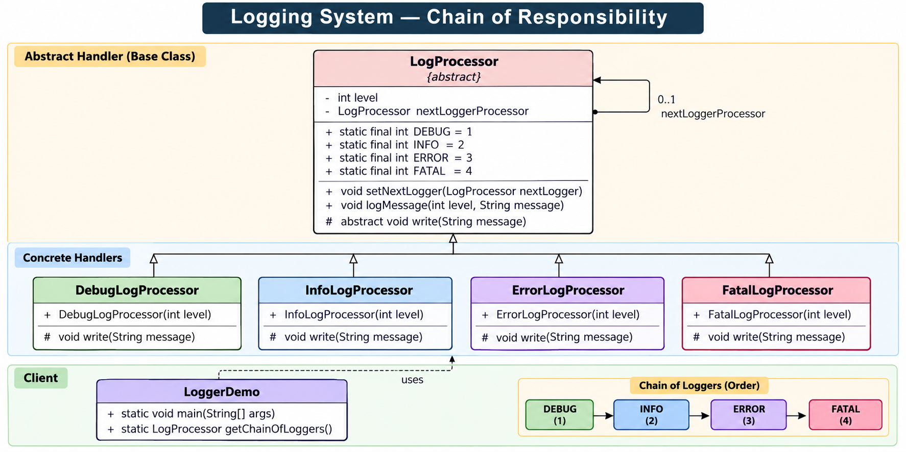

# Logging System — Low-Level Design



## Revision Snapshot

| Lens | Recall |
| --- | --- |
| Core model | Log event -> routing/filtering -> one or more appenders |
| Design leverage | Chain of Responsibility is useful for ordered handlers; production routing often needs threshold filters and fan-out |
| Hard problem | Async sinks require bounded queues, explicit overload behavior, and loss/latency observability |

## 1. Problem Statement

Design a logging system that supports multiple log levels:

* `DEBUG`
* `INFO`
* `ERROR`
* `FATAL`

A log request should be handled by the appropriate logger in a chain.

For example:

```text
DEBUG → INFO → ERROR → FATAL
```

If a `DEBUG` message arrives, the Debug logger handles it.

If an `ERROR` message arrives:

```text
Debug → Info → Error
                  ↓
               handles
```

The request should travel through the chain until the appropriate processor handles it.

---

## 2. Why Chain of Responsibility?

The main problem is that the client should **not need to know which concrete logger handles a particular log level**.

Without Chain of Responsibility, we might write:

```java
if (level == DEBUG) {
    debugLogger.write(message);
} else if (level == INFO) {
    infoLogger.write(message);
} else if (level == ERROR) {
    errorLogger.write(message);
} else if (level == FATAL) {
    fatalLogger.write(message);
}
```

This creates tight coupling between the client and every logger.

With Chain of Responsibility:

```text
Client
   |
   v
DebugLogger
   |
   v
InfoLogger
   |
   v
ErrorLogger
   |
   v
FatalLogger
```

The client simply says:

```java
loggerChain.logMessage(level, message);
```

The chain decides who handles it.

---

## 3. Core Design

The design has three major parts:

```text
                ┌─────────────────────┐
                │    LogProcessor     │
                │    <<abstract>>     │
                └──────────┬──────────┘
                           │
          ┌────────────────┼────────────────┐
          │                │                │
          ▼                ▼                ▼
   DebugLogProcessor  InfoLogProcessor  ErrorLogProcessor
                                              │
                                      FatalLogProcessor


Client
  |
  v
LogProcessor chain

DEBUG → INFO → ERROR → FATAL
```

The important class is:

```java
abstract class LogProcessor
```

It contains the common chain logic.

---

## 4. Log Levels

The base class maintains the supported levels.

```java
static final int DEBUG = 1;
static final int INFO  = 2;
static final int ERROR = 3;
static final int FATAL = 4;
```

So:

```text
DEBUG = 1
INFO  = 2
ERROR = 3
FATAL = 4
```

The numerical ordering is important because the processor can determine whether it should handle a particular request.

---

## 5. LogProcessor — Abstract Base Class

The central abstraction is:

```java
abstract class LogProcessor {

    public static final int DEBUG = 1;
    public static final int INFO = 2;
    public static final int ERROR = 3;
    public static final int FATAL = 4;

    int level;

    LogProcessor nextLoggerProcessor;

    public void setNextLogger(LogProcessor nextLoggerProcessor) {
        this.nextLoggerProcessor = nextLoggerProcessor;
    }

    public void logMessage(int level, String message) {

        if (this.level == level) {
            write(message);
        }

        if (nextLoggerProcessor != null) {
            nextLoggerProcessor.logMessage(level, message);
        }
    }

    protected abstract void write(String message);
}
```

The exact implementation can vary slightly, but these are the important responsibilities.

---

## 6. Why is LogProcessor Abstract?

`LogProcessor` represents the **common behavior of every logger**, but it doesn't know how an actual message should be written.

For example:

```text
DebugLogProcessor → write()
InfoLogProcessor  → write()
ErrorLogProcessor → write()
FatalLogProcessor → write()
```

Therefore:

```java
protected abstract void write(String message);
```

forces every concrete processor to provide its own implementation.

This gives us:

```text
Common chain logic
       +
Different logging behavior
```

---

## 7. `level` Field

Each processor knows which log level it is responsible for.

For example:

```java
DebugLogProcessor
    level = DEBUG

InfoLogProcessor
    level = INFO

ErrorLogProcessor
    level = ERROR

FatalLogProcessor
    level = FATAL
```

The constructor receives the level:

```java
public DebugLogProcessor(int level) {
    this.level = level;
}
```

The same idea applies to all processors.

---

## 8. `nextLoggerProcessor`

This is the key field implementing the chain.

```java
LogProcessor nextLoggerProcessor;
```

It points to the **next processor**.

For example:

```text
DebugLogProcessor
       |
       | nextLoggerProcessor
       ▼
InfoLogProcessor
       |
       ▼
ErrorLogProcessor
       |
       ▼
FatalLogProcessor
```

This creates a linked-list-like structure.

Conceptually:

```text
Current Processor
       |
       +---- next ----> Next Processor
                           |
                           +---- next ----> ...
```

This is one of the most important LLD concepts in this problem.

---

## 9. `setNextLogger()`

The chain is constructed using:

```java
public void setNextLogger(LogProcessor nextLoggerProcessor) {
    this.nextLoggerProcessor = nextLoggerProcessor;
}
```

Example:

```java
debugLogger.setNextLogger(infoLogger);
infoLogger.setNextLogger(errorLogger);
errorLogger.setNextLogger(fatalLogger);
```

Result:

```text
DEBUG
  ↓
INFO
  ↓
ERROR
  ↓
FATAL
```

The client doesn't need to understand the internal forwarding logic.

---

## 10. `logMessage()` — Core Algorithm

This is the heart of the design.

Conceptually:

```java
public void logMessage(int level, String message) {

    if (this.level == level) {
        write(message);
    }

    if (nextLoggerProcessor != null) {
        nextLoggerProcessor.logMessage(level, message);
    }
}
```

There are two responsibilities:

#### Step 1 — Check current processor

```java
if (this.level == level) {
    write(message);
}
```

If the current processor is responsible for this level, it writes the message.

#### Step 2 — Forward to next processor

```java
if (nextLoggerProcessor != null) {
    nextLoggerProcessor.logMessage(level, message);
}
```

The request is forwarded to the next processor.

---

## 11. Example — ERROR Message

Suppose:

```java
logger.logMessage(LogProcessor.ERROR, "Database connection failed");
```

The request starts at:

```text
DebugLogProcessor
```

#### Debug Processor

```text
current level = DEBUG
requested level = ERROR
```

Not a match.

Forward:

```text
Debug → Info
```

#### Info Processor

```text
current level = INFO
requested level = ERROR
```

Not a match.

Forward:

```text
Info → Error
```

#### Error Processor

```text
current level = ERROR
requested level = ERROR
```

Match!

```java
write(message);
```

Then, depending on the implementation shown, the request may continue to the next processor.

Conceptually:

```text
ERROR request

Debug
  │
  │ not responsible
  ▼
Info
  │
  │ not responsible
  ▼
Error
  │
  │ responsible
  ▼
write()
```

---

## 12. Concrete Processors

There are four concrete handlers.

---

### DebugLogProcessor

```java
class DebugLogProcessor extends LogProcessor {

    public DebugLogProcessor(int level) {
        this.level = level;
    }

    @Override
    protected void write(String message) {
        System.out.println("DEBUG: " + message);
    }
}
```

Responsibility:

```text
Handle DEBUG logs
```

---

### InfoLogProcessor

```java
class InfoLogProcessor extends LogProcessor {

    public InfoLogProcessor(int level) {
        this.level = level;
    }

    @Override
    protected void write(String message) {
        System.out.println("INFO: " + message);
    }
}
```

Responsibility:

```text
Handle INFO logs
```

---

### ErrorLogProcessor

```java
class ErrorLogProcessor extends LogProcessor {

    public ErrorLogProcessor(int level) {
        this.level = level;
    }

    @Override
    protected void write(String message) {
        System.out.println("ERROR: " + message);
    }
}
```

Responsibility:

```text
Handle ERROR logs
```

---

### FatalLogProcessor

```java
class FatalLogProcessor extends LogProcessor {

    public FatalLogProcessor(int level) {
        this.level = level;
    }

    @Override
    protected void write(String message) {
        System.out.println("FATAL: " + message);
    }
}
```

Responsibility:

```text
Handle FATAL logs
```

---

## 13. Client — LoggerDemo

The client creates the processors and constructs the chain.

Conceptually:

```java
public class LoggerDemo {

    public static void main(String[] args) {

        LogProcessor logger = getChainOfLoggers();

        logger.logMessage(
            LogProcessor.DEBUG,
            "Debug message"
        );

        logger.logMessage(
            LogProcessor.INFO,
            "Info message"
        );

        logger.logMessage(
            LogProcessor.ERROR,
            "Error message"
        );

        logger.logMessage(
            LogProcessor.FATAL,
            "Fatal message"
        );
    }

    public static LogProcessor getChainOfLoggers() {
        ...
    }
}
```

---

## 14. Chain Construction

The chain is built inside:

```java
getChainOfLoggers()
```

Conceptually:

```java
public static LogProcessor getChainOfLoggers() {

    LogProcessor fatalLogger =
        new FatalLogProcessor(LogProcessor.FATAL);

    LogProcessor errorLogger =
        new ErrorLogProcessor(LogProcessor.ERROR);

    LogProcessor infoLogger =
        new InfoLogProcessor(LogProcessor.INFO);

    LogProcessor debugLogger =
        new DebugLogProcessor(LogProcessor.DEBUG);

    errorLogger.setNextLogger(fatalLogger);
    infoLogger.setNextLogger(errorLogger);
    debugLogger.setNextLogger(infoLogger);

    return debugLogger;
}
```

The important point:

```text
return debugLogger
```

The client gets the **first element of the chain**, not every processor.

---

## 15. Final Object Graph

After construction:

```text
                ┌──────────────────┐
                │ DebugProcessor   │
                │ level = DEBUG    │
                └────────┬─────────┘
                         │
                         │ next
                         ▼
                ┌──────────────────┐
                │ InfoProcessor    │
                │ level = INFO     │
                └────────┬─────────┘
                         │
                         │ next
                         ▼
                ┌──────────────────┐
                │ ErrorProcessor   │
                │ level = ERROR    │
                └────────┬─────────┘
                         │
                         │ next
                         ▼
                ┌──────────────────┐
                │ FatalProcessor   │
                │ level = FATAL    │
                └──────────────────┘
```

The client only holds:

```text
debugLogger
```

which is the entry point to the complete chain.

---

## 16. Complete Class Relationship

```text
                         ┌──────────────────────────┐
                         │      LogProcessor        │
                         │       <<abstract>>       │
                         ├──────────────────────────┤
                         │ - level                  │
                         │ - nextLoggerProcessor    │
                         ├──────────────────────────┤
                         │ + setNextLogger()        │
                         │ + logMessage()           │
                         │ # abstract write()       │
                         └─────────────┬────────────┘
                                       │
                    ┌──────────────────┼──────────────────┐
                    │                  │                  │
                    ▼                  ▼                  ▼
          ┌────────────────┐  ┌────────────────┐  ┌────────────────┐
          │ DebugLog       │  │ InfoLog        │  │ ErrorLog       │
          │ Processor      │  │ Processor      │  │ Processor      │
          ├────────────────┤  ├────────────────┤  ├────────────────┤
          │ write()        │  │ write()        │  │ write()        │
          └────────────────┘  └────────────────┘  └────────────────┘
                                                           │
                                                           │
                                                           ▼
                                                  ┌────────────────┐
                                                  │ FatalLog       │
                                                  │ Processor      │
                                                  ├────────────────┤
                                                  │ write()        │
                                                  └────────────────┘
```

More accurately, **all four concrete processors directly extend `LogProcessor`**:

```text
                     LogProcessor
                          ▲
          ┌───────────────┼────────────────┐
          │               │                │
          │               │                │
       Debug            Info             Error
                                             ▲
                                             │
                                           Fatal
```

But UML-wise:

```text
DebugLogProcessor ────────▷ LogProcessor
InfoLogProcessor  ────────▷ LogProcessor
ErrorLogProcessor ────────▷ LogProcessor
FatalLogProcessor ────────▷ LogProcessor
```

There is **no inheritance relationship between Debug → Info → Error → Fatal**.

The chain is created through:

```java
nextLoggerProcessor
```

This distinction is very important in an interview.

---

## 17. Inheritance vs Chain

A common confusion is:

```text
Debug → Info → Error → Fatal
```

and assuming this means inheritance.

It does NOT.

#### Inheritance

```text
DebugLogProcessor
        ▲
        │ extends
        │
LogProcessor
```

All concrete processors inherit from:

```java
LogProcessor
```

#### Chain

```text
Debug
  │
  │ nextLoggerProcessor
  ▼
Info
  │
  ▼
Error
  │
  ▼
Fatal
```

The chain is a **runtime object relationship**, not an inheritance hierarchy.

---

## 18. Chain of Responsibility Pattern

The general pattern looks like:

```text
Client
   |
   ▼
Handler 1
   |
   ▼
Handler 2
   |
   ▼
Handler 3
   |
   ▼
Handler 4
```

Each handler has:

```text
request
  ↓
Can I handle it?
  │
  ├── YES → handle
  │
  └── NO  → forward
```

In this logging system:

```text
Client
  ↓
Debug
  ↓
Info
  ↓
Error
  ↓
Fatal
```

---

## 19. Why This Design Is Better Than `if-else`

#### Without Chain of Responsibility

```java
if (level == DEBUG) {
    ...
}
else if (level == INFO) {
    ...
}
else if (level == ERROR) {
    ...
}
else if (level == FATAL) {
    ...
}
```

Problems:

* Client knows every log type.
* Adding a new level modifies client logic.
* Logic becomes harder to maintain.
* Higher coupling.

#### With Chain of Responsibility

```java
logger.logMessage(level, message);
```

The client doesn't care about the concrete processor.

Benefits:

* Loose coupling
* Separation of responsibilities
* Easier extension
* Cleaner client
* Each handler has a focused responsibility

---

## 20. Adding a New Log Level

Suppose we introduce:

```text
TRACE
```

We can create:

```java
class TraceLogProcessor extends LogProcessor {

    public TraceLogProcessor(int level) {
        this.level = level;
    }

    @Override
    protected void write(String message) {
        System.out.println("TRACE: " + message);
    }
}
```

Then add it to the chain:

```text
TRACE → DEBUG → INFO → ERROR → FATAL
```

The overall architecture doesn't need to change.

This demonstrates the **Open/Closed Principle**:

> Open for extension, closed for modification.

---

## 21. SOLID Principles Used

### Single Responsibility Principle

Each concrete processor is responsible for one type of logging.

```text
DebugProcessor → DEBUG
InfoProcessor  → INFO
ErrorProcessor → ERROR
FatalProcessor → FATAL
```

---

### Open/Closed Principle

We can add:

```text
TraceLogProcessor
WarningLogProcessor
AuditLogProcessor
```

without rewriting existing processors.

---

### Dependency Inversion

The client works with:

```java
LogProcessor
```

rather than:

```java
DebugLogProcessor
InfoLogProcessor
ErrorLogProcessor
FatalLogProcessor
```

The client depends on the abstraction.

---

## 22. Important Interview Insight

The most important design decision is:

```java
LogProcessor nextLoggerProcessor;
```

This field makes the processor both:

1. A **handler**
2. A **link to the next handler**

Therefore the base class represents both the common behavior and the chain structure.

Think:

```text
Handler
 ├── knows how to process
 └── knows who comes next
```

---

## 23. Request Flow

For:

```java
logger.logMessage(ERROR, "DB failed");
```

Think of execution as:

```text
                    ERROR request
                         │
                         ▼
                ┌────────────────┐
                │ DebugProcessor  │
                └───────┬────────┘
                        │
                   not DEBUG
                        │
                        ▼
                ┌────────────────┐
                │ InfoProcessor   │
                └───────┬────────┘
                        │
                    not INFO
                        │
                        ▼
                ┌────────────────┐
                │ ErrorProcessor  │
                └───────┬────────┘
                        │
                     ERROR!
                        │
                        ▼
                    write()
```

The client doesn't know any of these internal steps.

---

## 24. Runtime Complexity

If there are `N` processors in the chain:

#### Best case

The first processor handles the request:

```text
O(1)
```

#### Worst case

The request travels through the entire chain:

```text
O(N)
```

#### Space

The chain itself requires:

```text
O(N)
```

because there are `N` processor objects.

If recursion is used for forwarding, there can also be:

```text
O(N)
```

call-stack depth in the worst case.

---

## 25. Important Design Tradeoff

The chain provides flexibility, but the request may have to traverse several handlers.

Therefore:

```text
More handlers
      ↓
More traversal
      ↓
Higher worst-case processing cost
```

For a small number of log levels this is negligible.

For a very large processing chain, other approaches may be preferable depending on the requirements.

---

## 26. One Important Implementation Detail

There are two common interpretations of Chain of Responsibility.

#### Variant A — Stop after handling

```java
if (this.level == level) {
    write(message);
    return;
}

if (nextLoggerProcessor != null) {
    nextLoggerProcessor.logMessage(level, message);
}
```

Only one handler processes the request.

```text
ERROR
  ↓
Debug → Info → Error
                  ↓
                STOP
```

#### Variant B — Continue after handling

```java
if (this.level == level) {
    write(message);
}

if (nextLoggerProcessor != null) {
    nextLoggerProcessor.logMessage(level, message);
}
```

The current handler can process it and the request can continue.

```text
ERROR
  ↓
Debug → Info → Error → Fatal
                  ↓
                write()
```

**For interview preparation, always clarify which behavior the requirements demand.**

---

## 27. What the Client Should Know

The client should know:

```text
LogProcessor
```

and the API:

```java
logMessage(level, message)
```

The client should NOT need to know:

```text
DebugLogProcessor
InfoLogProcessor
ErrorLogProcessor
FatalLogProcessor
```

after the chain has been constructed.

This is the core decoupling provided by the pattern.

---

## 28. Interview Explanation — 30 Seconds

If asked:

> Explain your design.

Say:

> "I have modeled the logging system using the Chain of Responsibility pattern. `LogProcessor` is an abstract handler containing the log level, a reference to the next processor, and the common `logMessage` logic. Debug, Info, Error and Fatal processors extend it and implement `write()`. During initialization, I construct a chain of processors from DEBUG to FATAL. The client only keeps a reference to the first processor and sends the log request to it. Each processor checks whether it can handle the requested level and forwards the request to the next processor when required. This keeps the client decoupled from concrete logging implementations and makes adding new log levels straightforward."

---

## 29. Interview Questions You Should Be Ready For

#### Q1. Why Chain of Responsibility?

Because the sender should not need to know which concrete handler processes the request.

---

#### Q2. Why is `LogProcessor` abstract?

Because it contains shared chain behavior but delegates the actual writing operation to concrete processors.

---

#### Q3. Why does every processor have `nextLoggerProcessor`?

To forward requests through the chain.

---

#### Q4. Is DebugProcessor the parent of InfoProcessor?

No.

All processors extend:

```text
LogProcessor
```

The DEBUG → INFO → ERROR → FATAL relationship is a runtime chain.

---

#### Q5. Who creates the chain?

The client/factory method:

```java
getChainOfLoggers()
```

---

#### Q6. Why doesn't the client directly call ErrorLogProcessor?

Because that would tightly couple the client to concrete implementations.

Instead:

```java
logger.logMessage(ERROR, message);
```

---

#### Q7. What happens if a new log level is introduced?

Create another `LogProcessor` implementation and insert it into the chain.

---

#### Q8. What is the worst-case complexity?

For `N` processors:

```text
Time:  O(N)
Space: O(N)
```

---

#### Q9. Is this inheritance or composition?

Both are present, but for different purposes.

Inheritance:

```text
ConcreteProcessor → LogProcessor
```

Composition/reference:

```text
Processor → nextLoggerProcessor → Processor
```

---

## 30. Mental Model

Remember the entire design using just this:

```text
              ABSTRACT HANDLER
                     │
                     ▼
              ┌─────────────┐
              │LogProcessor │
              └──────┬──────┘
                     │
       ┌─────────────┼─────────────┐
       ▼             ▼             ▼
     Debug          Info          Error       Fatal
       │             │             │            │
       └─────────────┴─────────────┴────────────┘
                     │
                     ▼
                 nextLogger
                     │
                     ▼
              NEXT PROCESSOR
```

And the runtime chain:

```text
DEBUG → INFO → ERROR → FATAL
```

The **most important distinction**:

```text
EXTENDS                         NEXT
  │                              │
  ▼                              ▼

LogProcessor                LogProcessor
    ▲                           │
    │                           │
    │                           ▼
DebugProcessor             next processor
InfoProcessor
ErrorProcessor
FatalProcessor
```

**Inheritance defines what a processor IS.**

**`nextLoggerProcessor` defines where a request GOES NEXT.**

That distinction is the essence of this LLD.

---

## 31. Staff-Level Deep Dive: Routing Semantics and Backpressure

First decide what “ERROR” means. The current chain is exact-level routing: one processor matches `ERROR`. A common production logger instead applies a threshold (`ERROR` includes FATAL) and fans the record out to configured appenders. Those are different semantics; express threshold filtering and sink routing explicitly rather than relying on chain order.

For a synchronous logger, a slow disk or network sink adds latency to the caller. An asynchronous design can enqueue structured records to a bounded queue, but must define what happens when it fills: block, drop low-severity records, spill to disk, or fail the logging call. Monitor queue depth and dropped-record counts. “Async” without a backpressure policy only hides overload until memory is exhausted.

Carry timestamp, severity, service, trace/span IDs, and event fields as structured data. Redact secrets and personal data before export, and define retention/access policy. Logging is an operational dependency: keep its failure behavior deliberate, and do not let a logging outage recursively generate unbounded logging retries.
