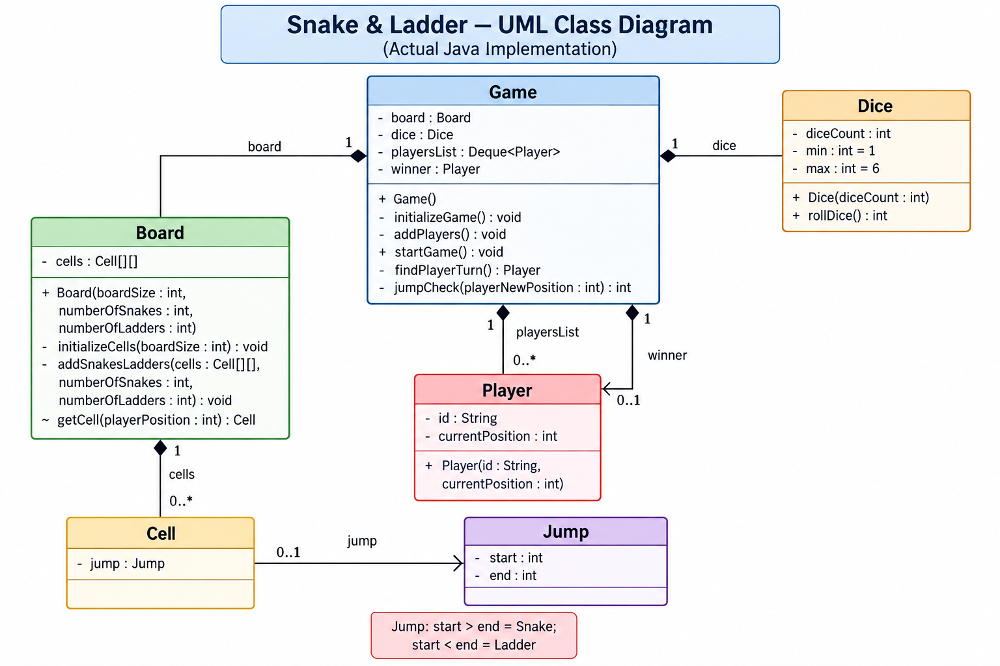

# Snake & Ladder — Low-Level Design


## Revision Snapshot

| Lens | Recall |
| --- | --- |
| Core model | Round-robin turns + dice result + board jump lookup |
| Design leverage | Inject dice for deterministic tests; keep rules explicit and configurable |
| Hard problem | Specify overshoot and chained-jump rules; reject invalid or cyclic board configuration |

## 1. Problem Understanding

We need to design a Snake & Ladder game where:

* The board contains multiple cells.
* Players start from the initial position.
* Players take turns rolling a dice.
* The dice determines how many positions a player moves.
* Some cells contain:

  * **Ladders** → move the player forward.
  * **Snakes** → move the player backward.
* A player wins when they reach the final cell.
* The game should support multiple players.
* The number of snakes, ladders, board size, and dice configuration should be configurable.

---

## 2. High-Level Design

The design is divided into six classes:

```text
Game
 ├── Board
 │    └── Cell[]
 │          └── Jump
 │
 ├── Dice
 │
 ├── Player[]
 │
 └── Winner
```

#### Core classes

| Class    | Responsibility                          |
| -------- | --------------------------------------- |
| `Game`   | Controls the complete game flow         |
| `Board`  | Represents the game board               |
| `Cell`   | Represents an individual board position |
| `Jump`   | Represents a snake or ladder            |
| `Dice`   | Generates dice values                   |
| `Player` | Maintains player identity and position  |

The key principle is:

> **Game coordinates the objects; individual classes own their respective data and behavior.**

---

## 3. Class Diagram

```text
                         ┌─────────────────────┐
                         │        Game         │
                         ├─────────────────────┤
                         │ - board : Board     │
                         │ - dice : Dice       │
                         │ - playersList       │
                         │   : Deque<Player>   │
                         │ - winner : Player   │
                         ├─────────────────────┤
                         │ + Game()            │
                         │ - initializeGame()  │
                         │ - addPlayers()      │
                         │ + startGame()       │
                         │ - findPlayerTurn()  │
                         │ - jumpCheck(...)    │
                         └──────────┬──────────┘
                                    │
                 ┌──────────────────┼──────────────────┐
                 │                  │                  │
                 ▼                  ▼                  ▼
          ┌────────────┐      ┌────────────┐    ┌────────────┐
          │   Board    │      │    Dice    │    │   Player   │
          ├────────────┤      ├────────────┤    ├────────────┤
          │- cells     │      │- diceCount │    │- id        │
          │ : Cell[][] │      │- min       │    │- current   │
          │            │      │- max       │    │  Position  │
          ├────────────┤      ├────────────┤    └────────────┘
          │+ Board(...)│      │+ Dice(...) │
          │- initialize│      │+ rollDice()│
          │  Cells()   │      └────────────┘
          │- addSnakes │
          │  Ladders() │
          │~ getCell() │
          └──────┬─────┘
                 │
                 ▼
          ┌────────────┐
          │    Cell    │
          ├────────────┤
          │- jump:Jump │
          └──────┬─────┘
                 │
                 ▼
          ┌────────────┐
          │   Jump     │
          ├────────────┤
          │- start:int │
          │- end:int   │
          └────────────┘
```

---

## 4. Game Class

### Responsibility

`Game` is the **orchestrator**.

It should not know the internal implementation of the board or dice. Instead, it coordinates them.

#### Attributes

```java
private Board board;
private Dice dice;
private Deque<Player> playersList;
private Player winner;
```

#### Why `Deque<Player>`?

The game is turn-based.

After a player's turn:

```text
Player A
   ↓
Player B
   ↓
Player C
   ↓
Player A
```

A `Deque` makes this very natural:

```java
Player player = playersList.removeFirst();

...

playersList.addLast(player);
```

This gives us a **queue-like round-robin mechanism**.

---

## 5. Game Methods

### `Game()`

Responsible for creating/initializing the game.

Conceptually:

```java
Game() {
    initializeGame();
    addPlayers();
}
```

---

### `initializeGame()`

Responsible for creating the game infrastructure.

```text
initializeGame()
      │
      ├── create Board
      └── create Dice
```

The board can be initialized with:

```text
board size
number of snakes
number of ladders
```

---

### `addPlayers()`

Creates players and puts them into:

```java
Deque<Player>
```

Players start from the initial position.

---

## 6. Starting the Game

### `startGame()`

This is the main game loop.

Conceptually:

```java
while (winner == null) {

    Player player = findPlayerTurn();

    int diceValue = dice.rollDice();

    int newPosition =
        player.currentPosition + diceValue;

    newPosition =
        jumpCheck(newPosition);

    player.currentPosition = newPosition;

    if (newPosition == boardEnd) {
        winner = player;
    }
}
```

The important thing is that **Game controls the sequence**, while other classes provide the required functionality.

---

## 7. Finding the Player's Turn

### `findPlayerTurn()`

The next player is obtained from the deque.

Example:

```text
Initial:

[A, B, C]

removeFirst()
      ↓
A

Deque becomes:

[B, C]

After turn:

addLast(A)

Deque becomes:

[B, C, A]
```

Next:

```text
B
```

This produces a simple **round-robin scheduling mechanism**.

---

## 8. Dice Class

### Responsibility

The `Dice` class is responsible only for generating dice values.

#### Attributes

```java
private int diceCount;
private int min = 1;
private int max = 6;
```

#### Constructor

```java
Dice(int diceCount)
```

This allows the design to support more than one dice.

For example:

```text
diceCount = 1
```

or

```text
diceCount = 2
```

---

### `rollDice()`

Returns the result of the dice roll.

Conceptually:

```java
random value between min and max
```

For a standard dice:

```text
1 2 3 4 5 6
```

---

## 9. Why Keep Dice Separate?

A common interview question:

> Why not generate the random number directly inside `Game`?

Because that violates separation of responsibility.

Without `Dice`:

```text
Game
 ├── player management
 ├── board management
 ├── random generation
 ├── movement
 └── winner calculation
```

With `Dice`:

```text
Game
 └── asks Dice for result

Dice
 └── handles random generation
```

This makes the design easier to:

* test
* extend
* modify

For example, we could later implement:

```java
class LoadedDice extends Dice
```

or inject a deterministic dice implementation for testing.

---

## 10. Board Class

### Responsibility

`Board` owns the physical representation of the game board.

#### Attribute

```java
private Cell[][] cells;
```

The board is represented as a **2D matrix**.

For example:

```text
100 99 98 ... 91
81  82 83 ... 90
80  79 78 ... 71
...
1   2  3  ... 10
```

The exact numbering strategy can vary, but the important abstraction is:

```text
Board
   ↓
Cell[][]
```

---

## 11. Why `Cell[][]`?

The actual game is conceptually a 2D board.

Using:

```java
Cell[][]
```

allows us to represent:

```text
row
column
```

while each `Cell` encapsulates what exists at a particular board position.

Instead of making `Board` responsible for every snake/ladder directly:

```text
Board
 └── Cell
       └── Jump
```

This provides a cleaner object model.

---

## 12. Board Constructor

Conceptually:

```java
Board(
    int boardSize,
    int numberOfSnakes,
    int numberOfLadders
)
```

The constructor receives the board configuration.

Example:

```text
Board
 ├── size = 10
 ├── snakes = 5
 └── ladders = 5
```

---

## 13. `initializeCells()`

Responsible for creating all cells.

Conceptually:

```java
for each row:
    for each column:
        cells[row][column] = new Cell();
```

After initialization:

```text
Board
 ├── Cell
 ├── Cell
 ├── Cell
 ├── ...
 └── Cell
```

---

## 14. Adding Snakes and Ladders

### `addSnakesLadders()`

This method creates the jumps on the board.

A cell can contain:

```java
Jump jump;
```

Therefore:

```text
Cell
 └── Jump
```

A jump has:

```java
start
end
```

---

## 15. Jump Class

The interesting design decision is that there is **no separate `Snake` and `Ladder` class**.

Instead:

```java
Jump
```

represents both.

#### Attributes

```java
private int start;
private int end;
```

---

## 16. How Does Jump Represent Snake vs Ladder?

This is determined from the relationship between `start` and `end`.

#### Ladder

```text
start < end
```

Example:

```text
4 → 25
```

Player climbs upward.

#### Snake

```text
start > end
```

Example:

```text
97 → 65
```

Player moves downward.

Therefore:

```text
             Jump
           /      \
      start < end  start > end
          /            \
      Ladder           Snake
```

No inheritance is required.

---

## 17. Why One `Jump` Class?

Instead of:

```text
Snake
 ├── start
 └── end

Ladder
 ├── start
 └── end
```

we have:

```text
Jump
 ├── start
 └── end
```

The behavior is determined by:

```text
start < end → Ladder
start > end → Snake
```

This avoids unnecessary classes because both objects have the same structural behavior:

```text
position A → position B
```

---

## 18. Cell Class

### Responsibility

A `Cell` represents one position on the board.

#### Attribute

```java
private Jump jump;
```

A cell can contain:

```text
no jump
```

or:

```text
one jump
```

Therefore:

```text
Cell ────── 0..1 ────── Jump
```

---

## 19. Why Does Cell Own Jump?

Consider:

```text
1   2   3   4   5
            ↑
          Ladder
```

The ladder belongs logically to the cell where the player lands.

Therefore:

```text
Cell 4
  └── Jump(4, 25)
```

When a player reaches cell 4:

```text
player.position = 4

        ↓

board.getCell(4)

        ↓

cell.jump

        ↓

jump.end = 25
```

---

## 20. `getCell()`

The Board provides:

```java
getCell(playerPosition)
```

which allows the game to obtain the cell corresponding to a player's position.

Conceptually:

```text
player position
      ↓
Board
      ↓
Cell
      ↓
Jump
```

This keeps the board representation hidden from `Game`.

---

## 21. Player Class

### Responsibility

`Player` represents the state of one player.

#### Attributes

```java
private String id;
private int currentPosition;
```

#### Constructor

```java
Player(
    String id,
    int currentPosition
)
```

Example:

```text
Player("P1", 0)
```

---

## 22. Player State

At any point:

```text
Player
 ├── id = P1
 └── currentPosition = 37
```

The `Game` changes the player's position as the game progresses.

Example:

```text
Before roll:

P1 → 37

Dice = 5

37 + 5 = 42

Check cell 42

If ladder:

42 → 75

Final:

P1 → 75
```

---

## 23. Complete Movement Flow

This is the most important flow to understand for interviews.

```text
Player's turn
      │
      ▼
Roll Dice
      │
      ▼
dice = 6
      │
      ▼
currentPosition + dice
      │
      ▼
newPosition
      │
      ▼
Board.getCell(newPosition)
      │
      ▼
Does Cell contain Jump?
      │
     / \
   Yes  No
    │    │
    ▼    ▼
Jump.end  Stay
    │
    ▼
Update Player Position
    │
    ▼
Check Winner
    │
    ▼
Next Player
```

---

## 24. `jumpCheck()`

`Game` contains the logic that checks whether a player landed on a snake or ladder.

Conceptually:

```java
private int jumpCheck(int playerNewPosition) {

    Cell cell = board.getCell(playerNewPosition);

    if (cell has jump) {
        return cell.jump.end;
    }

    return playerNewPosition;
}
```

So:

```text
Position
   ↓
Cell
   ↓
Jump?
 ┌─┴─┐
No   Yes
│     │
│     ▼
│   Jump.end
│
▼
Same position
```

---

## 25. Example

Suppose:

```text
Player position = 7
Dice = 3
```

Then:

```text
7 + 3 = 10
```

Suppose cell 10 has:

```text
Jump(10, 30)
```

Then:

```text
10 → 30
```

Final player position:

```text
30
```

If instead:

```text
Jump(10, 4)
```

then:

```text
10 → 4
```

The same `Jump` abstraction handles both cases.

---

## 26. Object Relationships

### Game → Board

```text
Game ◆──── Board
```

Game owns the board used by the game.

Multiplicity:

```text
Game 1 ─── 1 Board
```

---

### Game → Dice

```text
Game ◆──── Dice
```

One game uses one dice object.

```text
Game 1 ─── 1 Dice
```

---

### Game → Player

```text
Game ◆──── 0..* Player
```

A game can contain multiple players.

The players are stored in:

```java
Deque<Player>
```

---

### Game → Winner

```text
Game ───── 0..1 Player
```

Initially:

```java
winner = null;
```

Once somebody wins:

```java
winner = player;
```

So a game has **zero or one winner** at any point.

---

### Board → Cell

```text
Board ◆──── 0..* Cell
```

The board owns its cells.

The actual representation is:

```java
Cell[][]
```

---

### Cell → Jump

```text
Cell ───── 0..1 Jump
```

A cell may have:

```text
0 jumps
```

or:

```text
1 jump
```

A cell should not have multiple snakes/ladders simultaneously.

---

## 27. Complete Relationship Table

| Relationship  | Multiplicity | Meaning                         |
| ------------- | -----------: | ------------------------------- |
| Game → Board  |      `1 : 1` | One game has one board          |
| Game → Dice   |      `1 : 1` | One game uses one dice          |
| Game → Player |   `1 : 0..*` | Game contains multiple players  |
| Game → Winner |   `1 : 0..1` | Game has at most one winner     |
| Board → Cell  |   `1 : 0..*` | Board contains cells            |
| Cell → Jump   |       `0..1` | Cell may contain a snake/ladder |

---

## 28. Important Design Decision — No Snake/Ladder Classes

A common alternative design would be:

```text
Jump
  ↑
  ├── Snake
  └── Ladder
```

That is possible, but unnecessary for this implementation.

Why?

Both Snake and Ladder essentially perform:

```text
start → end
```

The only difference is:

```text
start > end → Snake
start < end → Ladder
```

Therefore:

```java
class Jump {
    int start;
    int end;
}
```

is sufficient.

This is a good example of avoiding **unnecessary abstraction**.

---

## 29. Separation of Responsibilities

This is one of the most important interview concepts.

#### Game

Responsible for:

```text
game flow
turn management
movement
winner detection
```

#### Board

Responsible for:

```text
board construction
cells
snakes/ladders placement
position → cell mapping
```

#### Cell

Responsible for:

```text
representing one board position
holding optional jump
```

#### Jump

Responsible for:

```text
start position
destination position
```

#### Dice

Responsible for:

```text
random dice generation
```

#### Player

Responsible for:

```text
player identity
current position
```

---

## 30. SOLID Principles Applied

### Single Responsibility Principle

Each class has a focused responsibility.

```text
Dice  → dice
Player → player state
Board → board
Cell → cell
Jump → jump
Game → orchestration
```

This is the strongest SOLID principle demonstrated by this design.

---

### Open/Closed Principle

The design can be extended without heavily modifying the existing classes.

For example, the dice abstraction can later be extended to support:

```text
LoadedDice
WeightedDice
MultipleDice
```

Similarly, the game can potentially support different board implementations.

---

### Dependency Inversion

The current implementation is relatively simple and does not fully demonstrate dependency inversion.

For a more production-oriented design, we could inject:

```java
Dice dice;
Board board;
```

rather than constructing everything directly inside `Game`.

That would improve testability.

---

## 31. Testability

One weakness of directly generating random values is that testing becomes difficult.

For example:

```text
What if we need to test:

P1 → 4
dice → 6
ladder → 25
```

Random dice makes the test nondeterministic.

A better production design could introduce:

```java
interface Dice {
    int roll();
}
```

Then:

```java
class RandomDice implements Dice
```

and:

```java
class FixedDice implements Dice
```

For testing:

```java
FixedDice(6)
```

Now the test is deterministic.

This is an **extension**, not necessarily part of the original video implementation.

---

## 32. Important Edge Cases

During an interview, discuss these explicitly.

## 1. Player crosses the final cell

Suppose:

```text
Board size = 100
Player = 98
Dice = 5
```

Then:

```text
98 + 5 = 103
```

What should happen?

Possible rules:

```text
Exact 100 required
```

or:

```text
>= 100 means winner
```

The rule should be clarified before implementation.

---

## 2. Invalid or Chained Jumps

Validate the board configuration once at creation time:

* Every jump starts and ends within the board, and a cell has at most one outgoing jump.
* A ladder moves upward and a snake moves downward; reject self-loops.
* Decide whether landing on a jump applies exactly one transition or follows jumps repeatedly. If jumps chain, detect cycles during validation so a turn cannot loop forever.
* Define overshoot, extra-turn, and starting-cell rules before implementing the turn loop; these are game rules, not incidental arithmetic.

---

## 33. Staff-Level Deep Dive: Deterministic Replay

Make randomness an injected dependency. A seeded random generator makes a game reproducible in tests; for a persisted match, record the accepted move events (player, roll, resulting position, ruleset version) rather than assuming a seed alone will remain compatible across code changes.

The board can map position directly to its jump, so a turn is `O(1)` for roll, bounds check, and jump lookup. Keep the simple array/map model for this game; do not introduce event sourcing or distributed coordination unless the product needs saved matches, spectators, or reconnects. If moves can arrive concurrently from clients, serialize them by game ID and accept a move only for the current player and expected game version. This prevents stale retries from advancing the same turn twice.
