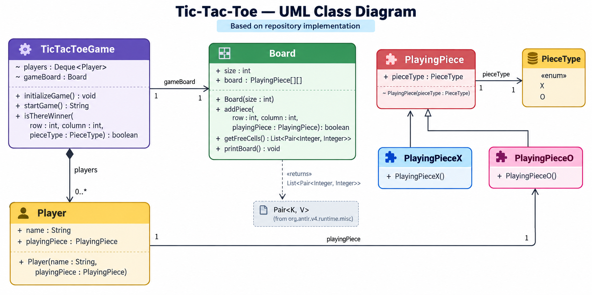

# Tic-Tac-Toe — Low Level Design Notes



## 1. Problem Overview

Design a two-player Tic-Tac-Toe game where:

* Two players alternate turns.
* Each player owns a piece: `X` or `O`.
* A player places their piece on an empty cell.
* A player wins when their pieces occupy:

  * an entire row, or
  * an entire column, or
  * the main diagonal, or
  * the anti-diagonal.
* If the board becomes full without a winner, the game is a draw.

### Core design idea

Separate the system into:

```text
TicTacToeGame
      │
      ├── manages players / turns
      ├── manages board
      └── checks winner

Board
      │
      └── manages cells / pieces

Player
      │
      └── owns a PlayingPiece

PlayingPiece
      │
      ├── PlayingPieceX
      └── PlayingPieceO
```

The repository implementation follows this decomposition.

---

# 2. Class Responsibilities

| Class           | Responsibility                            |
| --------------- | ----------------------------------------- |
| `TicTacToeGame` | Orchestrates the complete game            |
| `Board`         | Owns the grid and validates/places pieces |
| `Player`        | Represents a player and their piece       |
| `PlayingPiece`  | Base representation of a game piece       |
| `PlayingPieceX` | Concrete X piece                          |
| `PlayingPieceO` | Concrete O piece                          |
| `PieceType`     | Defines `X` and `O`                       |
| `Pair<K,V>`     | Represents a board coordinate             |
| `Main`          | Application entry point                   |

### Important design principle

`TicTacToeGame` should **coordinate** the game, while `Board` should be responsible for board-specific operations.

This avoids putting all logic into one giant class.

---

# 3. `TicTacToeGame`

## Responsibility

The game controller coordinates:

* player initialization
* turn management
* move processing
* board interaction
* winner detection
* draw detection

### Important fields

```java
Deque<Player> players;
Board gameBoard;
```

### Why `Deque<Player>`?

The implementation uses a queue-like rotation:

```text
players

Front
  ↓
Player 1
Player 2
  ↑
Back
```

For every turn:

```java
Player playerTurn = players.removeFirst();
```

After a valid move:

```java
players.addLast(playerTurn);
```

So the order automatically becomes:

```text
P1 → P2 → P1 → P2 → ...
```

### Invalid move

If the selected cell is already occupied:

```java
players.addFirst(playerTurn);
```

The same player gets another turn.

This is a subtle but important design detail.

---

# 4. Game Initialization

`initializeGame()` creates the complete initial state.

Conceptually:

```java
players = new LinkedList<>();

PlayingPieceX playingPieceX = new PlayingPieceX();
PlayingPieceO playingPieceO = new PlayingPieceO();

Player player1 =
    new Player("Player1", playingPieceX);

Player player2 =
    new Player("Player2", playingPieceO);

players.offer(player1);
players.offer(player2);

gameBoard = new Board(3);
```

### Object graph

```text
TicTacToeGame
│
├── players
│     ├── Player1
│     │      └── PlayingPieceX
│     │              └── PieceType.X
│     │
│     └── Player2
│            └── PlayingPieceO
│                    └── PieceType.O
│
└── Board
       └── PlayingPiece[][]
```

---

# 5. `Board`

## Responsibility

`Board` owns the physical game state.

### Fields

```java
int size;
PlayingPiece[][] board;
```

For a 3×3 game:

```text
board
 ┌───┬───┬───┐
 │   │   │   │
 ├───┼───┼───┤
 │   │   │   │
 ├───┼───┼───┤
 │   │   │   │
 └───┴───┴───┘
```

The board is represented using:

```java
PlayingPiece[size][size]
```

An empty cell is represented by:

```java
null
```

---

# 6. `Board.addPiece()`

### Purpose

Place a piece only if the target cell is empty.

```java
public boolean addPiece(
    int row,
    int column,
    PlayingPiece playingPiece
)
```

Core logic:

```java
if (board[row][column] != null) {
    return false;
}

board[row][column] = playingPiece;
return true;
```

### Why return `boolean`?

The caller needs to know whether the move succeeded.

```text
addPiece()
   │
   ├── true  → move accepted
   │
   └── false → cell occupied
```

This keeps move validation close to the board rather than duplicating it inside the game controller.

---

# 7. `Board.getFreeCells()`

Returns all currently empty positions.

Conceptually:

```java
List<Pair<Integer, Integer>> freeCells
```

Each pair represents:

```text
(row, column)
```

Example:

```text
Board

 X |   | O
---+---+---
   | X |  
---+---+---
 O |   |  

Free cells:

(0,1)
(1,0)
(1,2)
(2,1)
(2,2)
```

### Complexity

For an `N × N` board:

```text
Time  = O(N²)
Space = O(N²)
```

because every board cell is scanned and free coordinates are stored.

---

# 8. `Board.printBoard()`

Responsible only for displaying the current board.

Example:

```text
X | O | X |
---------
  | X | O |
---------
O |   | X |
```

### Design observation

Printing is presentation logic.

In a production-grade design, we could separate this into something like:

```text
Board
  ↓
GameRenderer
```

But the current implementation keeps printing inside `Board`.

That is an important distinction between:

> **What the current code implements**

and

> **How we might improve it in a production design.**

---

# 9. `Player`

## Responsibility

Represents a participant.

### Fields

```java
String name;
PlayingPiece playingPiece;
```

The actual repository implementation uses a player identifier/name together with the player's piece.

Conceptually:

```text
Player
 ├── name
 └── playingPiece
          │
          └── X / O
```

### Relationship

```text
Player 1 ─────── 1 PlayingPiece
Player 2 ─────── 1 PlayingPiece
```

Each player owns exactly one playing piece in this implementation.

---

# 10. `PlayingPiece`

## Responsibility

Represents the common abstraction for pieces placed on the board.

### Field

```java
PieceType pieceType;
```

### Constructor

```java
PlayingPiece(PieceType pieceType)
```

The constructor establishes the piece's type.

---

# 11. `PlayingPieceX` and `PlayingPieceO`

These are specialized versions of `PlayingPiece`.

```text
             PlayingPiece
                  ▲
          ┌───────┴───────┐
          │               │
 PlayingPieceX      PlayingPieceO
```

### `PlayingPieceX`

```java
public PlayingPieceX() {
    super(PieceType.X);
}
```

### `PlayingPieceO`

```java
public PlayingPieceO() {
    super(PieceType.O);
}
```

### Why have subclasses?

Instead of constructing:

```java
new PlayingPiece(PieceType.X)
```

the caller can use:

```java
new PlayingPieceX()
```

This makes the object semantically explicit.

It also provides an extension point for future piece-specific behavior.

---

# 12. `PieceType`

An enum:

```java
enum PieceType {
    X,
    O
}
```

### Why enum instead of String?

Avoid:

```java
"X"
"O"
```

because strings allow invalid values:

```java
"Cross"
"PlayerX"
"ABC"
```

An enum restricts the state to:

```text
X | O
```

It also makes comparisons type-safe.

---

# 13. `Pair<K,V>`

The board uses a pair to represent coordinates returned by `getFreeCells()`.

```java
Pair<Integer, Integer>
```

Conceptually:

```text
Pair
 ├── key → row
 └── val → column
```

Example:

```text
Pair(1, 2)
```

means:

```text
row    = 1
column = 2
```

This is a utility/data-holder relationship rather than a core domain object.

---

# 14. Winner Detection

This is the most algorithmically important part of the implementation.

Method:

```java
isThereWinner(
    int row,
    int column,
    PieceType pieceType
)
```

The implementation checks four possibilities:

```text
1. Row
2. Column
3. Main diagonal
4. Anti-diagonal
```

---

# 15. Row Check

Given the last move:

```text
(row, column)
```

scan the entire row.

For a 3×3 board:

```text
X | X | X
---------
O |   | O
---------
  |   |
```

If every cell in the selected row contains the same `PieceType`:

```text
rowMatch = true
```

Otherwise:

```text
rowMatch = false
```

### Complexity

```text
O(N)
```

---

# 16. Column Check

Same idea, but scan vertically.

```text
X | O | X
---------
X | O |
---------
X |   |
```

For the selected column:

```text
board[0][column]
board[1][column]
...
board[N-1][column]
```

All must contain the current player's `PieceType`.

Complexity:

```text
O(N)
```

---

# 17. Main Diagonal

The main diagonal consists of:

```text
(0,0)
(1,1)
(2,2)
...
(N-1,N-1)
```

Example:

```text
X | O |
---------
  | X |
---------
  |   | X
```

Condition:

```text
rowIndex == columnIndex
```

The implementation scans:

```java
for (
    int i = 0, j = 0;
    i < gameBoard.size;
    i++, j++
)
```

Complexity:

```text
O(N)
```

---

# 18. Anti-Diagonal

The anti-diagonal consists of:

```text
(0,N-1)
(1,N-2)
(2,N-3)
...
(N-1,0)
```

Example:

```text
  |   | X
---------
  | X |
---------
X |   |
```

The implementation scans with:

```java
i++
j--
```

Complexity:

```text
O(N)
```

---

# 19. Overall Winner Algorithm

The final condition is effectively:

```java
return rowMatch
    || colMatch
    || diagonalMatch
    || antidiagonalMatch;
```

Therefore:

```text
Winner?
   │
   ├── Complete row?       → YES
   ├── Complete column?   → YES
   ├── Main diagonal?     → YES
   ├── Anti-diagonal?     → YES
   └── Otherwise          → NO
```

### Complexity

Although four checks are performed:

```text
O(N) + O(N) + O(N) + O(N)
```

which simplifies to:

```text
Time = O(N)
Space = O(1)
```

for each move.

This is an important interview point.

---

# 20. Complete Game Flow

```text
             START
               │
               ▼
       initializeGame()
               │
               ▼
       Create players
               │
               ▼
       Create X / O pieces
               │
               ▼
        Create Board(3)
               │
               ▼
        ┌──────────────┐
        │ Player Turn  │
        └──────┬───────┘
               │
               ▼
        Remove first player
               │
               ▼
        Find free cells
               │
        ┌──────┴───────┐
        │              │
      Empty          Available
        │              │
        ▼              ▼
      DRAW         Read move
                       │
                       ▼
                 addPiece()
                       │
                 ┌─────┴─────┐
                 │           │
              Invalid       Valid
                 │           │
                 ▼           ▼
           Same player    Rotate turn
           tries again        │
                             ▼
                       Check winner
                             │
                       ┌─────┴─────┐
                       │           │
                      YES          NO
                       │           │
                       ▼           ▼
                     WIN       Next player
                                   │
                                   └──→ loop
```

---

# 21. State Ownership

A useful LLD interview concept is **who owns what state?**

### `TicTacToeGame` owns

```text
players
gameBoard
```

### `Board` owns

```text
size
board[][]
```

### `Player` owns

```text
name
playingPiece
```

### `PlayingPiece` owns

```text
pieceType
```

This creates a relatively clean ownership hierarchy:

```text
Game
 ├── Players
 │    └── PlayingPiece
 │          └── PieceType
 │
 └── Board
      └── PlayingPiece[][]
```

---

# 22. Key Relationships

### Game → Player

```text
TicTacToeGame
      │
      │ players
      ▼
   Player
```

The game maintains a collection of players.

### Game → Board

```text
TicTacToeGame
      │
      │ gameBoard
      ▼
    Board
```

The game uses one board.

### Player → PlayingPiece

```text
Player
  │
  │ playingPiece
  ▼
PlayingPiece
```

Each player has one piece.

### Board → PlayingPiece

```text
Board
  │
  │ board[][]
  ▼
PlayingPiece
```

Each occupied board cell references a playing piece.

### Inheritance

```text
PlayingPiece
     ▲
     │
 ┌───┴────┐
 │        │
 X        O
```

### Enum association

```text
PlayingPiece
      │
      ▼
 PieceType
 ┌─────────┐
 │ X       │
 │ O       │
 └─────────┘
```

---

# 23. Why `PlayingPiece` Is Useful

At first glance, we could simply store:

```java
PieceType[][] board;
```

instead of:

```java
PlayingPiece[][] board;
```

The current design chooses the latter.

### Advantage

The board works with the abstraction:

```java
PlayingPiece
```

rather than knowing about:

```java
X
O
```

This makes the board less coupled to concrete piece types.

For example, future pieces could potentially be introduced:

```text
PlayingPiece
     ▲
     │
 ┌───┼──────────────┐
 │   │              │
 X   O       SpecialPiece
```

without changing the board's fundamental representation.

---

# 24. Why `Deque` Instead of an Integer Turn Index?

Alternative:

```java
int currentPlayerIndex;
currentPlayerIndex =
    (currentPlayerIndex + 1) % players.size();
```

The current implementation instead uses:

```java
Deque<Player>
```

and rotates players:

```text
removeFirst()
     ↓
player takes turn
     ↓
addLast()
```

### Benefit

Turn management becomes an explicit data structure operation.

It also makes retrying an invalid move straightforward:

```java
addFirst(playerTurn)
```

The player remains at the front.

---

# 25. Important Design Observation: Game Controller

`TicTacToeGame` is effectively the **orchestrator/controller**.

It coordinates:

```text
Input
 ↓
Player
 ↓
Board
 ↓
Winner Check
 ↓
Next Turn
```

But it does not directly manipulate individual board cells for placement.

Instead:

```java
gameBoard.addPiece(...)
```

is responsible for placement.

This is a good separation of responsibilities.

---

# 26. Important Interview Discussion: Current Design vs Production Design

The current implementation is intentionally simple and interview-oriented.

### Current implementation

```text
TicTacToeGame
 ├── console input
 ├── game flow
 ├── turn management
 └── winner detection

Board
 ├── board state
 └── console printing
```

For a larger production system, these concerns could be separated:

```text
GameController
      │
      ├── Game
      │
      ├── Board
      │
      ├── MoveValidator
      │
      ├── WinningStrategy
      │
      └── GameRenderer
```

This would improve testability and extensibility.

---

# 27. Most Important SOLID / OOP Concepts

## Encapsulation

Board-specific state is grouped inside:

```java
Board
```

Player-specific state is grouped inside:

```java
Player
```

Piece state is grouped inside:

```java
PlayingPiece
```

---

## Abstraction

The board operates on:

```java
PlayingPiece
```

rather than concrete:

```java
PlayingPieceX
PlayingPieceO
```

---

## Inheritance

```text
PlayingPiece
      ▲
      │
 ┌────┴────┐
 X         O
```

Concrete pieces reuse the common base class.

---

## Polymorphism

The board stores:

```java
PlayingPiece
```

but the actual runtime objects may be:

```java
PlayingPieceX
PlayingPieceO
```

---

## Single Responsibility

The major classes have relatively distinct responsibilities:

```text
Game   → orchestration
Board  → board state
Player → player state
Piece  → piece state
```

---

# 28. Complexity Summary

For an `N × N` board:

| Operation             |  Time | Space |
| --------------------- | ----: | ----: |
| Create board          | O(N²) | O(N²) |
| `addPiece()`          |  O(1) |  O(1) |
| `getFreeCells()`      | O(N²) | O(N²) |
| Row winner check      |  O(N) |  O(1) |
| Column winner check   |  O(N) |  O(1) |
| Diagonal check        |  O(N) |  O(1) |
| Anti-diagonal check   |  O(N) |  O(1) |
| Complete winner check |  O(N) |  O(1) |

The board itself requires:

```text
O(N²)
```

space.

---

# 29. Potential Improvements — Interview Discussion

These are **not claims about the current repository implementation**. They are useful follow-up discussion points if an interviewer asks, "How would you improve this design?"

### 1. Separate input from game logic

Current:

```text
TicTacToeGame
    └── Scanner
```

Better:

```text
GameController
      │
      ├── InputHandler
      └── Game
```

---

### 2. Separate rendering

Instead of:

```java
Board.printBoard()
```

use:

```text
Board
  │
  └── GameRenderer
```

This allows:

```text
Console UI
Web UI
Mobile UI
```

without modifying the board.

---

### 3. Extract winning strategy

Instead of hardcoding:

```text
row
column
diagonal
anti-diagonal
```

inside `TicTacToeGame`, introduce:

```text
WinningStrategy
      │
      ├── RowWinningStrategy
      ├── ColumnWinningStrategy
      └── ...
```

Or a single configurable strategy:

```java
interface WinningStrategy {
    boolean checkWinner(Board board, Move move);
}
```

This becomes useful for larger or variant games.

---

### 4. Represent a move explicitly

Instead of passing:

```java
row
column
pieceType
```

everywhere, introduce:

```text
Move
 ├── Player
 └── Position
      ├── row
      └── column
```

This becomes more scalable as game rules grow.

---

### 5. Track occupied cells

The current implementation calls:

```java
getFreeCells()
```

which scans the entire board.

A production implementation could maintain:

```java
int movesMade;
```

Then:

```java
movesMade == N * N
```

immediately determines whether the board is full.

---

# 30. Interview Questions You Should Be Ready For

### Q1. Why is `PlayingPiece` a class instead of directly using `PieceType`?

Because it provides an abstraction for pieces and allows concrete piece implementations to be introduced independently of the board.

---

### Q2. Why use `PlayingPiece[][]`?

The board can store the common piece abstraction while remaining independent of concrete `X`/`O` implementations.

---

### Q3. Why use a `Deque<Player>`?

It provides simple turn rotation using:

```text
removeFirst()
addLast()
```

and lets an invalid-move player be restored using:

```text
addFirst()
```

---

### Q4. What happens when a player chooses an occupied cell?

`Board.addPiece()` returns `false`, and the current player is placed back at the front of the deque.

---

### Q5. How is a winner detected?

Only the row, column, main diagonal, and anti-diagonal associated with the latest move need to be checked.

The current implementation scans those four lines.

---

### Q6. What is the complexity of winner detection?

```text
O(N)
```

for an `N × N` board.

---

### Q7. How would you support a 4×4 board?

The current board already uses:

```java
size
```

and:

```java
PlayingPiece[size][size]
```

so board dimensions are not hardcoded into the board representation.

The winner-checking logic also iterates using:

```java
gameBoard.size
```

rather than a fixed `3`.

---

### Q8. How would you support an AI?

Introduce a player abstraction or strategy:

```text
Player
  │
  ├── HumanPlayer
  └── AIPlayer
           │
           └── MoveStrategy
```

The game controller should ask the current player for a move rather than directly reading console input.

---

### Q9. How would you make the game testable?

Separate:

```text
Input
Game logic
Board state
Rendering
```

Then unit tests can directly test:

```text
addPiece()
winner detection
draw detection
invalid moves
turn rotation
```

without requiring `Scanner` or console output.

---

# 31. 30-Second Interview Explanation

> "I modelled Tic-Tac-Toe around a game controller, board, player and playing-piece hierarchy. `TicTacToeGame` owns the turn flow and a `Deque<Player>` so players can be rotated efficiently. `Board` owns an N×N `PlayingPiece` matrix and exposes operations for adding pieces and finding free cells. A player owns one `PlayingPiece`, while `PlayingPieceX` and `PlayingPieceO` specialize the base `PlayingPiece` using the `PieceType` enum. After every valid move, the game checks the corresponding row, column, main diagonal and anti-diagonal for a win. This keeps board state, player state, piece representation and game orchestration reasonably separated."

---

# 32. Mental Model to Remember

```text
                 GAME
                  │
          ┌───────┴────────┐
          │                │
       PLAYERS            BOARD
          │                │
          ▼                ▼
       PIECES          PIECE[][]
          │
          ▼
      PieceType
       X / O


GAME LOOP

Take Player
     ↓
Take Move
     ↓
Board.addPiece()
     ↓
Valid?
 ┌───┴────┐
 NO       YES
 │         │
Retry    Rotate
           │
           ▼
      Check Winner
       ┌────┴────┐
      YES        NO
       │          │
      WIN       Next Turn
                  │
                  └──→ repeat
```

## Core takeaway

The most important LLD lesson from this implementation is **separation of game orchestration from domain objects**:

```text
TicTacToeGame → "What happens next?"
Board         → "What is on the board?"
Player        → "Who is playing?"
PlayingPiece  → "What piece do they own?"
PieceType     → "Which type is it?"
```

That mental model is more important for an LLD interview than memorizing the individual classes.

---

# 33. Staff-Level Deep Dive: Constant-Time Move Evaluation

For a small board, scanning the affected row, column, and diagonals is the clearest design. If move volume or board size makes that expensive, maintain per-player counts for each row, column, and diagonal. A move then updates at most four counters and detects a win in `O(1)` time, with `O(N)` auxiliary state per player. The trade-off is duplicated derived state, so update the board and counters together in one move operation and test them against a slower reference implementation.

Treat `Move` as a command with `(gameId, playerId, row, column, expectedVersion)`. Validate bounds, game status, current player, and cell availability before applying it; increment the version exactly once after acceptance. This makes duplicate network retries harmless and rejects stale moves. For a local console game, this protocol is unnecessary ceremony; it becomes valuable for a multiplayer service.

For an `N x N` board, bitsets can accelerate line checks, but only adopt them after profiling and after the win rule is precise (exactly N-in-a-row versus at least K-in-a-row). The data structure should follow the rule, not drive it.
