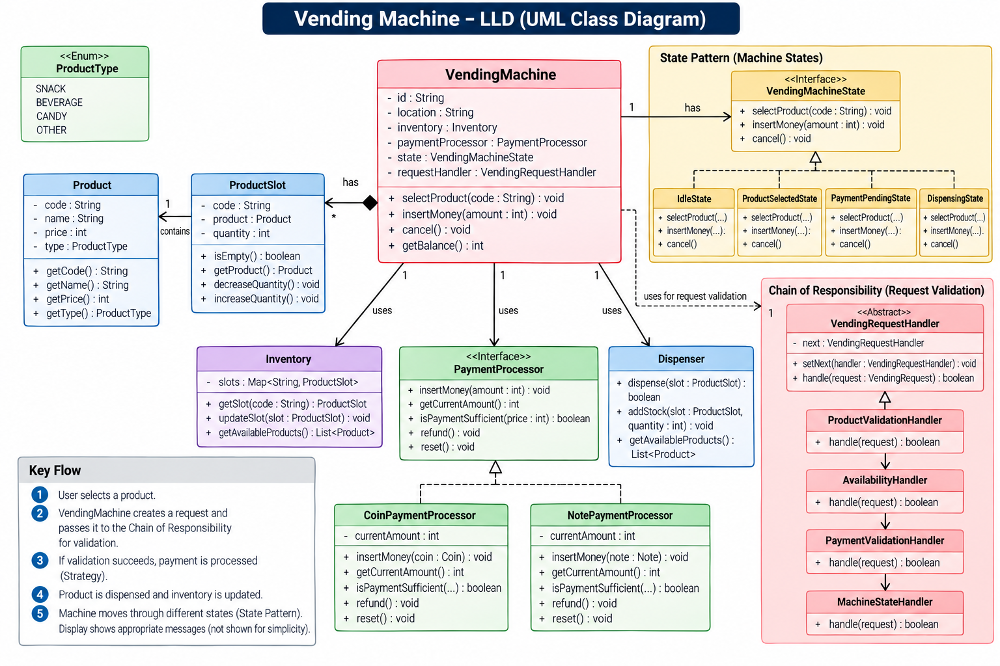

# Vending Machine — Low-Level Design



## 1. Problem Statement

Design a vending machine that can:

* Display available products.
* Maintain product inventory.
* Allow a user to select a product.
* Accept coins/notes.
* Validate the transaction.
* Check product availability.
* Check whether sufficient money has been inserted.
* Dispense the selected product.
* Return change.
* Refund money when a transaction is cancelled.
* Move through well-defined machine states.
* Support validation through a **Chain of Responsibility**.
* Keep payment handling extensible through a **Strategy-style abstraction**.

The important design challenge is not the vending machine itself. It is correctly modeling **state-dependent behavior**, **money handling**, **inventory**, and **validation without creating a giant conditional-heavy class**.

---

# 2. High-Level Architecture

The design can be divided into five logical areas:

```text
                    ┌─────────────────────┐
                    │    VendingMachine   │
                    │      (Context)      │
                    └──────────┬──────────┘
                               │
          ┌────────────────────┼────────────────────┐
          │                    │                    │
          ▼                    ▼                    ▼
      Inventory          PaymentProcessor       Dispenser
          │                    │
          │                    ├── CoinPaymentProcessor
          │                    └── NotePaymentProcessor
          │
          ▼
      ProductSlot
          │
          ▼
       Product


VendingMachine
      │
      ├── Current State
      │       ├── IdleState
      │       ├── ProductSelectedState
      │       ├── PaymentPendingState
      │       └── DispensingState
      │
      └── Request Validation
              │
              ▼
      VendingRequestHandler
              │
              ├── ProductValidationHandler
              ↓
        AvailabilityHandler
              ↓
        PaymentValidationHandler
              ↓
        MachineStateHandler
```

The architecture intentionally separates:

* **What the machine owns** → Inventory, products, slots.
* **What the machine is doing** → State Pattern.
* **How payment is processed** → PaymentProcessor abstraction.
* **How physical dispensing happens** → Dispenser.
* **How requests are validated** → Chain of Responsibility.

---

# 3. Core Classes

## 3.1 VendingMachine

The `VendingMachine` is the central **Context / Orchestrator**.

### Fields

```java
class VendingMachine {

    private String id;
    private String location;

    private Inventory inventory;

    private PaymentProcessor paymentProcessor;

    private Dispenser dispenser;

    private VendingMachineState state;

    private VendingRequestHandler requestHandler;
}
```

### Responsibilities

It should:

* Accept user actions.
* Delegate behavior to the current state.
* Maintain references to major components.
* Initiate validation.
* Coordinate payment.
* Trigger dispensing.
* Change state.
* Return balance/refund.

### Important principle

`VendingMachine` should **not** contain all business logic.

Bad:

```java
if(state == IDLE) {
    ...
} else if(state == PAYMENT_PENDING) {
    ...
} else if(state == DISPENSING) {
    ...
}
```

This quickly becomes difficult to maintain.

Instead:

```java
state.selectProduct(code);
state.insertMoney(amount);
state.cancel();
```

The current state determines what the operation means.

This is the primary reason for using the **State Pattern**.

---

# 4. Product

`Product` represents the actual merchandise.

```java
class Product {

    private String code;
    private String name;
    private int price;
    private ProductType type;
}
```

### Responsibilities

Represents immutable product information.

Typical methods:

```java
getCode()
getName()
getPrice()
getType()
```

### Important Design Decision

Use the smallest currency unit:

```text
₹10.50 → 1050 paise
$10.50 → 1050 cents
```

Avoid:

```java
double price;
```

because floating-point arithmetic can introduce monetary precision errors.

Prefer:

```java
long priceInPaise;
```

---

# 5. ProductType

An enum represents the category.

```java
enum ProductType {
    SNACK,
    BEVERAGE,
    CANDY,
    OTHER
}
```

This prevents arbitrary string values such as:

```text
"snack"
"SNACK"
"Snack"
"snaks"
```

from being treated as different values.

---

# 6. ProductSlot

A physical slot contains one type of product.

```java
class ProductSlot {

    private String code;
    private Product product;
    private int quantity;
}
```

Example:

```text
A1 → Coke → ₹40 → quantity 8
A2 → Chips → ₹30 → quantity 5
B1 → Chocolate → ₹50 → quantity 0
```

### Responsibilities

* Determine whether slot is empty.
* Return its product.
* Increase quantity.
* Decrease quantity.

```java
boolean isEmpty();

Product getProduct();

void decreaseQuantity();

void increaseQuantity();
```

### Relationship

```text
ProductSlot ─────── contains ───────> Product
      1                                1
```

A slot normally represents one product type.

---

# 7. Inventory

Inventory manages all slots.

```java
class Inventory {

    private Map<String, ProductSlot> slots;
}
```

Example:

```text
A1 → ProductSlot(Coke, 10)
A2 → ProductSlot(Pepsi, 5)
A3 → ProductSlot(Chips, 0)
B1 → ProductSlot(Chocolate, 8)
```

### Responsibilities

```java
ProductSlot getSlot(String code);

void addSlot(ProductSlot slot);

void updateSlot(ProductSlot slot);

List<Product> getAvailableProducts();
```

### Why Map?

Using:

```java
Map<String, ProductSlot>
```

gives approximately:

```text
getSlot(code) → O(1)
```

instead of scanning every slot.

---

# 8. Dispenser

The `Dispenser` represents the physical mechanism responsible for releasing the product.

```java
class Dispenser {

    boolean dispense(ProductSlot slot);

    void addStock(ProductSlot slot, int quantity);

    List<Product> getAvailableProducts();
}
```

### Important Separation

Inventory answers:

> "Do we have the product?"

Dispenser answers:

> "Can we physically release it?"

This separation is valuable because physical dispensing can eventually involve:

* Motor control.
* Sensor confirmation.
* Jam detection.
* Retry.
* Hardware failure.
* Door/open detection.

A real implementation should not blindly decrement inventory before confirming successful dispensing.

---

# 9. PaymentProcessor

Payment is abstracted behind an interface.

```java
interface PaymentProcessor {

    void insertMoney(int amount);

    int getCurrentAmount();

    boolean isPaymentSufficient(int price);

    void refund();

    void reset();
}
```

This provides an abstraction between the vending machine and payment implementation.

---

# 10. CoinPaymentProcessor

Handles coin-based payments.

```java
class CoinPaymentProcessor
        implements PaymentProcessor {

    private int currentAmount;

    void insertMoney(Coin coin);

    int getCurrentAmount();

    boolean isPaymentSufficient(int price);

    void refund();

    void reset();
}
```

Example:

```text
User inserts:

₹10
₹10
₹5

currentAmount = ₹25
```

---

# 11. NotePaymentProcessor

Handles notes.

```java
class NotePaymentProcessor
        implements PaymentProcessor {

    private int currentAmount;

    void insertMoney(Note note);

    int getCurrentAmount();

    boolean isPaymentSufficient(int price);

    void refund();

    void reset();
}
```

The machine can therefore support different payment mechanisms without changing the core vending-machine logic.

---

# 12. Item / Money Hierarchy

The diagram models a common abstraction for physical monetary items.

```java
abstract class Item {

    protected int value;

    int getValue();

    boolean isValid();
}
```

Concrete implementations:

```java
class Coin extends Item {

    private int denomination;

    int getDenomination();
}
```

```java
class Note extends Item {

    private int denomination;

    int getDenomination();
}
```

Conceptually:

```text
                 Item
                  ▲
             ┌────┴────┐
             │         │
           Coin       Note
```

This allows common behavior to be shared while keeping coin and note-specific behavior separate.

---

# 13. State Pattern

This is the most important pattern in the vending-machine design.

The machine's behavior changes depending on its current state.

For example:

```text
Idle
  ↓
Product Selected
  ↓
Payment Pending
  ↓
Dispensing
  ↓
Idle
```

A machine in `IdleState` should not behave the same way as a machine in `DispensingState`.

Instead of implementing all possible behavior inside `VendingMachine`, we delegate to a state object.

---

# 14. VendingMachineState

The state abstraction can be:

```java
interface VendingMachineState {

    void selectProduct(String code);

    void insertMoney(int amount);

    void cancel();
}
```

The concrete states implement this interface.

---

# 15. IdleState

Represents the machine waiting for a customer.

Typical behavior:

```text
selectProduct() → allowed
insertMoney()   → generally rejected
cancel()        → nothing to cancel
```

Flow:

```text
Idle
 ↓
selectProduct("A1")
 ↓
ProductSelectedState
```

---

# 16. ProductSelectedState

A product has been selected.

Responsibilities:

* Validate selection.
* Verify product exists.
* Verify stock.
* Store selected product/slot.
* Wait for payment.

Possible transition:

```text
ProductSelectedState
        ↓
insertMoney()
        ↓
PaymentPendingState
```

Depending on the implementation, the state may be combined with the payment state.

---

# 17. PaymentPendingState

The machine waits until enough money is inserted.

Example:

```text
Product price = ₹50

Inserted = ₹20
→ insufficient

Inserted = ₹30
→ total = ₹50
→ sufficient
```

Once payment becomes sufficient:

```text
PaymentPendingState
        ↓
payment sufficient
        ↓
DispensingState
```

---

# 18. DispensingState

This state performs the actual vending operation.

Responsibilities:

1. Retrieve selected slot.
2. Confirm stock.
3. Confirm payment.
4. Dispense product.
5. Update inventory.
6. Calculate change.
7. Return change.
8. Reset payment session.
9. Transition back to `IdleState`.

Typical flow:

```text
DispensingState
      │
      ├── dispense product
      │
      ├── decrease inventory
      │
      ├── calculate change
      │
      ├── return change
      │
      └── IdleState
```

---

# 19. State Transition Table

| Current State   | Operation     | Result                      |
| --------------- | ------------- | --------------------------- |
| Idle            | selectProduct | ProductSelected             |
| Idle            | insertMoney   | Reject / invalid operation  |
| ProductSelected | insertMoney   | PaymentPending              |
| ProductSelected | cancel        | Idle                        |
| PaymentPending  | insertMoney   | Remain / move to Dispensing |
| PaymentPending  | cancel        | Refund + Idle               |
| Dispensing      | selectProduct | Reject                      |
| Dispensing      | insertMoney   | Reject                      |
| Dispensing      | cancel        | Reject / already processing |
| Dispensing      | completion    | Idle                        |

The exact states can be simplified or expanded depending on interview requirements.

---

# 20. Chain of Responsibility

This is the additional pattern inspired by the referenced logging-system design.

The **Chain of Responsibility (CoR)** pattern passes a request through a sequence of handlers. Each handler can process/reject the request or forward it to the next handler.

For vending, the chain can validate a purchase request before the actual operation proceeds.

```text
VendingMachine
      │
      ▼
ProductValidationHandler
      │
      ▼
AvailabilityHandler
      │
      ▼
PaymentValidationHandler
      │
      ▼
MachineStateHandler
```

---

# 21. Why Chain of Responsibility?

Without CoR, `VendingMachine` could become:

```java
if(product == null) {
    ...
}

if(product.isEmpty()) {
    ...
}

if(payment < price) {
    ...
}

if(machineState != ...) {
    ...
}

if(...) {
    ...
}
```

As validation rules increase, this becomes difficult to maintain.

CoR separates each validation responsibility.

---

# 22. VendingRequestHandler

Base handler:

```java
abstract class VendingRequestHandler {

    protected VendingRequestHandler next;

    void setNext(VendingRequestHandler handler) {
        this.next = handler;
    }

    abstract boolean handle(VendingRequest request);
}
```

The critical field is:

```java
next
```

That is what forms the chain.

---

# 23. VendingRequest

A request object should contain the information required by the handlers.

For example:

```java
class VendingRequest {

    private String productCode;
    private int insertedAmount;
    private VendingMachine machine;
}
```

A richer production implementation could contain:

```java
selectedSlot
product
paymentSession
transactionId
```

The request object prevents us from passing a growing list of parameters through every handler.

---

# 24. ProductValidationHandler

Responsible for validating product selection.

```java
class ProductValidationHandler
        extends VendingRequestHandler {

    boolean handle(VendingRequest request) {

        // validate product code

        // if invalid:
        // return false

        return next == null ||
               next.handle(request);
    }
}
```

Examples of failures:

```text
Invalid product code
Unknown slot
Malformed request
```

---

# 25. AvailabilityHandler

Checks whether the product is available.

```java
class AvailabilityHandler
        extends VendingRequestHandler {

    boolean handle(VendingRequest request) {

        // find slot

        // verify quantity > 0

        return next == null ||
               next.handle(request);
    }
}
```

Example:

```text
A1 → Coke → quantity = 0

AvailabilityHandler
        ↓
REJECT
```

No payment should be committed.

---

# 26. PaymentValidationHandler

Checks whether payment is sufficient.

```java
class PaymentValidationHandler
        extends VendingRequestHandler {

    boolean handle(VendingRequest request) {

        // compare inserted amount
        // against product price

        return next == null ||
               next.handle(request);
    }
}
```

Example:

```text
Product = ₹50
Inserted = ₹30

PaymentValidationHandler
        ↓
REJECT
```

---

# 27. MachineStateHandler

Ensures the operation is legal in the current state.

For example:

```text
DispensingState + selectProduct()
```

should not be accepted.

This handler protects the state-machine contract.

---

# 28. Chain Construction

The chain can be constructed as:

```java
VendingRequestHandler product =
        new ProductValidationHandler();

VendingRequestHandler availability =
        new AvailabilityHandler();

VendingRequestHandler payment =
        new PaymentValidationHandler();

VendingRequestHandler state =
        new MachineStateHandler();

product.setNext(availability);
availability.setNext(payment);
payment.setNext(state);
```

Result:

```text
Product
   ↓
Availability
   ↓
Payment
   ↓
State
```

The client only needs:

```java
requestHandler.handle(request);
```

It does not need to know the individual validation sequence.

---

# 29. CoR: Important Interview Detail

Chain of Responsibility does **not necessarily mean only one handler processes the request**.

There are two common styles.

### Style 1 — First handler wins

```text
Handler A
   ↓ can't handle
Handler B
   ↓ handles
STOP
```

### Style 2 — Pipeline

```text
Handler A
   ↓
Handler B
   ↓
Handler C
   ↓
Handler D
```

The vending-machine validation design uses the **pipeline style**.

Each handler performs one validation and forwards the request if validation succeeds.

This is similar to middleware/filter pipelines.

---

# 30. Strategy Pattern

The payment abstraction can also be viewed as a Strategy-style design.

```text
             PaymentProcessor
                    ▲
             ┌──────┴──────┐
             │             │
       CoinPayment     NotePayment
       Processor        Processor
```

The vending machine depends on the abstraction:

```java
private PaymentProcessor paymentProcessor;
```

rather than:

```java
private CoinPaymentProcessor paymentProcessor;
```

This makes payment mechanisms replaceable.

Potential future strategies:

```text
CoinPaymentProcessor
NotePaymentProcessor
CardPaymentProcessor
UPIPaymentProcessor
WalletPaymentProcessor
```

The core machine does not need to know the implementation details.

---

# 31. Important Distinction: State vs Strategy vs CoR

These three patterns solve completely different problems.

### State

Answers:

> "What should the machine do right now?"

```text
Idle
PaymentPending
Dispensing
```

### Strategy

Answers:

> "Which algorithm/implementation should perform this operation?"

```text
Coin payment
Note payment
Card payment
UPI payment
```

### Chain of Responsibility

Answers:

> "Which validation/processing steps should this request pass through?"

```text
Product
 → Availability
 → Payment
 → State
```

A good interview answer explicitly explains this distinction.

---

# 32. Complete Purchase Flow

Consider:

```text
Product A1
Price = ₹40
Stock = 5
```

User inserts:

```text
₹50
```

### Step 1 — Selection

```text
User
 ↓
VendingMachine.selectProduct("A1")
```

Current state:

```text
IdleState
```

---

### Step 2 — Request creation

The machine creates:

```text
VendingRequest
```

containing:

```text
productCode = A1
```

---

### Step 3 — Chain validation

```text
ProductValidationHandler
        ↓
AvailabilityHandler
        ↓
PaymentValidationHandler
        ↓
MachineStateHandler
```

Each handler validates its responsibility.

---

### Step 4 — Payment

```text
₹50 inserted
```

Payment processor:

```text
currentAmount = 50
```

Product price:

```text
40
```

Therefore:

```text
50 >= 40
```

Payment is sufficient.

---

### Step 5 — Dispensing

Machine moves into:

```text
DispensingState
```

The dispenser releases product A1.

---

### Step 6 — Inventory update

Before:

```text
A1 → quantity 5
```

After:

```text
A1 → quantity 4
```

---

### Step 7 — Change

```text
Inserted = ₹50
Price    = ₹40

Change = ₹10
```

Change is returned.

---

### Step 8 — Reset

```text
PaymentProcessor.reset()
```

Selected product is cleared.

Machine returns:

```text
IdleState
```

---

# 33. Complete Flow Diagram

```text
             SELECT PRODUCT
                   │
                   ▼
              VendingMachine
                   │
                   ▼
           VendingRequest
                   │
                   ▼
       ┌─────────────────────┐
       │ ProductValidation   │
       └──────────┬──────────┘
                  ▼
       ┌─────────────────────┐
       │ Availability        │
       └──────────┬──────────┘
                  ▼
       ┌─────────────────────┐
       │ PaymentValidation   │
       └──────────┬──────────┘
                  ▼
       ┌─────────────────────┐
       │ MachineState        │
       └──────────┬──────────┘
                  ▼
             PAYMENT
                  │
                  ▼
             DISPENSING
                  │
          ┌───────┴────────┐
          ▼                ▼
      Product          Inventory
      Dispensed        Decrement
          │                │
          └───────┬────────┘
                  ▼
             Calculate
               Change
                  │
                  ▼
             Refund/Change
                  │
                  ▼
                IDLE
```

---

# 34. Cancellation Flow

Suppose:

```text
Product price = ₹50
Inserted = ₹30
```

User presses Cancel.

```text
PaymentPendingState
        │
        ▼
     cancel()
        │
        ▼
paymentProcessor.refund()
        │
        ▼
     reset()
        │
        ▼
    IdleState
```

Important invariant:

> Cancellation must not modify inventory because the product was never dispensed.

---

# 35. Out-of-Stock Flow

Suppose:

```text
A1 → Coke → quantity = 0
```

User selects A1.

Chain:

```text
ProductValidation
        ↓
AvailabilityHandler
        ↓
REJECT
```

No payment should be committed.

The machine remains in an appropriate non-dispensing state.

---

# 36. Insufficient Payment

Product:

```text
₹100
```

User inserts:

```text
₹50
```

Then:

```text
PaymentValidationHandler
        ↓
50 < 100
        ↓
REJECT / WAIT
```

There are two possible UX choices:

### Strict validation

Reject the vending request immediately.

### Interactive payment state

Allow the machine to remain in:

```text
PaymentPendingState
```

until sufficient payment arrives.

For an actual vending machine, the second approach is generally more natural.

---

# 37. Change-Making

A production-quality design should separate change calculation from payment collection.

For example:

```java
interface ChangeStrategy {

    Change calculateChange(
        int amount,
        CashInventory cashInventory
    );
}
```

Possible implementation:

```java
class GreedyChangeStrategy
        implements ChangeStrategy
```

Another:

```java
class ExactChangeStrategy
        implements ChangeStrategy
```

This is another natural use of Strategy.

The change algorithm can therefore be changed without modifying the vending-machine state machine.

A common interview discussion is that greedy works for canonical denominations but is not universally optimal for arbitrary denomination sets.

---

# 38. Cash Inventory

For a realistic implementation, the machine should track the cash it owns.

```java
class CashInventory {

    Map<Integer, Integer> denominationCount;
}
```

Example:

```text
₹1    → 20
₹5    → 10
₹10   → 15
₹20   → 5
₹50   → 2
₹100  → 1
```

This matters because:

```text
User paid ₹100
Product costs ₹30
Change = ₹70
```

doesn't guarantee that the machine can actually return ₹70.

---

# 39. Critical Transaction Rule

Do not:

```text
take money
↓
dispense product
↓
discover change cannot be made
```

Instead:

```text
Validate product
      ↓
Validate stock
      ↓
Validate payment
      ↓
Calculate possible change
      ↓
Confirm transaction can complete
      ↓
Commit payment
      ↓
Dispense
      ↓
Update inventory
      ↓
Return change
```

This is a classic **validate-before-commit** principle.

---

# 40. Failure During Dispensing

Consider:

```text
Payment successful
        ↓
Motor fails
        ↓
Product not dispensed
```

The machine must not silently keep the user's money.

Possible recovery:

```text
Payment
  ↓
Dispensing failure
  ↓
Compensating action
  ↓
Refund
```

In a real system this resembles a small transactional workflow / saga:

```text
Charge
  ↓
Dispense
  ↓
If failure → Refund
```

The design should record the transaction so the operation can be reconciled.

---

# 41. Concurrency

A real machine can have concurrent operations:

```text
Customer interaction
Maintenance interface
Inventory refill
Cash collection
Telemetry
```

Critical operations should therefore be synchronized.

For example:

```java
synchronized void purchase(...) {
    ...
}
```

or use a transaction/session lock.

The critical section should cover:

```text
check stock
check payment
reserve stock
calculate change
dispense
update inventory
```

Otherwise two requests could potentially observe:

```text
quantity = 1
```

and both attempt to purchase the final product.

---

# 42. Inventory Race Condition

Bad:

```text
Thread A → check quantity = 1
Thread B → check quantity = 1

Thread A → dispense
Thread B → dispense
```

Possible result:

```text
quantity = -1
```

or double dispensing.

Correct approach:

```text
LOCK
  ↓
check stock
  ↓
reserve/decrement
  ↓
perform controlled dispensing
  ↓
COMMIT
UNLOCK
```

For a physical machine, hardware-level locking and transaction state are also important.

---

# 43. Idempotency

A transaction should have a unique identifier:

```java
transactionId
```

Example:

```text
TXN-100001
```

If a retry occurs:

```text
dispense(TXN-100001)
```

the machine should not dispense the same product twice.

This becomes particularly important when:

* Payment is remote.
* Card/UPI is involved.
* Network calls are involved.
* Hardware acknowledgements are delayed.

---

# 44. SOLID Principles

## Single Responsibility Principle

Each component has a focused responsibility.

```text
Product       → product data
ProductSlot   → slot inventory
Inventory     → inventory management
Payment       → payment
Dispenser     → physical dispensing
State         → state-specific behavior
Handler       → validation
```

---

## Open/Closed Principle

Adding:

```text
UPIPaymentProcessor
```

should not require modifying the core machine.

Adding:

```text
LowBalanceValidationHandler
```

should not require rewriting every existing handler.

---

## Liskov Substitution

Any implementation of:

```java
PaymentProcessor
```

should be usable wherever the interface is expected.

Likewise:

```java
VendingMachineState
```

implementations should be safely substitutable.

---

## Interface Segregation

Instead of one massive interface:

```text
MachineEverythingInterface
```

use focused abstractions:

```text
PaymentProcessor
VendingMachineState
ChangeStrategy
VendingRequestHandler
```

---

## Dependency Inversion

`VendingMachine` should depend on:

```java
PaymentProcessor
```

rather than:

```java
CoinPaymentProcessor
```

and on:

```java
VendingMachineState
```

rather than concrete state classes.

---

# 45. Design Patterns Summary

| Pattern                     | Component                    | Purpose                          |
| --------------------------- | ---------------------------- | -------------------------------- |
| **State**                   | `VendingMachineState`        | State-dependent machine behavior |
| **Strategy**                | `PaymentProcessor`           | Pluggable payment implementation |
| **Strategy**                | `ChangeStrategy`             | Pluggable change algorithm       |
| **Chain of Responsibility** | `VendingRequestHandler`      | Sequential request validation    |
| **Composition**             | `VendingMachine → Inventory` | Machine owns inventory           |
| **Inheritance**             | `Item → Coin/Note`           | Shared monetary abstraction      |

The **State Pattern is the core pattern** for the vending machine. CoR is an additional pattern used for validation, following the same handler-chain concept demonstrated in the referenced logging-system material.

---

# 46. Complexity

Assuming:

```text
Map<String, ProductSlot>
```

is used for inventory:

### Product lookup

```text
O(1) average
```

### Product selection

Approximately:

```text
O(1)
```

excluding validation-chain cost.

### Validation chain

For `N` handlers:

```text
O(N)
```

Usually `N` is very small.

### Change-making

For `D` denominations with a greedy strategy:

```text
O(D)
```

For a DP-based exact-change algorithm, complexity depends on the target amount and denomination count.

### Inventory update

```text
O(1)
```

average with a hash map.

---

# 47. Error Handling

Typical errors:

```text
InvalidProductCode
ProductOutOfStock
InvalidCoin
InvalidNote
InsufficientPayment
UnableToMakeChange
InvalidStateOperation
DispensingFailure
PaymentFailure
MachineOutOfService
HardwareFailure
```

These should preferably be represented as typed errors/exceptions rather than arbitrary strings.

---

# 48. Machine-Level States vs Transaction-Level States

This distinction is important in a senior LLD discussion.

The machine may have states such as:

```text
IDLE
READY
OUT_OF_SERVICE
MAINTENANCE
```

while a customer transaction may have:

```text
CREATED
PRODUCT_SELECTED
PAYMENT_PENDING
PAYMENT_CONFIRMED
DISPENSING
COMPLETED
CANCELLED
FAILED
REFUNDED
```

For a simple interview implementation, these can be combined into one State Pattern.

For a production system, separating:

```text
Machine lifecycle
```

from:

```text
Transaction lifecycle
```

often produces a cleaner design.

---

# 49. Production-Level Extension

A more production-ready architecture could look like:

```text
                   VendingMachine
                         │
             ┌───────────┼────────────┐
             │           │            │
             ▼           ▼            ▼
         Inventory   Payment      Dispenser
             │       Processor        │
             │           │            │
             ▼           ▼            ▼
          Product     Payment       Hardware
           Slots      Gateway        Driver
                         │
                         ▼
                  Payment Provider
```

And around the workflow:

```text
Request
   ↓
Validation Chain
   ↓
Transaction Service
   ↓
Payment
   ↓
Dispensing
   ↓
Inventory
   ↓
Audit / Events
```

---

# 50. Observer Pattern — Optional Extension

A useful extension is low-stock notification.

Example:

```text
ProductSlot
    │
    │ quantity < threshold
    ▼
InventoryEvent
    │
    ├── OperatorDashboard
    ├── RestockService
    └── MonitoringSystem
```

This is a natural use case for Observer because inventory should not need to know who consumes low-stock notifications.

---

# 51. Factory Pattern — Optional Extension

If many payment processors or states need to be created, a factory can construct them.

```java
PaymentProcessor processor =
    PaymentProcessorFactory.create(PaymentType.UPI);
```

Possible values:

```text
COIN
NOTE
CARD
UPI
WALLET
```

The factory centralizes object creation.

---

# 52. Dependency Injection

Instead of:

```java
VendingMachine machine =
    new VendingMachine();
```

with everything created internally, prefer:

```java
VendingMachine machine =
    new VendingMachine(
        inventory,
        paymentProcessor,
        dispenser,
        requestHandler
    );
```

Benefits:

* Easier unit testing.
* Lower coupling.
* Easy replacement of implementations.
* Better separation of construction and business logic.

---

# 53. Unit Testing Strategy

### Product tests

```text
correct price
correct type
correct code
```

### Inventory tests

```text
add product
remove product
out-of-stock
quantity update
```

### Payment tests

```text
valid coin
invalid coin
insufficient amount
exact amount
overpayment
refund
```

### State tests

```text
select in idle
insert money in invalid state
cancel payment
successful transition
```

### CoR tests

```text
invalid product → rejected
empty slot → rejected
insufficient payment → rejected
valid request → reaches final handler
```

### End-to-end tests

```text
select → pay → dispense → change → idle
```

---

# 54. Important Invariants

These are excellent points to mention during an interview.

### Invariant 1

Never dispense an unavailable product.

```text
quantity > 0
```

must be true before dispensing.

### Invariant 2

Never dispense without sufficient payment.

```text
paid >= price
```

### Invariant 3

Inventory cannot become negative.

```text
quantity >= 0
```

### Invariant 4

Refund must not exceed the amount actually inserted.

### Invariant 5

A completed transaction cannot be executed again.

### Invariant 6

Machine should have exactly one active state at a time.

### Invariant 7

Payment and inventory should remain consistent after success/failure.

---

# 55. Interview Explanation — 60 Seconds

If asked to explain the design quickly:

> "I model the vending machine as a Context using the State Pattern because the machine's behavior changes depending on whether it is idle, has a selected product, is waiting for payment, or is dispensing. Inventory owns product slots, and each slot contains a product and quantity. Payment is abstracted behind a PaymentProcessor so different payment mechanisms can be plugged in. Dispensing is isolated in a Dispenser because physical hardware concerns should not leak into the domain logic.
>
> For request validation, I use Chain of Responsibility. A vending request goes through product validation, availability validation, payment validation, and state validation. Each handler performs one responsibility and forwards the request to the next handler.
>
> Strategy can additionally be used for payment processing and change calculation. The machine validates the complete transaction before committing it, and the transaction should be protected against concurrency, duplicate execution, and dispensing failures."

---

# 56. What the Interviewer Is Really Testing

This problem tests much more than class creation.

### 1. Can you identify changing behavior?

→ **State Pattern**

### 2. Can you separate responsibilities?

→ Inventory / Payment / Dispenser / State

### 3. Can you make behavior extensible?

→ **Strategy**

### 4. Can you compose validations cleanly?

→ **Chain of Responsibility**

### 5. Can you reason about money?

→ Integer currency units, refunds, change, cash availability

### 6. Can you reason about consistency?

→ Validate-before-commit, failure recovery

### 7. Can you reason about concurrency?

→ Atomic purchase / locking / reservation

### 8. Can you reason about extensibility?

→ Card, UPI, wallet, maintenance, new product types, new validators

---

# 57. Final Mental Model

Remember the entire design using this simple decomposition:

```text
                    VENDING MACHINE
                           │
          ┌────────────────┼────────────────┐
          │                │                │
          ▼                ▼                ▼
       INVENTORY        PAYMENT          DISPENSER
          │                │
          ▼                ▼
     ProductSlot       Strategy
          │
          ▼
       Product


                    VENDING MACHINE
                           │
                           ▼
                        STATE
                           │
          ┌────────────────┼────────────────┐
          ▼                ▼                ▼
        IDLE          PAYMENT          DISPENSING


                    REQUEST
                       │
                       ▼
                    CoR CHAIN
                       │
          ┌────────────┼─────────────┐
          ▼            ▼             ▼
       PRODUCT      STOCK         PAYMENT
       VALIDATION   VALIDATION    VALIDATION
```

### The three most important patterns

```text
STATE
↓
Controls machine behavior


STRATEGY
↓
Makes payment/change algorithms replaceable


CHAIN OF RESPONSIBILITY
↓
Builds a sequential validation pipeline
```

That separation is the core of a clean, extensible vending-machine LLD.

---

# 58. One Important Design Refinement

The diagram uses `PaymentProcessor` as the payment abstraction and CoR for validation, which is useful for demonstrating the patterns. In a production implementation, I would additionally introduce a dedicated `Transaction` / `PaymentSession` object:

```java
class Transaction {

    private String transactionId;
    private String productCode;
    private long productPrice;
    private long insertedAmount;
    private TransactionStatus status;
}
```

This prevents transaction-specific mutable data from leaking into the `VendingMachine` and becomes especially valuable when adding:

* Card/UPI payments
* Distributed payment providers
* Idempotency
* Audit trails
* Refunds
* Payment reconciliation
* Hardware failures

This is the natural next step when evolving the interview design toward a production-grade system.

---

# 59. Staff-Level Deep Dive: Physical Dispensing and Recovery

Payment authorization, cash acceptance, stock, and a motor cannot be committed atomically. Model a purchase as a durable transaction with explicit milestones:

```text
STARTED -> FUNDS_HELD -> STOCK_RESERVED -> DISPENSE_COMMAND_SENT
                                              |-> DISPENSE_CONFIRMED -> SETTLED
                                              |-> DISPENSE_UNCERTAIN -> RECONCILIATION
```

Reserve the slot quantity and change before taking an irreversible payment. Expire an abandoned reservation only after checking payment status and confirming dispensing has not begun. For electronic payments, authorize first and capture only when the product is confirmed dispensed. For physical cash, track accepted funds in escrow where hardware supports it. A motor timeout is ambiguous: sensor feedback may prove delivery, but absent proof, do not blindly dispense again or claim a refund completed. Persist the outcome and reconcile against hardware counters, payment-provider status, and operator records.

Give every purchase a stable transaction ID and make retries idempotent at each boundary. Serialize commands per machine; if control can fail over across processes, use a lease with a fencing token so a stale controller cannot continue actuating hardware. Durable state recovery handles restarts. The core principle is to make uncertainty visible and recoverable instead of disguising it as success or failure.
