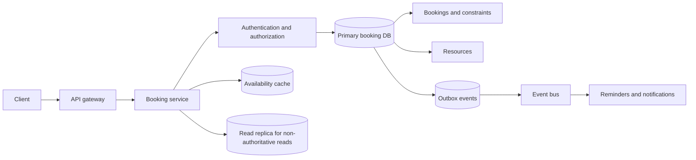
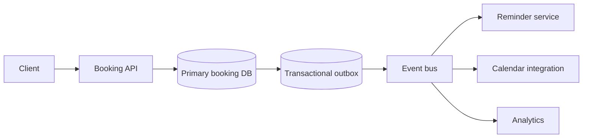
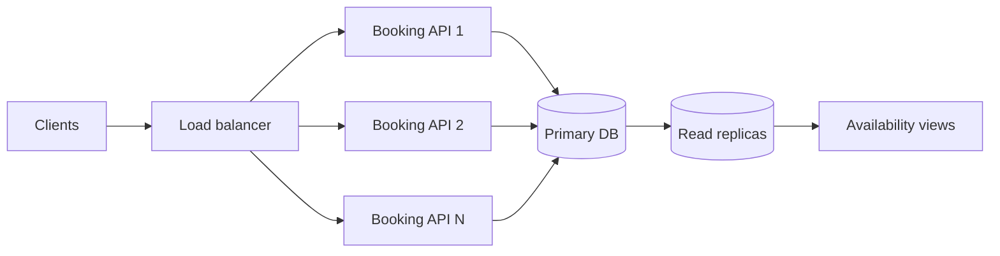

# Booking System

Senior SWE system-design interview revision notes.

## 1. Problem Framing

The difficult part of a booking system is not CRUD. It is guaranteeing that concurrent requests cannot book the same resource and overlapping time slot.

Core invariant:

> For one tenant and resource, confirmed bookings must not overlap.

Example:

```text
Room-101
10:00 -> 11:00
```

Two requests for overlapping intervals must produce exactly one successful booking and one conflict, even when they arrive concurrently.

Start by clarifying:

- What is being booked: rooms, appointments, seats, equipment, or inventory?
- Are bookings fixed slots or arbitrary time intervals?
- Are adjacent bookings allowed?
- Can a booking be held temporarily before payment or confirmation?
- What are the cancellation, rescheduling, and expiry rules?
- Is the system single-tenant or multi-tenant?
- What are the peak contention and traffic patterns?
- Is timezone or daylight-saving behavior relevant?

## 2. Requirements

### Functional

- Create a booking for a resource and time range.
- Check informational availability.
- Cancel or reschedule a booking.
- Prevent overlapping confirmed bookings.
- Support client retries without duplicate bookings.
- Return booking status and details.
- Support authorization, tenant isolation, and ownership rules.
- Optionally support temporary holds, payment state, reminders, and waitlists.

### Non-functional

- Strong consistency for booking writes.
- Low-latency availability reads.
- Horizontal API scalability.
- Durable bookings and auditable state transitions.
- Clear behavior under concurrent requests.
- Graceful handling of retries, timeouts, deadlocks, and database failures.

## 3. High-Level Architecture



The primary database is the correctness boundary. Caches and replicas may accelerate availability views, but only the booking transaction can authoritatively accept or reject a booking.

## 4. Core APIs

### Create booking

```http
POST /v1/tenants/{tenantId}/bookings
Idempotency-Key: abc123
```

```json
{
  "resourceId": "ROOM-101",
  "startTime": "2026-09-21T10:00:00Z",
  "endTime": "2026-09-21T11:00:00Z"
}
```

Successful response:

```json
{
  "bookingId": "B-101",
  "tenantId": "T1",
  "resourceId": "ROOM-101",
  "userId": "U-42",
  "startTime": "2026-09-21T10:00:00Z",
  "endTime": "2026-09-21T11:00:00Z",
  "status": "CONFIRMED",
  "version": 1
}
```

Return a conflict such as `409 Conflict` when the interval is no longer available. Validate that `startTime < endTime`, timestamps use a defined timezone policy, and the requested duration is within product limits.

### Availability

```http
GET /v1/tenants/{tenantId}/resources/{resourceId}/availability?startTime=...&endTime=...
```

Availability is informational. It is not a reservation or a guarantee that a later booking will succeed.

### Cancel booking

```http
POST /v1/tenants/{tenantId}/bookings/{bookingId}/cancel
Idempotency-Key: cancel-abc123
```

Use an explicit action when cancellation has authorization, refund, or event side effects. A repeated cancellation should return the same final state.

### Reschedule booking

Treat rescheduling as a new availability decision. It should not release the old interval until the new interval is successfully secured, or it should use one transaction that locks and validates both intervals.

## 5. Data Model

Use a relational database initially because the no-overlap invariant needs transactional enforcement.

### Resource

```text
resources
---------
tenant_id       UUID NOT NULL
resource_id     TEXT NOT NULL
name            TEXT NOT NULL
resource_type   TEXT NOT NULL
status          ACTIVE | INACTIVE
created_at      TIMESTAMP NOT NULL
updated_at      TIMESTAMP NOT NULL

PRIMARY KEY (tenant_id, resource_id)
```

### Booking

```text
bookings
--------
booking_id      UUID PRIMARY KEY
tenant_id       UUID NOT NULL
resource_id     TEXT NOT NULL
user_id         UUID NOT NULL
start_time      TIMESTAMP WITH TIME ZONE NOT NULL
end_time        TIMESTAMP WITH TIME ZONE NOT NULL
status          HOLD | CONFIRMED | CANCELLED | EXPIRED
version         BIGINT NOT NULL
created_at      TIMESTAMP NOT NULL
updated_at      TIMESTAMP NOT NULL
```

Useful indexes:

```text
(tenant_id, resource_id, start_time, end_time)
(tenant_id, user_id, created_at)
(status, end_time)
```

Use UTC or an explicit timezone-aware type for persisted instants. Convert to the user's timezone only at the presentation boundary.

### Idempotency record

```text
idempotency_keys
----------------
tenant_id       UUID NOT NULL
user_id         UUID NOT NULL
key             TEXT NOT NULL
request_hash    TEXT NOT NULL
booking_id      UUID NULL
response        JSONB NULL
created_at      TIMESTAMP NOT NULL
expires_at      TIMESTAMP NOT NULL

UNIQUE (tenant_id, user_id, key)
```

A reused key with a different request payload should be rejected rather than silently mapped to the original booking.

## 6. The Check-Then-Act Race

Suppose two users request overlapping times:

```text
User A: ROOM-1, 10:00 -> 11:00
User B: ROOM-1, 10:30 -> 11:30
```

A naive implementation does this:

```sql
SELECT *
FROM bookings
WHERE tenant_id = :tenantId
  AND resource_id = :resourceId
  AND status = 'CONFIRMED'
  AND start_time < :requestedEnd
  AND end_time > :requestedStart;
```

Both transactions can observe no rows and then insert:

```text
A: check -> available
B: check -> available
A: insert
B: insert

Double booking
```

A check followed by an insert is not atomic unless the database or transaction locking makes it so.

## 7. Preferred Solution: Database-Enforced Invariant

PostgreSQL can enforce non-overlapping time ranges with an exclusion constraint.

Conceptually:

```sql
CREATE EXTENSION IF NOT EXISTS btree_gist;

ALTER TABLE bookings
ADD CONSTRAINT no_overlapping_confirmed_bookings
EXCLUDE USING gist (
    tenant_id WITH =,
    resource_id WITH =,
    tstzrange(start_time, end_time, '[)') WITH &&
)
WHERE (status IN ('HOLD', 'CONFIRMED'));
```

The half-open interval `[)` means:

```text
10:00 -> 11:00
11:00 -> 12:00
```

are allowed because they touch but do not overlap. These intervals conflict:

```text
10:00 -> 11:00
10:30 -> 11:30
```

Booking flow:

```text
BEGIN
  validate request
  insert booking
  database checks overlap constraint
  commit

success -> CONFIRMED
conflict -> rollback and return 409
```

The constraint remains correct even when thousands of requests arrive concurrently. The application should translate the database constraint violation into a stable domain response rather than exposing raw SQL errors.

## 8. Fallback When Exclusion Constraints Are Unavailable

Use a short transaction and lock the resource row:

```sql
BEGIN;

SELECT resource_id
FROM resources
WHERE tenant_id = :tenantId
  AND resource_id = :resourceId
FOR UPDATE;

SELECT booking_id
FROM bookings
WHERE tenant_id = :tenantId
  AND resource_id = :resourceId
  AND status IN ('HOLD', 'CONFIRMED')
  AND start_time < :requestedEnd
  AND end_time > :requestedStart;

-- If a row exists: ROLLBACK and return conflict.
-- Otherwise:
INSERT INTO bookings (...)
VALUES (...);

COMMIT;
```

The resource row acts as the serialization point:

```text
Request A: lock resource -> check -> insert -> commit
Request B: wait          -> check -> conflict
```

This is reliable but a heavily contended resource becomes a bottleneck. Keep the transaction short and never hold the lock while calling payment or external services.

## 9. Optimistic versus Pessimistic Concurrency

### Database-enforced optimistic conflict detection

```text
Attempt insert
      |
      v
Database constraint
   |          |
Success    Conflict
```

Prefer this when conflicts are relatively uncommon and the database supports the invariant directly.

### Pessimistic resource locking

```text
Lock resource
      |
Check availability
      |
Insert booking
      |
Commit
```

Use this when the database cannot express the constraint or when serializing a particular hot resource is acceptable.

The preferred principle is:

> Enforce correctness in the database with the shortest possible transaction. Do not depend on an application-level lock alone.

## 10. Availability Semantics

`GetAvailability` is a snapshot:

```text
10:00  availability says FREE
10:01  another user books the interval
10:02  original user clicks Book
       booking returns 409 Conflict
```

This is valid behavior. The UI should handle the conflict and refresh availability.

Do not use a cached or replica-backed availability result as proof that a booking will succeed. The authoritative booking write must revalidate against the primary database.

For high-read systems, availability can use:

- Read replicas for non-authoritative views.
- Short-lived cache entries.
- Precomputed slot summaries.
- Search or calendar projections.

All are hints until the booking transaction commits.

## 11. Cancellation and Rescheduling

Cancellation should be transactional and idempotent:

```sql
UPDATE bookings
SET status = 'CANCELLED',
    version = version + 1,
    updated_at = CURRENT_TIMESTAMP
WHERE tenant_id = :tenantId
  AND booking_id = :bookingId
  AND status = 'CONFIRMED';
```

If the row is already cancelled, return the existing final state. If it is expired, completed, or owned by another user, apply the product's authorization and lifecycle rules.

Only active statuses should participate in overlap checks:

```text
HOLD or CONFIRMED -> occupy the interval
CANCELLED/EXPIRED -> do not occupy the interval
```

Cancellation and a new booking can race safely when both rely on the same database invariant. If cancellation commits first, the interval becomes available; otherwise the new booking receives a conflict.

For rescheduling, prefer:

```text
validate new interval
secure new interval
release old interval
```

inside one transaction when both intervals belong to the same resource. Avoid releasing the old booking first, because a competing request could take it before the new interval is secured.

## 12. Idempotent Booking Requests

A client may retry because the response was lost after the booking committed:

```text
Client -> Book request
Server -> booking committed
Network response lost
Client -> retry
```

Without idempotency, the retry can create a second booking. Require an idempotency key:

```http
POST /bookings
Idempotency-Key: abc123
```

Processing flow:

```text
BEGIN
  insert idempotency key and request hash
  if key already exists:
      return stored booking response
  attempt booking under overlap constraint
  store booking ID and response
COMMIT
```

The key must be scoped to the tenant and user or client identity. Retain it long enough to cover expected retry windows. Combine idempotency with the overlap constraint: idempotency prevents duplicate client intent; the database constraint prevents conflicting bookings.

## 13. Holds, Expiry, and Payments

If payment or confirmation is required, use a temporary hold:

```text
AVAILABLE -> HOLD -> CONFIRMED
                  |
                  +-> EXPIRED
```

A hold should have an expiry timestamp and participate in the overlap constraint while active. Expiry can be handled by:

- A scheduled expiry worker.
- A database query that treats past-due holds as inactive.
- A transaction that marks the hold expired before a new booking.

Never call a payment provider while holding a database row lock. Coordinate payment with a state machine and idempotent callbacks:

```text
HOLD_CREATED
      |
      v
PAYMENT_PENDING
   |          |
PAID       FAILED/EXPIRED
   |
CONFIRMED
```

The exact choice between charging before confirmation and confirming before charging depends on the product's compensation and refund policy.

## 14. Events and Notifications

Booking writes should remain independent from reminders and downstream integrations:



Insert the booking and outbox event in one transaction. Publish events such as:

```json
{
  "eventId": "evt-123",
  "eventType": "BOOKING_CONFIRMED",
  "tenantId": "T1",
  "bookingId": "B-101",
  "resourceId": "ROOM-101",
  "startTime": "2026-09-21T10:00:00Z",
  "endTime": "2026-09-21T11:00:00Z",
  "version": 1
}
```

Consumers should be idempotent. Notifications and analytics are eventually consistent; booking acceptance is strongly consistent.

## 15. Scaling



- Scale stateless booking API instances horizontally.
- Send authoritative booking writes to the primary database.
- Use replicas or caches for non-authoritative availability views.
- Partition or shard by tenant only after validating the access pattern and transaction boundaries.
- Protect hot resources with short transactions, queueing, or per-resource admission limits.
- Monitor lock waits, conflict rates, transaction latency, database CPU, and connection pool saturation.

A read replica can say a slot is free while a concurrent primary transaction has already claimed it. Replica lag never replaces the booking invariant.

## 16. Redis Locks and Other Alternatives

A distributed Redis lock can reduce contention:

```text
lock key = booking:{tenantId}:{resourceId}
```

However, Redis should not be the correctness mechanism when the database can enforce the invariant. A lock introduces a second stateful system whose lease, expiry, failure, and fencing behavior must be correct.

Preferred order:

```text
Database constraint -> correctness
Redis or cache      -> performance and hints
```

If a distributed lock is unavoidable, use fencing tokens and still validate the final booking in the primary database. Losing the lock must never permit an invalid booking.

## 17. Failure Scenarios

| Failure | Response |
|---|---|
| Two users book the same interval | Database constraint or resource-row lock returns one conflict |
| Availability result is stale | Treat availability as informational; booking rechecks authoritatively |
| Client retries after timeout | Idempotency key returns original booking |
| Cancellation is repeated | Idempotent state transition returns existing result |
| Payment callback is repeated | Idempotent payment state update |
| Worker crashes during reminder | Event redelivery and idempotent consumer |
| DB succeeds, event publish fails | Transactional outbox |
| Read replica is behind | Never use replica for booking correctness |
| Hold expires during booking | Transaction evaluates expiry and active overlap atomically |
| Hot resource receives heavy traffic | Short transactions, queues, or admission limits |
| Redis lock is lost | Primary DB constraint still rejects invalid booking |
| Deadlock or serialization failure | Retry the short transaction with bounded backoff |

## 18. Consistency Model

| Concern | Consistency |
|---|---|
| Booking acceptance | Strongly consistent primary transaction |
| No-overlap invariant | Database-enforced |
| Cancellation state | Strongly consistent transaction |
| Availability view | Snapshot; may be stale |
| Reminders and integrations | Eventually consistent |
| Analytics | Eventually consistent |

## 19. Reference Interview Answer

“The core requirement is preventing overlapping confirmed bookings for the same tenant resource. I would use a relational primary database as the source of truth and enforce the invariant there. With PostgreSQL, an exclusion constraint over tenant, resource, and a half-open time range gives a clean concurrent solution: one insert commits and the conflicting insert returns a domain-level conflict. If exclusion constraints are unavailable, I would lock the resource row in a short transaction, check active bookings, insert, and commit. Availability is only a snapshot; the booking write is authoritative. I would require an idempotency key for client retries, use soft state transitions for cancellation and holds, and publish reminders through a transactional outbox. Replicas and Redis can improve reads and reduce contention, but neither replaces the primary database’s correctness check.”

## 20. Key Decisions to Memorize

| Area | Decision | Reason |
|---|---|---|
| Source of truth | Primary relational DB | Strong transactional correctness |
| Core invariant | No overlapping active bookings | Prevents double booking |
| PostgreSQL solution | Exclusion constraint on time ranges | Database-enforced concurrency |
| Fallback | Lock resource row in a short transaction | Reliable when exclusion is unavailable |
| Time intervals | Half-open `[)` ranges | Adjacent bookings can touch |
| Availability | Informational snapshot | It cannot reserve a future slot |
| Client retries | Idempotency key | Prevents duplicate bookings |
| Cancellation | Idempotent state transition | Safe repeated requests |
| Holds | Expiring active state | Supports payment/confirmation flows |
| Side effects | Outbox plus event bus | Decouples reminders and integrations |
| Reads | Replicas and cache for hints | Improves scale without weakening writes |
| Redis | Performance aid, not correctness boundary | Avoids split-brain booking state |
