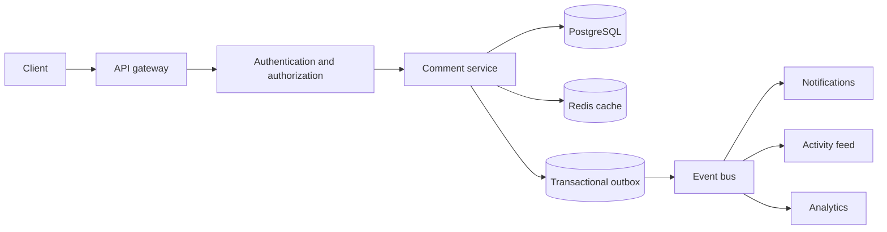

# Comment and Collaboration System

Senior SWE system-design interview revision notes.

## 1. Problem Framing

Comments are attached to a resource such as a document, task, or issue.

```text
Document / Task / Issue
        |
        +-- Comment
              +-- replies
              +-- edits
              +-- reactions (optional)
```

Start by clarifying:

- Who can view, create, edit, and delete comments?
- Are replies and deep nesting required?
- Is ordering by creation time or recent activity?
- Are edit history, reactions, mentions, and moderation in scope?
- Is ordinary comment editing sufficient, or is real-time co-editing required?



The database is authoritative for comments. The cache and event consumers improve read latency and fan out side effects asynchronously.

## 2. Requirements

### Functional

- Create a comment on a resource.
- List comments with pagination and deterministic ordering.
- Edit or soft-delete a comment.
- Reply to a comment and list replies independently.
- Enforce resource and comment permissions.
- Notify mentioned users and relevant subscribers.
- Prevent lost updates during concurrent edits and deletes.
- Retain an audit trail where required.

### Non-functional

- Low-latency reads and durable writes.
- Horizontal scalability for hot resources.
- Strong correctness for comment mutations.
- Eventual consistency is acceptable for notifications, analytics, and caches.
- Graceful handling of retries, duplicate events, and downstream failures.

## 3. API Design

Keep the resource identity explicit rather than hiding it in a generic comment endpoint.

```text
POST   /comments
GET    /comments?resourceId=doc-123&cursor=abc&limit=20&sort=createdAt
PATCH  /comments/{commentId}
DELETE /comments/{commentId}
GET    /comments/{commentId}/replies?cursor=abc&limit=20
```

### Create comment

```http
POST /comments
```

```json
{
  "resourceId": "doc-123",
  "parentCommentId": null,
  "text": "This looks good."
}
```

```json
{
  "id": "c-456",
  "resourceId": "doc-123",
  "parentCommentId": null,
  "text": "This looks good.",
  "authorId": "u-123",
  "createdAt": "2026-09-21T10:00:00Z",
  "updatedAt": "2026-09-21T10:00:00Z",
  "status": "ACTIVE",
  "version": 1
}
```

### Edit comment

The client sends the version it last read:

```json
{
  "text": "Updated text",
  "version": 5
}
```

Return `409 Conflict` when the supplied version is stale. Use `401 Unauthorized` for a missing identity, `403 Forbidden` for insufficient permission, and `404 Not Found` or `410 Gone` according to the API's deleted-resource policy.

## 4. Data Model

A relational database such as PostgreSQL is a good initial choice because mutations need transactions, optimistic locking, and indexed queries.

```text
comments
--------
id                  UUID PRIMARY KEY
resource_id         UUID NOT NULL
parent_comment_id   UUID NULL
author_id           UUID NOT NULL
text                TEXT
status              ACTIVE | DELETED
version             BIGINT NOT NULL
created_at          TIMESTAMP NOT NULL
updated_at          TIMESTAMP NOT NULL
deleted_at          TIMESTAMP NULL
```

Recommended indexes:

```text
(resource_id, created_at, id)
(resource_id, parent_comment_id, created_at, id)
(author_id)
```

The `id` tie-breaker is important because timestamps are not guaranteed to be unique.

For edit auditability, add a separate history table or append-only audit event stream:

```text
comment_edits
-------------
id, comment_id, editor_id, old_text, new_text, version, created_at
```

## 5. Pagination and Ordering

Use cursor-based pagination instead of offsets. Offsets become slow and unstable when comments are inserted or deleted between requests.

For newest-first ordering, the cursor contains the last `(createdAt, id)` pair:

```sql
SELECT *
FROM comments
WHERE resource_id = :resourceId
  AND status = 'ACTIVE'
  AND (created_at, id) < (:lastCreatedAt, :lastCommentId)
ORDER BY created_at DESC, id DESC
LIMIT :limit;
```

Use an opaque, signed cursor in the API. A simple first version should support `createdAt DESC`; `updatedAt DESC` is a separate product requirement and needs matching indexes and semantics.

Do not return an entire reply tree for a large discussion:

- `GET /comments` returns top-level comments.
- `GET /comments/{commentId}/replies` returns paginated direct replies.
- `parent_comment_id` supports threading without making one response unbounded.

## 6. Concurrency and Correctness

### Optimistic locking

Use the version column for edits and deletes:

```sql
UPDATE comments
SET text = :text,
    version = version + 1,
    updated_at = CURRENT_TIMESTAMP
WHERE id = :commentId
  AND version = :expectedVersion
  AND status = 'ACTIVE';
```

If no row is updated, the comment changed after the client read it. Return `409 Conflict` instead of silently overwriting the newer change.

Example:

```text
Initial version = 5
User A reads v5; User B reads v5
User A updates -> v6: success
User B updates expecting v5: 409 Conflict
```

This is sufficient for ordinary comments. Google Docs-style simultaneous character editing would require OT or CRDTs and is a different system.

### Edit versus delete

Use the same version check for both operations. Whichever valid operation updates the expected version first wins; the other receives a conflict or deleted-resource response.

## 7. Delete Semantics

Prefer soft deletion:

```sql
UPDATE comments
SET status = 'DELETED',
    deleted_at = CURRENT_TIMESTAMP,
    version = version + 1,
    updated_at = CURRENT_TIMESTAMP
WHERE id = :commentId
  AND version = :expectedVersion;
```

Benefits:

- Preserves audit and moderation history.
- Keeps replies' references valid.
- Allows recovery and analytics.
- Supports compliance requirements.

For a threaded view, retain the node and render `[deleted]` so replies do not become orphaned. Hide deleted text from normal responses.

## 8. Permissions

Authorization must be enforced server-side for every mutation and read:

```text
Request
  -> authentication
  -> resource authorization
  -> comment authorization
  -> comment service
  -> database
```

Typical policy:

| Operation | Permission |
|---|---|
| Create | User can comment on the resource |
| Read | User can view the resource |
| Edit | Comment author or permitted moderator |
| Delete | Comment author or permitted moderator/admin |
| Reply | User can comment on the resource and parent is visible |

Keep policy checks in explicit service methods such as `canUserComment`, `canUserEditComment`, and `canUserDeleteComment`. The comment service should consult the resource/document ACL rather than duplicating it.

## 9. Notifications and Events

Comment creation should not synchronously call email, push, Slack, or analytics services. Use an event-driven flow:

```text
Comment Service
      |
      | one database transaction
      v
  comments + outbox_event
      |
      v
  outbox publisher -> Kafka / event bus
      |
      +--> Notification Service
      +--> Activity Feed
      +--> Analytics
```

Example event:

```json
{
  "eventType": "COMMENT_CREATED",
  "eventId": "evt-789",
  "commentId": "c-123",
  "resourceId": "doc-123",
  "authorId": "u-1",
  "mentionedUsers": ["u-2", "u-3"]
}
```

### Why the outbox pattern?

Without an outbox, a database insert can succeed while event publication fails, leaving a comment with no notification. Insert the comment and outbox event in one transaction; a retryable publisher then delivers the event.

Consumers should be idempotent because event delivery may be repeated. Use `eventId` or a consumer-side deduplication key.

### Mentions

Parse `@user` references when the comment is created, validate that the users exist and can view the resource, then let the notification service decide channels, aggregation, and preferences.

## 10. Caching and Scaling

Use Redis only as a performance layer; the database remains the source of truth.

Cache-aside flow:

```text
Read -> Redis hit -> return
     -> miss -> database -> populate Redis -> return
```

Cursor-specific page keys can have low reuse. Prefer caching the first page or hot resources, for example:

```text
comments:{resourceId}:first-page:{sort}
```

Invalidate or refresh affected keys after successful writes. Accept that cache and notification views may be eventually consistent.

At larger scale:

- Partition or shard by `resource_id`, since most queries retrieve one resource's comments.
- Route reads for a resource consistently where practical.
- Add rate limits and maximum page sizes for hot resources.
- Monitor database latency, cache hit rate, outbox lag, event failures, and conflict rates.
- Use retries with backoff and dead-letter handling for failed event consumers.

## 11. Reference Architecture

```text
                         +------------------+
                         |      Client      |
                         +--------+---------+
                                  |
                                  v
                         +------------------+
                         |   API Gateway    |
                         +--------+---------+
                                  |
                                  v
                    +----------------------------+
                    |       Comment Service      |
                    | auth, ACL, validation,     |
                    | pagination, concurrency    |
                    +---------+----------+-------+
                              |          |
                         cache|          |database
                              v          v
                           Redis     PostgreSQL
                                         |
                                         | outbox
                                         v
                                      Kafka
                              +----------+----------+
                              |          |          |
                              v          v          v
                       Notifications  Activity   Analytics
                         email/push     Feed
```

## 12. Consistency Model

| Concern | Consistency |
|---|---|
| Comment create/edit/delete | Strongly consistent transaction |
| Version conflict detection | Strongly consistent |
| Primary comment reads | Database-consistent, or cache-consistent when cached |
| Notifications | Eventually consistent |
| Activity feed | Eventually consistent |
| Analytics | Eventually consistent |

## 13. Interview Approach

Use this sequence to keep the discussion structured:

1. Clarify resource scope, permissions, threading, ordering, and scale.
2. State the APIs and the primary read/write flows.
3. Choose PostgreSQL initially and explain the indexes.
4. Explain cursor pagination using `(created_at, id)`.
5. Explain optimistic locking and the `409 Conflict` path.
6. Choose soft deletes and preserve reply structure.
7. Move notifications behind an outbox and event bus.
8. Add Redis cache-aside only where read traffic justifies it.
9. Discuss partitioning, idempotency, retries, observability, and failure modes.
10. Call out that real-time collaborative text editing would need OT/CRDT rather than ordinary version checks.

## 14. Key Decisions to Memorize

| Area | Decision | Reason |
|---|---|---|
| Storage | PostgreSQL initially | Transactions, relationships, indexed queries |
| Pagination | Cursor-based | Stable and efficient under inserts |
| Cursor order | `(created_at, id)` | Deterministic ordering |
| Concurrency | Optimistic locking with `version` | Prevents lost updates |
| Deletes | Soft delete | Auditability and intact threads |
| Notifications | Outbox plus event bus | Reliable asynchronous delivery |
| Cache | Redis cache-aside | Lower read latency; DB stays authoritative |
| Scale | Partition by `resource_id` | Matches the dominant query pattern |

## 15. Reference Interview Answer

“I would start with a PostgreSQL-backed comment service using cursor pagination and optimistic version checks. Comment mutations are strongly consistent and permission-checked. Deletes are soft, and replies are fetched separately. The comment and an outbox event are committed together, after which an event bus drives notifications, activity feeds, and analytics asynchronously. Redis can reduce read latency for hot resources, while partitioning by resource ID and idempotent consumers provide a path to scale.”