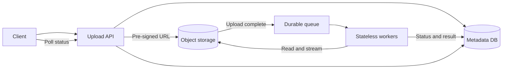

# File Processing System

Senior SWE system-design interview revision notes.

## 1. Problem Framing

Design a system that accepts large files, stores them durably, processes them asynchronously, and exposes reliable status and results.

```text
Client
  |
  v
Upload API -----> Metadata DB
  |
  | pre-signed URL
  v
Object Storage
  |
  | upload-complete event
  v
Queue ----------> Processing Workers
                       |
                       +--> Object Storage
                       +--> Metadata DB
                       +--> Status API
```

Start by clarifying:

- Maximum file size and expected upload volume.
- Supported file types and processing operations.
- Processing latency: seconds, minutes, or hours.
- Whether duplicate content should be deduplicated.
- Whether users can pause, cancel, retry, or resume processing.
- Required durability, retention, access control, and audit history.
- Whether processing is one stage or a multi-stage pipeline.



The API handles metadata and authorization; object storage handles file bytes; workers handle asynchronous processing.

## 2. Requirements

### Functional

- Create an upload session and return a pre-signed upload URL.
- Upload directly to object storage.
- Verify upload completion, size, type, and checksum.
- Process files asynchronously.
- Track status, progress, errors, and retry attempts.
- Retrieve processing results and output files.
- Support large multipart uploads and resumable failed chunks.
- Prevent duplicate processing and handle worker crashes.
- Support cancellation and cleanup of abandoned uploads where required.

### Non-functional

- Durable storage for source files and outputs.
- Horizontal worker scalability.
- Bounded memory usage through streaming.
- At-least-once queue processing with idempotent side effects.
- Low API latency because uploads and processing are asynchronous.
- Tenant isolation, authorization, rate limits, and abuse protection.
- Observable queues, workers, storage, and processing stages.

## 3. API Design

```text
POST /files/uploads
POST /files/{fileId}/complete
GET  /files/{fileId}
GET  /files/{fileId}/status
GET  /files/{fileId}/result
POST /files/{fileId}/cancel
```

### Create upload

```json
{
  "fileName": "report.pdf",
  "contentType": "application/pdf",
  "sizeBytes": 104857600,
  "checksum": "sha256:abc123"
}
```

Response:

```json
{
  "fileId": "F123",
  "uploadId": "U456",
  "objectKey": "uploads/tenant-1/F123/source",
  "uploadUrl": "https://object-storage.example/...",
  "expiresAt": "2026-09-21T15:00:00Z"
}
```

The API authenticates the caller, checks quotas and allowed types, creates the metadata row, and issues a short-lived URL scoped to one object key. The API server does not proxy the file bytes.

### Complete upload

The client calls completion after the object upload succeeds. The service verifies that the object exists and matches the expected size and checksum before enqueueing processing.

```json
{
  "uploadId": "U456",
  "parts": [
    { "partNumber": 1, "etag": "etag-1" },
    { "partNumber": 2, "etag": "etag-2" }
  ]
}
```

Completion must be idempotent: repeated requests should return the same file state rather than enqueueing duplicate work.

## 4. Upload Flow

```text
1. Client -> API: create upload session
2. API -> DB: create file row with UPLOADING
3. API -> Client: short-lived pre-signed URL(s)
4. Client -> Object Storage: upload directly
5. Client -> API: complete upload
6. API: verify object metadata and checksum
7. API -> Queue: publish FILE_UPLOADED
8. Worker: process source object
9. Worker -> Storage: write versioned output
10. Worker -> DB: persist result and COMPLETED status
```

Direct-to-object-storage upload avoids API bandwidth bottlenecks and lets object storage handle multipart transfer, retries, and durable persistence.

## 5. Large and Resumable Uploads

For large files, use multipart or chunked upload:

```text
10 GB file
   |
   +-- part 1 ---> Object Storage
   +-- part 2 ---> Object Storage
   +-- part 3 ---> Object Storage
   +-- ...
```

- Retry individual failed parts instead of restarting the upload.
- Persist the upload ID and completed part numbers.
- Complete the multipart upload only after all expected parts are present.
- Validate the final size and checksum.
- Expire and clean up abandoned multipart uploads.
- Apply per-user and per-tenant size and rate quotas.

For processing, stream the object instead of loading it entirely into memory:

```text
Object Storage -> stream -> parse -> transform -> output
```

Worker memory should be approximately independent of file size, subject to parser and transformation requirements.

## 6. Data Model

### File metadata

```text
files
-----
id                  UUID PRIMARY KEY
owner_id            UUID NOT NULL
tenant_id           UUID NOT NULL
object_key          TEXT NOT NULL
file_name           TEXT NOT NULL
content_type        TEXT NOT NULL
size_bytes          BIGINT NOT NULL
checksum            TEXT NULL
status              UPLOADING | UPLOADED | QUEUED | PROCESSING |
                    COMPLETED | FAILED | CANCELLED
progress_percent    INT NULL
processing_version  INT NOT NULL
attempt_count       INT NOT NULL
error_code          TEXT NULL
error_message       TEXT NULL
created_at          TIMESTAMP NOT NULL
updated_at          TIMESTAMP NOT NULL
```

### Processing job

```text
processing_jobs
---------------
id                  UUID PRIMARY KEY
file_id             UUID NOT NULL
processing_version  INT NOT NULL
status              PENDING | PROCESSING | COMPLETED | FAILED
lease_until         TIMESTAMP NULL
attempt_count       INT NOT NULL
checkpoint          JSONB NULL
output_key          TEXT NULL
created_at          TIMESTAMP NOT NULL
updated_at          TIMESTAMP NOT NULL

UNIQUE(file_id, processing_version)
```

The processing version prevents an old retry from overwriting a newer run. Store stage checkpoints only when the pipeline is long-running or expensive enough to justify resumption.

## 7. State Machine

```text
UPLOADING
    |
    v
UPLOADED -> QUEUED -> PROCESSING -> COMPLETED
               |          |
               |          +------> FAILED
               |                         |
               +-------------------------+
                         retry

PROCESSING -> CANCELLED
```

Only valid transitions should be accepted. Use an atomic database update with the expected current state so completion, retry, cancellation, and duplicate messages cannot corrupt the state machine.

Example status response:

```json
{
  "fileId": "F123",
  "status": "PROCESSING",
  "progressPercent": 65,
  "updatedAt": "2026-09-21T14:35:00Z",
  "error": null
}
```

For long-running work, workers update progress periodically. Progress is informational and should not be treated as a transactional guarantee.

## 8. Queue Processing and Worker Crashes

Workers should be stateless. Use acknowledgement plus a visibility timeout or lease:

```text
Queue delivers message to Worker A
        |
        +--> Worker processes
        |
        +--> Worker crashes before ACK
        |
        +--> Lease expires
        |
        +--> Message is redelivered to Worker B
```

This gives at-least-once processing. A lease must be long enough for normal work, and long jobs may need lease renewal. A worker must verify that it still owns the lease before committing results.

At-least-once delivery means a message can be processed more than once. Design every stage to be idempotent.

## 9. Idempotency and Duplicate Work

There are two separate duplicate problems.

### A. Same content uploaded twice

Calculate a content hash such as SHA-256:

```text
file bytes -> SHA-256 -> content hash
```

Use a lookup such as:

```text
(tenant_id, content_hash, processing_policy)
```

Depending on product requirements, either return the existing logical file or create a new logical file that references the same immutable source object.

Do not deduplicate across tenants unless ownership, privacy, and authorization rules explicitly allow it.

### B. Same queue message delivered twice

Use a deterministic processing key:

```text
processingId = fileId + processingVersion
```

Enforce uniqueness in the database:

```sql
INSERT INTO processing_jobs(file_id, processing_version, status)
VALUES (:fileId, :version, 'PROCESSING')
ON CONFLICT (file_id, processing_version) DO NOTHING;
```

If the job already exists, the worker should inspect its current state and return or resume safely.

### External side effects

A database unique constraint does not make the whole workflow exactly once:

```text
Worker writes output object
       |
       +--> Worker crashes before DB commit
       |
       +--> Retry runs again
```

Use deterministic, versioned output keys, for example:

```text
outputs/{fileId}/v{processingVersion}/result.json
```

Write outputs atomically where the storage system supports it, or write to a temporary key and commit a final pointer in the database. Do not overwrite a newer processing version with an older retry.

## 10. Retry and Dead-Letter Handling

Retry transient failures with exponential backoff and jitter:

```text
Attempt 1 -> fail -> 2 seconds + jitter
Attempt 2 -> fail -> 4 seconds + jitter
Attempt 3 -> fail -> 8 seconds + jitter
```

### Retryable failures

- Temporary object-storage or database outage.
- Network timeout.
- Worker dependency unavailable.
- Queue or service throttling.

### Permanent failures

- Unsupported file type.
- Invalid file format.
- Checksum mismatch.
- Corrupt or malicious file.
- Policy or authorization failure.
- Non-retryable parser error.

After a bounded number of attempts, move poison messages to a DLQ and mark the job `FAILED`:

```text
Processing queue -> retry policy -> DLQ
```

A DLQ record should include `fileId`, processing version, error code, attempt count, timestamps, and a reference to the original message. Replay must be permissioned and idempotent.

## 11. Multi-Stage Processing

For pipelines such as virus scan, extraction, transformation, and indexing, model stages explicitly:

```text
Upload
  -> virus scan
  -> parse
  -> transform
  -> index
  -> publish result
```

Each stage should have:

- A clear input and output contract.
- A durable status.
- A retry policy.
- An idempotency key.
- A checkpoint or versioned output when restarting is expensive.

Use separate queues for materially different workloads:

```text
Upload event
     +--> Image queue -> Image workers
     +--> Video queue -> Video workers
     +--> PDF queue   -> PDF workers
```

This prevents expensive video jobs from starving lightweight image or metadata jobs.

## 12. Scaling and Backpressure

Scale workers independently by workload:

```text
                 +-- Worker 1
Queue -----------+-- Worker 2
                 +-- Worker N
```

Scale based on:

- Queue depth and oldest message age.
- Processing latency.
- CPU, memory, and I/O utilization.
- Provider or dependency throttling.

Apply backpressure with bounded concurrency, queue limits, per-tenant quotas, and priority queues. Do not allow an unbounded backlog to exhaust storage or worker resources.

Use separate pools for CPU-heavy, memory-heavy, and I/O-heavy jobs. Large files may need dedicated workers with explicit memory and timeout limits.

## 13. Security and Access Control

- Authorize every metadata, source, and output request.
- Scope pre-signed URLs to one object, operation, content type, and short expiry.
- Never trust a client-supplied MIME type; inspect file signatures where appropriate.
- Scan untrusted files for malware before making outputs available.
- Encrypt objects at rest and use TLS in transit.
- Isolate tenant object keys and enforce tenant-level quotas.
- Avoid logging file contents, credentials, or sensitive metadata.
- Record audit events for upload, download, processing, cancellation, and deletion.

## 14. Observability and Operations

Track metrics by tenant, file type, processing stage, and worker pool:

- Upload success and completion latency.
- Queue depth and oldest job age.
- Processing latency and throughput.
- Retry, failure, cancellation, and DLQ counts.
- Checksum and validation failures.
- Worker CPU, memory, disk, and lease-expiry rates.
- Storage capacity, orphaned uploads, and output retention.

Propagate `fileId`, processing version, job ID, and trace ID through API, queue, worker, storage, and database logs. Alert on queue age, repeated lease expiry, DLQ growth, checksum failures, and storage pressure.

## 15. Important Failure Scenarios

| Problem | Design response |
|---|---|
| API bandwidth overloaded | Direct upload with pre-signed URLs |
| Very large file | Multipart upload and streaming processing |
| Upload interrupted | Resume individual parts |
| Upload never completed | Expire session and clean up orphaned parts |
| Corrupt upload | Verify size and checksum before enqueueing |
| Worker crashes | Lease/visibility timeout and redelivery |
| Duplicate queue delivery | Deterministic processing key and idempotent stages |
| Temporary dependency failure | Backoff, jitter, and bounded retries |
| Poison message | Permanent-error classification and DLQ |
| Duplicate output | Versioned deterministic output key |
| Heavy jobs starve light jobs | Separate queues and worker pools |
| Lost status | Persistent metadata database |
| Partial pipeline failure | Stage checkpoints and durable state |
| Unauthorized file access | Resource-level authorization and scoped URLs |

## 16. Reference Interview Answer

“I would use object storage for file bytes, a metadata database for ownership and processing state, and a queue to decouple uploads from asynchronous workers. The client receives a short-lived pre-signed URL and uploads directly to object storage, using multipart upload for large files. The completion endpoint verifies the object and checksum, then publishes a durable processing job. Stateless workers stream the file, update a versioned state machine, and write deterministic outputs. Queue delivery is at least once, so jobs and every external side effect must be idempotent; leases handle worker crashes, while retries with backoff and a DLQ handle failures. I would separate queues by workload, autoscale from queue age and resource usage, and enforce authorization, quotas, malware scanning, and scoped storage URLs.”

## 17. Key Decisions to Memorize

| Area | Decision | Reason |
|---|---|---|
| File bytes | Object storage | Durable and scalable for large payloads |
| Upload path | Pre-signed direct upload | Keeps file traffic off API servers |
| Large files | Multipart and resumable upload | Retries only failed parts |
| Processing | Queue plus stateless workers | Decoupling and horizontal scale |
| Delivery semantics | At-least-once | Reliable under crashes |
| Idempotency | File/version key plus deterministic outputs | Prevents duplicate effects |
| State | Persistent versioned state machine | Reliable status and transitions |
| Failure handling | Backoff, jitter, and DLQ | Separates transient from permanent errors |
| Workload isolation | Separate queues and worker pools | Prevents starvation |
| Integrity | Size and checksum validation | Detects incomplete or corrupt uploads |
| Security | Scoped URLs and resource authorization | Limits unauthorized access |
| Recovery | Checkpoints and versioned outputs | Resumes expensive pipelines safely |
