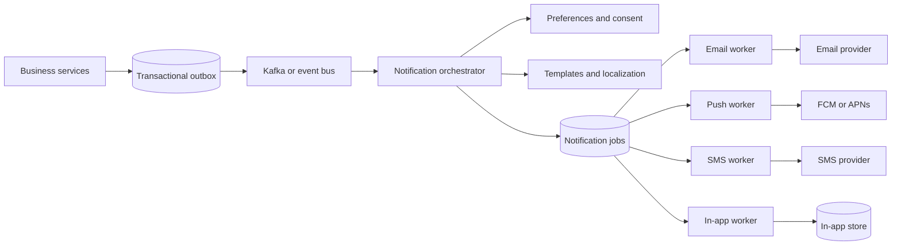

# Notification System

Senior SWE system-design interview revision notes.

## 1. Problem Framing

A notification system consumes business events, applies user preferences and policy, renders a message, and delivers it through one or more channels.

```text
Business event
      |
      v
Notification orchestration
      |
      +--> Email
      +--> Push
      +--> SMS
      +--> In-app
```

Start by clarifying:

- Which channels are required: email, push, SMS, in-app, or webhooks?
- Are notifications immediate, scheduled, or digest-based?
- Is ordering required, and within what scope: user, tenant, order, or event type?
- Are duplicate deliveries acceptable for each channel?
- Who controls templates, localization, preferences, and opt-outs?
- What delivery volume, latency, and retention are expected?

## 2. Requirements

### Functional

- Consume events from business services.
- Deliver through email, push, SMS, and in-app channels.
- Apply user, tenant, and channel preferences.
- Support immediate delivery and future scheduling where needed.
- Retry transient provider failures.
- Avoid duplicate notification jobs and minimize duplicate deliveries.
- Track lifecycle state and provider responses.
- Support templates, localization, mentions, and unsubscribe rules.
- Provide delivery history and operational replay from a dead-letter queue.

### Non-functional

- Highly available and horizontally scalable.
- Asynchronous so business requests do not wait for providers.
- At-least-once event processing with idempotent consumers.
- Per-provider, per-tenant, and per-user rate limits.
- Observable with metrics, logs, traces, and alerts.
- Durable enough to recover jobs after process or provider failures.

### Explicit guarantees

Do not promise exactly-once delivery unless every external provider supports a usable idempotency key. A practical design provides:

- At-least-once event processing.
- Exactly-once creation of an internal notification job.
- Best-effort deduplication at the provider boundary.
- Eventual consistency for delivery status and user-facing history.

## 3. High-Level Architecture

```text
Business services
      |
      | transactional outbox
      v
Event bus / Kafka
      |
      v
Notification orchestrator
      |
      +--> preference and policy service
      +--> template service
      +--> notification database
      |
      +--> Email queue --> Email workers --> Email provider
      +--> Push queue  --> Push workers  --> FCM / APNs
      +--> SMS queue   --> SMS workers   --> SMS provider
      +--> In-app queue --> In-app store / WebSocket gateway
```



The key boundary is:

> A business service publishes a durable event. It does not synchronously call an external notification provider.

This keeps the core business transaction independent from provider latency and failure.

## 4. Event Contract

Use a versioned event envelope with a stable event ID:

```json
{
  "eventId": "evt-123",
  "eventType": "ORDER_PLACED",
  "schemaVersion": 1,
  "aggregateId": "order-789",
  "userId": "user-456",
  "tenantId": "tenant-1",
  "occurredAt": "2026-09-21T14:30:00Z",
  "data": {
    "orderId": "order-789"
  }
}
```

The producer should use a transactional outbox when the event is derived from a database change:

```text
One database transaction:
  update business state
  insert outbox event

Background publisher:
  read unpublished outbox rows
  publish to Kafka
  mark rows published
```

This prevents the business update from succeeding while event publication is lost.

## 5. Notification Processing Flow

```text
Event
  |
  v
Validate schema and deduplicate event
  |
  v
Load preferences, consent, and policy
  |
  v
Resolve channels and select template
  |
  v
Create one notification job per channel
  |
  v
Publish jobs to channel-specific queues
  |
  v
Workers send and persist the result
```

Separate workers by channel because providers have different latency, limits, credentials, payloads, and retry behavior.

Example for `ORDER_SHIPPED`:

```text
Email enabled?  -> email job
Push enabled?   -> push job
In-app enabled? -> in-app job
SMS enabled?    -> SMS job, if policy allows it
```

## 6. Data Model

### Notification job

```text
notifications
-------------
id                    UUID PRIMARY KEY
event_id              UUID NOT NULL
user_id               UUID NOT NULL
tenant_id             UUID NULL
channel               EMAIL | PUSH | SMS | IN_APP
template_id           TEXT NOT NULL
payload               JSONB NOT NULL
status                PENDING | PROCESSING | SENT | DELIVERED | FAILED
attempt_count         INT NOT NULL
next_attempt_at       TIMESTAMP NULL
provider_message_id   TEXT NULL
last_error_code       TEXT NULL
last_error_message    TEXT NULL
created_at            TIMESTAMP NOT NULL
updated_at            TIMESTAMP NOT NULL
```

Recommended constraints and indexes:

```text
UNIQUE(event_id, user_id, channel)
(status, next_attempt_at)
(user_id, created_at)
(tenant_id, created_at)
```

The unique key creates one internal job for a logical event, user, and channel. If one event intentionally produces multiple messages, add an explicit `notification_key` rather than weakening the constraint.

### Preferences

```text
notification_preferences
------------------------
user_id
event_type
channel
enabled
quiet_hours
updated_at
```

Keep consent and legal opt-out rules authoritative. A user preference must not override mandatory compliance behavior or a channel-specific unsubscribe requirement.

## 7. Idempotency and Delivery Semantics

Kafka and most queues provide at-least-once delivery. A consumer can send successfully and crash before acknowledging the message:

```text
consume event
  -> send email succeeds
  -> process crashes before offset commit
  -> event is redelivered
  -> email may be sent again
```

Use two layers of protection:

1. **Internal deduplication:** insert the notification job with `UNIQUE(event_id, user_id, channel)`.
2. **Provider deduplication:** pass `notification.id` as the provider idempotency key when supported.

The database alone cannot prove whether an external provider completed a request during a crash window:

```text
mark PROCESSING
  -> provider accepts message
  -> service crashes before saving SENT
  -> retry cannot know whether the provider sent it
```

If the provider has no idempotency support, choose between possible duplicates and possible drops based on product requirements, and document the tradeoff.

## 8. Retry and Failure Handling

Classify failures before retrying.

### Retryable failures

- Network timeout.
- HTTP `429 Too Many Requests`.
- HTTP `500`-series response.
- Temporary provider outage.
- Connection or dependency failure.

Use exponential backoff with jitter, for example:

```text
1 minute, 2 minutes, 4 minutes, 8 minutes, 16 minutes
```

Honor provider `Retry-After` values and cap the maximum delay.

### Permanent failures

- Invalid email address or phone number.
- User has unsubscribed.
- Invalid or missing template.
- Unsupported device token.
- Permanent provider rejection.

Mark permanent failures as `FAILED` without retrying. After a bounded number of retry attempts, move retryable failures to a dead-letter queue (DLQ).

### DLQ

Store enough context to investigate and replay safely:

```text
eventId
notificationId
channel
errorCode
errorMessage
attemptCount
failedAt
original payload or payload reference
```

DLQ replay must be permissioned, observable, and idempotent.

## 9. Ordering

Kafka guarantees ordering only within one partition. If order matters for an aggregate, use a stable partition key such as `orderId`, not a random message key:

```text
partition key = orderId

PaymentSuccessful
OrderShipped
OrderDelivered
```

This preserves producer order for that order within Kafka. It does not guarantee end-to-end display order because channel queues, workers, retries, and external providers can reorder delivery.

If strict user-visible ordering is required, add a sequence number and hold later jobs until earlier jobs complete or expire. This increases latency and operational complexity, so make it an explicit requirement.

## 10. Rate Limiting and Backpressure

Protect providers and prevent one tenant or user from consuming all capacity:

```text
Channel workers
      |
      v
Rate limiter / concurrency limiter
      |
      v
External provider
```

Apply limits at several scopes:

- Global provider limit.
- Per-channel limit.
- Per-tenant limit.
- Per-user frequency limit.
- Per-provider credential limit.

Use token bucket or leaky bucket algorithms. When capacity is exhausted, keep the job queued, delay it, or reject it according to the notification's priority and expiry policy.

Separate priority queues when urgent security notifications must not wait behind bulk marketing traffic.

## 11. Templates and Preferences

The orchestrator should resolve:

```text
event type
  -> user preferences and consent
  -> quiet hours and frequency policy
  -> locale and template version
  -> channel-specific rendering
```

Render and validate channel payloads before handing them to workers. Store the template version used by each notification so delivery history remains explainable after templates change.

For scheduled or digest notifications, persist the schedule and use a durable scheduler. Do not rely on an in-memory timer in a worker process.

## 12. In-App Notifications

Persist in-app notifications before publishing a real-time update:

```text
create notification row
      |
      +--> WebSocket or SSE update, if the user is online
      |
      +--> unread count and notification history use the database
```

The real-time message is an optimization. A reconnecting client can fetch missed notifications using a cursor, so a dropped WebSocket message does not lose the notification.

## 13. Scaling and Storage Choices

Start with PostgreSQL for notification jobs, preferences, and in-app history when transactional state and operational simplicity matter. Add Kafka or another durable queue for high-volume asynchronous processing.

At larger scale:

- Partition notification history by tenant or time.
- Partition Kafka by aggregate ID when ordering matters.
- Scale workers independently by channel.
- Use separate storage or retention policies for long-lived history and short-lived job state.
- Archive or delete old delivery records according to compliance requirements.
- Use Redis for rate-limit counters or short-lived preference caching, not as the source of truth for durable jobs.

## 14. Observability and Operations

Track metrics by channel, provider, tenant, and event type:

- Queue depth and oldest message age.
- End-to-end delivery latency.
- Success, permanent failure, retry, and duplicate rates.
- Provider response codes and throttling.
- DLQ size and replay count.
- Preference suppression count.
- In-app unread count and WebSocket disconnect rate.

Propagate `eventId`, `notificationId`, and a trace ID through every service. Alert on queue age, provider error spikes, DLQ growth, and outbox lag.

## 15. Reference Interview Answer

“I would design the notification system as an asynchronous, event-driven service. Business services commit their state change and an outbox event together, then publish the event to Kafka. A notification orchestrator validates the event, applies user preferences and consent, chooses versioned templates, and creates one idempotent job per channel. Channel-specific workers send through email, push, SMS, or in-app providers with bounded retries, exponential backoff, rate limits, and a DLQ. Internal jobs use a unique event-user-channel key, while provider idempotency keys reduce duplicates during crash windows. Kafka partitioning can preserve ordering for an aggregate, but I would not claim strict end-to-end ordering unless the product requires and supports it. PostgreSQL stores durable state, Redis supports short-lived counters, and metrics track queue age, latency, failures, and provider health.”

## 16. Key Decisions to Memorize

| Area | Decision | Reason |
|---|---|---|
| Integration | Events plus outbox | Decouples business writes from delivery |
| Processing | At-least-once | Reliable under crashes and retries |
| Internal deduplication | Unique event-user-channel key | One logical job per channel |
| External deduplication | Provider idempotency key | Reduces crash-window duplicates |
| Workers | Separate by channel | Independent scaling and failure handling |
| Retry | Exponential backoff with jitter | Handles transient failures safely |
| Poison messages | DLQ with replay | Isolates failures without losing context |
| Ordering | Partition by aggregate ID | Preserves local event order in Kafka |
| Storage | PostgreSQL initially | Durable transactional state |
| Rate limits | Token bucket or concurrency limits | Protects providers and tenants |
| In-app delivery | Persist first, push second | Reconnects cannot lose history |
