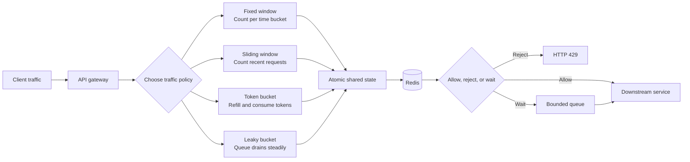

# Rate Limiter

Senior SWE system-design interview revision notes.

## 1. Problem Framing

A rate limiter decides whether a request is allowed, delayed, or rejected based on a traffic policy.

The key question is:

> What traffic shape should be allowed, and what should happen when traffic exceeds the limit?

Example policy:

```text
100 requests per minute per user
```

Before choosing an algorithm, clarify:

- Is the limit per user, API key, IP, tenant, endpoint, or provider?
- Is the quota strict or approximate?
- Should short bursts be allowed?
- Should excess requests wait, return `429 Too Many Requests`, or be queued?
- Is fairness more important than low cost?
- Do limits need to be shared across many API servers?

## 2. Four Designs at a Glance



The algorithm determines traffic behavior. Redis or another distributed store provides shared state and atomic decisions across API instances.

## 3. Fixed Window Counter

Divide time into fixed intervals and count requests in each interval.

```text
12:00:00 ---------------- 12:01:00
             100 requests

12:01:00 ---------------- 12:02:00
             100 requests
```

State:

```text
key = user:123
windowStart = 12:00
count = 73
```

Decision logic:

```text
if currentWindow != storedWindow:
    count = 0
    storedWindow = currentWindow

if count < limit:
    count += 1
    allow
else:
    reject
```

### Boundary burst

A client can make 100 requests at `12:00:59` and another 100 at `12:01:00`. That is 200 requests within roughly one second even though the configured limit is 100 per minute.

### Choose fixed window when

- Simplicity and low cost matter most.
- Approximate enforcement is acceptable.
- Traffic is not highly bursty.
- The API needs a straightforward first implementation.

### Complexity

```text
Time:  O(1) per request
Space: O(number of active keys)
```

Redis commonly implements this with an atomic `INCR` and a window expiration. Set the expiration only for a newly created counter so later requests do not extend the window accidentally.

## 4. Sliding Window

A sliding window evaluates the previous interval relative to the current request. For 100 requests per 60 seconds at `12:01:30`, count requests from `12:00:30` through `12:01:30`.

### 4.1 Sliding window log

Store request timestamps per key:

```text
user:123 -> [12:00:35, 12:00:42, 12:00:55, ...]
```

For every request:

```text
1. Remove timestamps older than the window.
2. If remaining count < limit, append now and allow.
3. Otherwise reject.
```

This is accurate but memory-intensive for high-volume keys.

### 4.2 Sliding window counter

Approximate the moving window using smaller fixed buckets:

```text
60-second window = 6 x 10-second buckets

[10] [10] [10] [10] [10] [10]
```

Expire old buckets and combine the relevant counts. This uses less memory than a timestamp log but is approximate near bucket boundaries.

### Choose sliding window when

- Boundary bursts from fixed windows are unacceptable.
- Fairness and accurate recent usage matter.
- Slightly higher memory and implementation complexity are acceptable.
- The endpoint is sensitive, such as login, payment, SMS, or public quota APIs.

### Complexity

```text
Log:     O(number of timestamps removed) per request, O(requests in window) space
Counter: O(number of buckets) per key, O(number of buckets) space
```

## 5. Token Bucket

A token bucket has a maximum capacity and a continuous refill rate. Each accepted request consumes tokens.

Example:

```text
Capacity   = 100 tokens
Refill     = 10 tokens per second
Cost       = 1 token per request
```

Decision logic:

```text
elapsed = now - lastRefillTime
newTokens = min(capacity, tokens + elapsed * refillRate)

if newTokens >= requestCost:
    tokens = newTokens - requestCost
    lastRefillTime = now
    allow
else:
    reject or wait
```

A full bucket permits a burst of up to 100 requests. After that, traffic is limited by the refill rate of 10 requests per second.

### Choose token bucket when

- Legitimate short bursts should be allowed.
- You want an explicit long-term rate and burst capacity.
- You are protecting an API, service, or provider.
- Requests may have different costs, such as one token for reads and five for expensive writes.

Example policy:

```text
Average rate = 100 requests/sec
Burst capacity = 500 requests
```

This allows a temporary burst up to 500 while controlling the sustained rate near 100 requests per second.

### Complexity

```text
Time:  O(1) per request
Space: O(number of active keys)
```

Token bucket is a strong default for a general-purpose API gateway, but the requirement should determine the choice.

## 6. Leaky Bucket

A leaky bucket models a bounded queue drained at a fixed rate.

```text
Incoming requests
      |
      v
+----------------+
| bounded queue  | ----> fixed-rate worker ----> downstream
+----------------+
      |
      +---- full: reject or shed load
```

Example:

```text
Queue capacity   = 100 requests
Drain rate       = 10 requests/sec
```

A burst of 50 requests is buffered and released at approximately 10 requests per second. Once the queue is full, new requests must be rejected, delayed elsewhere, or handled by a priority policy.

### Choose leaky bucket when

- Downstream systems cannot tolerate bursts.
- Output smoothing matters more than immediate admission.
- You need predictable processing throughput.
- Requests can wait in a bounded queue.

Example:

```text
Incoming burst: 1,000 requests/sec
Downstream safe rate: 100 requests/sec
```

Leaky bucket smooths the output toward 100 requests per second. It is more naturally a traffic-shaping queue than a simple allow/reject counter.

### Complexity

```text
Time:  O(1) admission decision, plus queue scheduling
Space: O(queue capacity per key or shared queue)
```

## 7. Comparison

| Algorithm | Main idea | Burst behavior | Accuracy / output | Best fit |
|---|---|---|---|---|
| Fixed window | Count inside fixed intervals | Boundary bursts possible | Approximate | Simple, low-cost APIs |
| Sliding window | Count recent requests | Limited bursts | Fair and accurate, or bucket approximation | Strict quotas and sensitive endpoints |
| Token bucket | Refill and consume tokens | Explicit burst capacity | Controlled average rate | API gateways and service protection |
| Leaky bucket | Queue drains at a fixed rate | Buffers, then smooths | Predictable output rate | Protecting burst-sensitive downstream systems |

## 8. Distributed Rate Limiter

With many API servers, local counters are incorrect:

```text
Server 1 -> local count = 20
Server 2 -> local count = 20
Server 3 -> local count = 20
```

Each server may independently allow traffic beyond the global limit. Use shared state:

```text
Client -> Load balancer -> API servers
                              |
                              v
                    Shared atomic rate-limit store
                              |
                              v
                           Redis
```

A state key can include the policy scope:

```text
rate:{tenantId}:{userId}:{endpoint}
```

Store only the fields required by the algorithm. For token bucket:

```text
key = rate:tenant-1:user-123:write
capacity = 100
tokens = 73
refillRate = 10 tokens/sec
lastRefillTime = T
```

For fixed window:

```text
key = rate:tenant-1:user-123:write:window-293847
count = 73
```

## 9. Atomicity and Redis Implementation

The read, refill, compare, decrement, and state update must be one atomic operation. Otherwise concurrent requests can both observe the same available capacity.

Use one of:

- A Redis Lua script for token bucket or multi-key decisions.
- An atomic Redis command where the algorithm permits it.
- A server-side Redis function.
- A purpose-built rate-limiting service.

For token bucket, the atomic operation is conceptually:

```text
load tokens and lastRefillTime
calculate elapsed refill
cap tokens at capacity
if tokens >= cost:
    decrement by cost
    save state
    return ALLOW
else:
    save refreshed state if needed
    return REJECT with retry-after
```

Return useful response metadata:

```http
HTTP/1.1 429 Too Many Requests
Retry-After: 3
X-RateLimit-Limit: 100
X-RateLimit-Remaining: 0
X-RateLimit-Reset: 1726920000
```

## 10. Correctness and Operational Tradeoffs

### Clock handling

Use a consistent time source for refill and window calculations. Redis server time or a trusted monotonic time source can reduce differences between API servers. Clock skew can otherwise cause inconsistent decisions.

### Redis failure

Choose the failure policy explicitly:

- **Fail open:** preserve availability but risk overload.
- **Fail closed:** protect the backend but reject valid traffic.
- **Fallback local limiter:** degrade to approximate per-instance limits.

The right choice depends on whether availability or backend protection is more important. Security-sensitive endpoints commonly prefer fail closed or a conservative fallback.

### Hot keys

A single user, tenant, or public API key can become a hot key. Mitigations include local short-lived caching, sharded counters where exactness permits it, hierarchical limits, or a dedicated rate-limiting tier.

### Multiple limits

A request may need to pass several policies:

```text
per-user limit
      AND
per-tenant limit
      AND
per-IP limit
      AND
provider limit
```

Evaluate them atomically when possible, or define which partial outcomes are acceptable. Avoid making a request appear allowed when a required downstream policy has already rejected it.

### Waiting versus rejecting

For synchronous APIs, return `429` rather than holding connections indefinitely. Queue or delay work only when the product can tolerate asynchronous completion and the queue is bounded.

## 11. Choosing an Algorithm in an Interview

### Scenario 1: simple API quota

```text
100 requests/minute/user
```

Choose **fixed window** when approximate enforcement and simplicity are acceptable.

### Scenario 2: strict recent quota

```text
100 requests/minute/user
No boundary burst allowed
```

Choose **sliding window**, using a log for high accuracy or buckets for lower memory usage.

### Scenario 3: burst-tolerant API

```text
100 requests/sec
Burst capacity = 500
```

Choose **token bucket** because burst capacity and sustained rate are explicit.

### Scenario 4: burst-sensitive downstream

```text
Incoming burst: 1,000 requests/sec
Downstream capacity: 100 requests/sec
```

Choose **leaky bucket** or a bounded queue because the goal is smooth output, not only admission control.

## 12. Reference Interview Answer

“I would first clarify the scope, burst tolerance, fairness, and behavior when the limit is exceeded. For a general API gateway, I would usually start with a token bucket because it expresses both sustained rate and burst capacity. If I need strict fairness over the previous interval, I would use a sliding window; if simplicity is more important, fixed window is sufficient. For a downstream dependency that cannot tolerate bursts, I would use a leaky bucket or bounded queue to smooth output. In a distributed deployment, all instances use shared atomic state in Redis, typically through a Lua script. I would return `429` with retry metadata, monitor rejection and latency rates, and define an explicit fail-open or fail-closed policy for Redis outages.”

## 13. Key Decisions to Memorize

| Area | Decision | Reason |
|---|---|---|
| Simple quota | Fixed window | Lowest complexity and cost |
| Strict recent quota | Sliding window | Avoids fixed-boundary artifacts |
| Bursty API traffic | Token bucket | Explicit burst and refill controls |
| Smooth downstream traffic | Leaky bucket | Bounded queue and predictable output |
| Distributed state | Redis or equivalent | Shared state across instances |
| Atomicity | Lua script / server-side function | Prevents concurrent over-admission |
| Excess traffic | `429` or bounded queue | Avoids unbounded waiting |
| Failure policy | Explicit fail-open/closed choice | Makes availability tradeoff visible |
| Observability | Rejections, latency, queue age, store health | Detects overload and policy issues |
