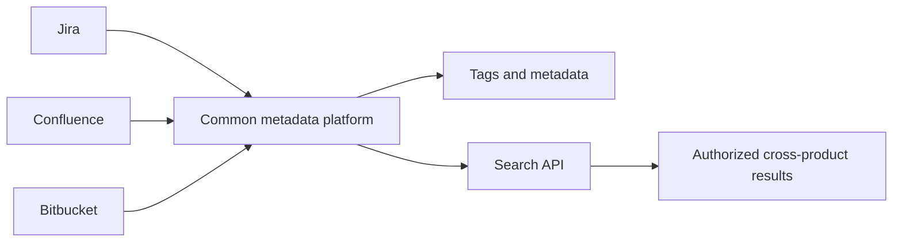
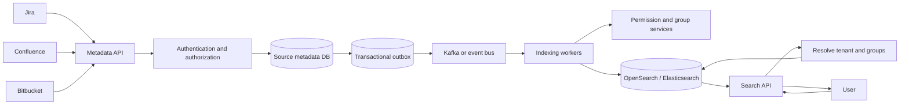
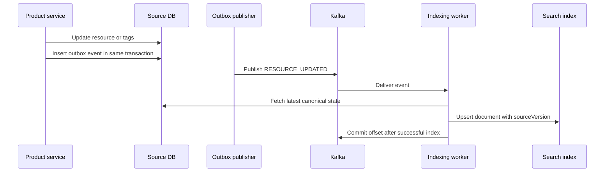
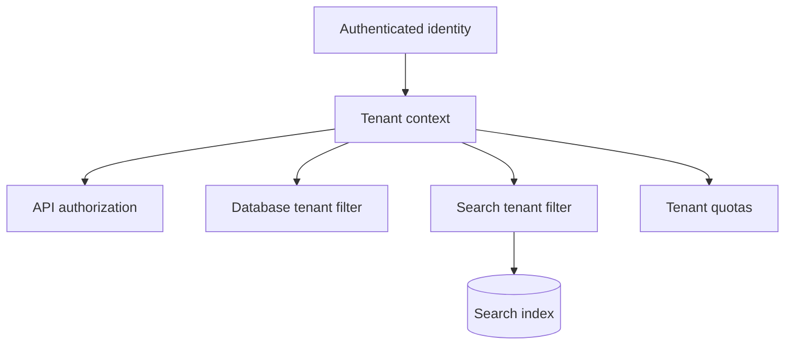
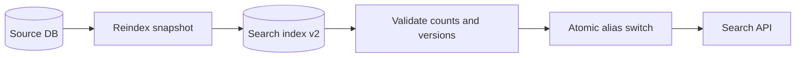

# Common Tagging and Search Platform

Senior SWE system-design interview revision notes.

## 1. Problem Framing

Jira, Confluence, and Bitbucket need a shared platform for tagging and searching content across products.



Example resources:

```text
Jira issue       JIRA-123  "Payment failure"       [payments, production, p1]
Confluence page  PAGE-456  "Payment architecture"   [payments, architecture]
Bitbucket PR     PR-789    "Fix payment retry"      [payments, reliability]
```

A query such as `payment tag:payments` should return only resources the requesting user is authorized to view, within the active tenant.

Start by clarifying:

- Which products and resource types are in scope?
- Are tags tenant-scoped, product-scoped, or global?
- Is search cross-product or limited to one product?
- Which fields are searchable: title, body, comments, code, or metadata?
- How quickly must writes become searchable?
- How are permissions represented, and how frequently do they change?
- Are exact quotas, retention, audit history, and regional data boundaries required?

## 2. Requirements

### Functional

- Add, remove, rename, and list tags for a resource.
- Search across products and resource types.
- Filter by exact tags, resource type, tenant, and other metadata.
- Search only content the current user can access.
- Support multi-tenant isolation.
- Reflect resource, tag, and permission updates within a defined indexing SLA.
- Support deletes and rebuild the search index from canonical data.
- Provide pagination, relevance ordering, and optionally updated-time ordering.

### Non-functional

- Strong consistency for source metadata, tag writes, and permission writes.
- Eventual consistency for the derived search index.
- Low-latency search at millions or billions of resources.
- Horizontal scaling for API, event processing, and search workloads.
- No cross-tenant data leakage.
- At-least-once event processing with idempotent indexing.
- Backpressure, retries, dead-letter handling, observability, and reconciliation.

## 3. High-Level Architecture



The source database is authoritative. The search index is a derived, read-optimized representation that can be rebuilt.

## 4. Core APIs

### Add a tag

```http
POST /v1/tenants/{tenantId}/resources/{resourceId}/tags
```

```json
{
  "tag": "payments"
}
```

### Remove a tag

```http
DELETE /v1/tenants/{tenantId}/resources/{resourceId}/tags/payments
```

### List resource tags

```http
GET /v1/tenants/{tenantId}/resources/{resourceId}/tags
```

### Search

```http
GET /v1/search?q=payment&tags=payments&type=JIRA&cursor=abc&limit=20
```

Example response:

```json
{
  "results": [
    {
      "resourceId": "JIRA-123",
      "resourceType": "JIRA",
      "title": "Payment failure",
      "tags": ["payments", "production"],
      "updatedAt": "2026-09-21T14:30:00Z"
    }
  ],
  "nextCursor": "opaque-cursor"
}
```

The tenant should be derived from authenticated context and verified against the requested resource. Never trust a client-provided tenant ID as the only isolation check.

## 5. Source-of-Truth Data Model

Use a transactional relational database initially.

### Tenant

```text
tenants
-------
tenant_id       UUID PRIMARY KEY
name            TEXT NOT NULL
status          ACTIVE | SUSPENDED | DELETED
created_at      TIMESTAMP NOT NULL
```

### Resource

```text
resources
---------
tenant_id       UUID NOT NULL
resource_id     TEXT NOT NULL
resource_type   JIRA | CONFLUENCE | BITBUCKET
source_version  BIGINT NOT NULL
title           TEXT
content_ref     TEXT
created_at      TIMESTAMP NOT NULL
updated_at      TIMESTAMP NOT NULL

PRIMARY KEY (tenant_id, resource_type, resource_id)
```

A resource ID is unique within tenant and product, not globally. For example, `tenant-a / JIRA / 123` and `tenant-b / JIRA / 123` are different resources.

### Tag

```text
tags
----
tenant_id        UUID NOT NULL
tag_id           UUID NOT NULL
name             TEXT NOT NULL
normalized_name  TEXT NOT NULL
status           ACTIVE | DELETED
created_at       TIMESTAMP NOT NULL
updated_at       TIMESTAMP NOT NULL

PRIMARY KEY (tenant_id, tag_id)
UNIQUE (tenant_id, normalized_name)
```

Store a stable `tag_id` in search documents. Renaming a tag then updates tag metadata rather than rewriting every resource containing that tag.

### ResourceTag

```text
resource_tags
-------------
tenant_id       UUID NOT NULL
resource_type   TEXT NOT NULL
resource_id     TEXT NOT NULL
tag_id          UUID NOT NULL
created_at      TIMESTAMP NOT NULL

PRIMARY KEY (tenant_id, resource_type, resource_id, tag_id)
```

The composite key prevents duplicate tags and enforces tenant-scoped ownership.

## 6. Search Index Design

Use OpenSearch or Elasticsearch as a derived search store.

Example canonical document:

```json
{
  "tenantId": "T1",
  "resourceId": "JIRA-123",
  "resourceType": "JIRA",
  "title": "Payment failure",
  "content": "Payment processing failed after timeout",
  "tagIds": ["TAG-123", "TAG-456"],
  "visibleToUsers": ["U42"],
  "visibleToGroups": ["engineering"],
  "visibility": "PRIVATE",
  "sourceVersion": 42,
  "indexedAt": "2026-09-21T14:30:00Z"
}
```

Field mapping should match query behavior:

| Field | Mapping | Reason |
|---|---|---|
| `title`, `content` | Analyzed text | Full-text search and relevance |
| `tagIds` | Keyword | Exact tag filtering |
| `tenantId` | Keyword | Mandatory tenant filter |
| `resourceId` | Keyword | Exact lookup |
| `resourceType` | Keyword | Product/type filtering |
| `sourceVersion` | Numeric | Stale-event protection |
| ACL fields | Keyword arrays | Authorization filtering |

Tags should not be analyzed like ordinary text. `tag:payments` means an exact match, not a tokenized text search.

## 7. Indexing Pipeline

When Jira updates a resource or tag:



Prefer an event that identifies the changed resource rather than an event containing the entire current state:

```json
{
  "eventId": "evt-123",
  "tenantId": "T1",
  "resourceId": "JIRA-123",
  "resourceType": "JIRA",
  "operation": "UPDATED",
  "sourceVersion": 42
}
```

The worker fetches the latest resource, tags, and permission state before producing one search-document update. This avoids unnecessary fan-out and prevents an old event payload from becoming the indexed truth.

## 8. Outbox and Event Delivery

Do not rely on a direct dual write:

```text
DB update
Kafka publish
```

If the DB update succeeds and Kafka publication fails, the source and index diverge permanently unless another recovery path exists.

Use one source-DB transaction:

```text
BEGIN
  update resource or ResourceTag
  insert OutboxEvent
COMMIT
```

A retryable publisher then reads unpublished outbox rows and sends them to Kafka. The outbox publisher must be idempotent or track publication state safely.

Kafka should be partitioned by:

```text
hash(tenantId + resourceType + resourceId)
```

This preserves ordering for one resource within a partition, but version checks are still required because retries, replays, and multiple consumers can expose stale work.

## 9. Versioning and Idempotent Indexing

Events can arrive out of order:

```text
Event A: sourceVersion 42
Event B: sourceVersion 43

Consumer receives B, then A
```

The indexer must compare versions:

```text
if incoming.sourceVersion > indexed.sourceVersion:
    apply update
else:
    ignore stale event
```

A duplicate event with the same version should be harmless. Deletes should also be idempotent.

A practical guarantee is:

```text
Kafka at-least-once delivery
        +
Idempotent index updates
        +
Version checks
        =
Effectively correct final index state
```

Do not claim end-to-end exactly-once semantics.

## 10. Permission-Aware Search

Search must enforce both tenant isolation and resource authorization.

A conceptual query is:

```text
tenantId = T1
AND title/content matches "payment"
AND tagIds contains TAG-123
AND resourceType = JIRA
AND (
    visibleToUsers contains U42
    OR visibleToGroups intersects [G1, G5, G9]
    OR visibility = PUBLIC
)
```

### Option A: authorize after search

```text
Search top results
      -> authorization service
      -> remove unauthorized results
```

This is simple but can require repeated searches when most top results are inaccessible. It can also produce unstable pagination and poor latency.

### Option B: push ACL filtering into search

Store ACL principals with each search document and include the authorization predicate in the search query. This gives predictable search latency, but ACL changes may require document updates.

### Recommended hybrid

Store relatively stable resource ACLs in the search index:

```text
resource -> allowed users and groups
```

Resolve the requesting user's current group memberships at query time:

```text
user U42 -> [G1, G5, G9]
```

Then query for direct-user or group intersection. Do not expand every group member into every document.

The group membership service and ACL cache must have clear freshness and revocation behavior. For sensitive resources, recheck authorization after search or use a short ACL-cache TTL.

## 11. Avoiding Permission Fan-Out

Consider:

```text
Engineering group: 100,000 users
Engineering documents: 20 million
```

When one user leaves the group, do not update 20 million documents. Store:

```text
Document -> group:engineering
User     -> group:engineering
```

Evaluate the intersection at query time. A group membership change then updates one membership record instead of materializing millions of user-document relationships.

This is one of the most important scaling decisions in the design.

## 12. Multi-Tenancy and Isolation

Every request, database row, event, and search document carries `tenantId`.



Rules:

- Derive tenant context from authenticated identity and membership, not an untrusted request field.
- Require `tenantId = currentTenant` in every search query.
- Include tenant scope in every primary key, unique key, cache key, event, and object path.
- Enforce tenant authorization before tag writes and resource reads.
- Use quotas for tag writes, searches, indexing throughput, and storage.

### Index strategies

| Strategy | Benefit | Risk |
|---|---|---|
| Index per tenant | Strong physical isolation | Too many indexes for many tenants |
| Shared index with `tenantId` | Operationally simple | Requires strict filters and noisy-neighbor controls |
| Hybrid | Shared infrastructure for small tenants; dedicated indexes for large tenants | More placement and migration complexity |

A hybrid strategy is usually practical: route very large or high-traffic tenants to dedicated indexes or clusters while smaller tenants share infrastructure.

## 13. Consistency Model

| Concern | Consistency |
|---|---|
| Tag writes | Strongly consistent in source DB |
| Permission writes | Strongly consistent in authorization source |
| Source metadata | Strongly consistent |
| Search index | Eventually consistent |
| Search results after indexing | Read-consistent with the index replica policy |
| Analytics and dashboards | Eventually consistent |

Example propagation path:

```text
T0       source DB updated
T0+50ms  outbox event published
T0+100ms indexer consumes event
T0+150ms search document updated
```

Define an indexing SLA, for example: 99% of updates searchable within one second and 99.9% within ten seconds.

### Read-your-write options

- Accept eventual consistency and document the SLA.
- Return an `operationId` and expose an `indexedVersion` check.
- Temporarily combine recent source-DB changes with search results.

Use the simplest option that meets the product requirement.

## 14. Search and Tag Fan-Out

### Resource changes

A page with many tags and permissions should produce one logical resource-change event:

```text
RESOURCE_UPDATED
       |
       v
Indexer fetches latest resource, tags, and ACL
       |
       v
One canonical search-document update
```

Do not emit one event per tag, group, or user unless an independent consumer truly requires it.

### Tag renames

Index stable tag IDs rather than only names:

```text
Tag metadata: TAG-123 -> "payments"
Search document: tagIds contains TAG-123
```

Renaming `payments` to `payment-processing` updates tag metadata and avoids rewriting millions of resource documents. Tag deletion still needs a policy for whether existing associations are removed synchronously or hidden by tag status.

## 15. Search Index Rebuild and Reconciliation

The search index is derived data and must be rebuildable:



Build a new index in the background, validate document counts and representative queries, then atomically switch an alias from `index_v1` to `index_v2`.

Run periodic reconciliation using resource versions:

```text
Source DB:       JIRA-123 sourceVersion = 45
Search index:    JIRA-123 sourceVersion = 43

Action: re-index JIRA-123
```

Reconciliation protects against lost events, consumer bugs, partial outages, and index corruption. Use push events for low latency and reconciliation as the safety net.

## 16. Failure Handling and Backpressure

### Common failures

| Failure | Response |
|---|---|
| DB update succeeds, Kafka fails | Transactional outbox and publisher retry |
| Kafka redelivers event | Idempotent upsert and version check |
| Events arrive out of order | Ignore versions older than indexed version |
| Search index unavailable | Kafka buffers events; indexer retries |
| Poison event | Bounded retries and DLQ |
| Search index corrupted | Rebuild from source DB and switch alias |
| Permission change creates huge fan-out | Query-time group intersection |
| Cross-tenant result risk | Mandatory authenticated tenant filter |
| Tag rename affects millions of resources | Stable tag IDs |
| One tenant overwhelms indexing | Tenant quotas and isolated capacity |
| Consumer crashes after indexing | Redelivery is safe through idempotency |

### Backpressure

If producers generate 100,000 updates per second while indexers process 50,000:

```text
Product services -> Kafka -> indexer consumer pool -> OpenSearch
                         |
                         +-> consumer lag grows temporarily
```

Scale consumers based on lag and partition count. Monitor:

- Kafka consumer lag.
- Indexing latency.
- Search indexing failures and rejections.
- OpenSearch CPU, storage, and heap pressure.
- DLQ size.
- Outbox age and unpublished event count.

## 17. Caching and Rate Limiting

Useful caches include:

```text
Redis: tagId -> tag metadata
Redis: userId + tenantId -> current group memberships
```

Permission-aware search-result caching is risky. If used, include the full authorization context or a permission-version token in the cache key:

```text
tenant + query + filters + user/group context version
```

Otherwise a result cached for one user may leak to another. Apply tenant-aware rate limits to search requests, tag mutations, and indexing throughput so one tenant cannot become a noisy neighbor.

## 18. Push versus Pull Indexing

### Push

```text
Source change -> event -> indexer -> search index
```

Low latency and efficient incremental updates, but requires reliable events and replay handling.

### Pull

```text
Periodic scan -> changed source records -> indexer
```

Simpler recovery, but higher latency and potentially expensive scans.

### Recommended approach

Use push plus periodic reconciliation:

```text
Real time:  source DB -> outbox -> Kafka -> search index
Safety net: source DB -> reconciliation -> search index
```

## 19. Scaling Strategy

### Search

- Scale OpenSearch with shards, replicas, and dedicated coordinator nodes where appropriate.
- Route by tenant when it improves locality without creating hot shards.
- Keep large text fields and authorization fields mapped intentionally.
- Isolate very large tenants with dedicated indexes or clusters.

### Kafka and indexers

- Partition by `tenantId + resourceId` to preserve per-resource order.
- Use stateless indexer workers.
- Scale from consumer lag, processing latency, and OpenSearch rejection rate.
- Use bulk indexing with bounded batch sizes and retries.

### Metadata database

- Index resource tags by tenant and resource identity.
- Partition or shard by tenant at very large scale.
- Keep outbox retention long enough to replay outages.

## 20. Reference Interview Answer

“I would make the metadata database the source of truth and OpenSearch a derived index. Product services write resource and tag changes transactionally with an outbox event, which is published to Kafka. Indexers consume resource-level events, fetch the latest canonical resource, tags, and ACLs, and upsert one versioned search document. Kafka is partitioned by tenant and resource to preserve local ordering, while version checks and idempotent writes handle retries and stale events. Search always applies the authenticated tenant filter and an ACL predicate using direct users and groups; I would avoid expanding group membership across every document because that creates massive fan-out. Search is eventually consistent, so I would define an indexing SLA and run periodic reconciliation. For scale and isolation, use shared indexes for normal tenants and dedicated capacity for very large tenants, with quotas, backpressure, DLQs, and rebuildable index aliases.”

## 21. Key Decisions to Memorize

| Area | Decision | Reason |
|---|---|---|
| Source of truth | Transactional metadata DB | Correct tag, resource, and permission state |
| Search | OpenSearch / Elasticsearch | Distributed full-text and filter queries |
| Propagation | Outbox plus Kafka | Avoids DB/event dual-write loss |
| Indexing event | Resource change plus version | Consumer fetches latest state and limits fan-out |
| Ordering | Partition by tenant and resource | Preserves per-resource event order |
| Stale events | Version checks | Prevents older updates overwriting newer ones |
| Permissions | Query-time group intersection | Avoids user-to-every-document expansion |
| Tenant isolation | Mandatory tenant filter and scoped keys | Prevents cross-tenant leakage |
| Tags | Stable tag IDs | Makes renames cheap |
| Consistency | Strong source, eventual search | Practical latency and reliability tradeoff |
| Recovery | Reconciliation and rebuildable aliases | Repairs lost events and corrupted indexes |
| Scale | Tenant quotas and tiered capacity | Controls noisy neighbors |
